# V1 — Tax Assessment System: Architecture & Implementation Plan

**Document ID:** `V1_tax_assessment_initial_plan_05092026`\
**Product:** iFile‑Teapot (IRIS Regtech)\
**Date:** 05 September 2026\
**Status:** Draft for architecture / product / tax‑domain review\
**Scope:** Planning only. No code, migrations, BPMN files, DynaForms or configuration were created or modified while producing this document.

---

## Legend — Evidence Discipline

Throughout this document, every material statement about the platform is tagged:

| Tag | Meaning |
|---|---|
| **[E]** Evidence | Verified directly by reading files in this repository. A concrete path is given. |
| **[A]** Assumption | Not verifiable from the repository (external repo, runtime behaviour, or business input). Stated explicitly so it can be confirmed. |
| **[R]** Recommendation | An architectural proposal by this document, not an existing capability. |

Nothing tagged **[R]** or **[A]** should be read as an existing Teapot feature.

---

## 1. Executive Summary

### 1.1 What was found

iFile‑Teapot is **not** a greenfield platform for this requirement. Repository inspection shows that a substantial part of a tax‑assessment capability **already exists**, in two very different architectural styles:

1. **A generic, configuration‑driven filing/workflow platform** — DynaForms (JSON form definitions, formula engine, dependency engine, validation engine), two workflow engines (a Flowable‑backed BPMN engine and a table‑driven step engine), a configurable JSON‑Logic rule engine, a versioned risk‑scoring engine, a category‑driven menu/permission model, a Redis‑backed authorization cache, configurable e‑mail alerting, document storage, dashboards, grids and CSV/XLSX export. **[E]**

2. **A bespoke, hard‑coded tax audit / presumptive‑assessment module** — `TBL_AUDIT_PROCESS` / `TBL_AUDIT_ACTION` / `TBL_AUDIT_STATUS` in the core service, a `/auditService/*` REST surface, a Postgres stored function `GTA.sp_get_taxpayer_audit_data(tin, years[])` returning year‑wise revenues, expenses, non‑deductible items, tax due, adjustments and losses carried forward, and a ~2,500‑line Angular component (`audit-detail.ts`) with a hand‑written formula service covering reconciliation, depreciation, carry‑forward losses, provisions, peer comparison and presumptive tax assessment. **[E]**

The second is functionally the closest thing to "Tax Assessment" in the product today. It is also the least configurable, least reusable and least jurisdiction‑portable part of the codebase: statuses, roles, tab structure, field keys and formulas are compiled into Java DTOs and Angular TypeScript.

### 1.2 The central recommendation

> **Build Tax Assessment as a *configured DynaForms category* with a *domain wrapper*, not as a second bespoke module — and treat the existing Audit Journaling module as the functional specification to be generalised, not as the code to be extended.** **[R]**

Concretely:

- Model the assessment **case** as a thin domain table (`tbl_tax_assessment_case`) that wraps an existing workflow case / BPMN process instance and points at DynaForms submissions — exactly the pattern already proven by `tbl_dynaform_license`, `tbl_fit_proper_initiation` and `tbl_dynaform_workflow_case`. **[R]**, pattern **[E]**
- Express every **form** (assessment worksheet, adjustment schedule, review form, notice cover, objection, appeal) as a DynaForms `form_template_definition`, not as an Angular component. **[R]**
- Express the **lifecycle** as a published BPMN linking‑workflow (Flowable) with `stepCode` / `formId` / `roles` user tasks, or as a table‑driven workflow definition for the MVP. **[R]**
- Express **jurisdiction‑specific tax rules** (rates, slabs, thresholds, penalty and interest formulas, objection/appeal deadlines) as **versioned, effective‑dated configuration** consumed by a new server‑side calculation service — because the DynaForms formula engine, as verified, cannot express `IF`, `ROUND`, `SUM` or slab logic. This is the single largest genuinely‑new backend component. **[R]**, limitation **[E]**

### 1.3 Effort shape

| Category | Share of scope | Notes |
|---|---|---|
| Reuse of existing Teapot capability, unchanged | ~45% | Forms, workflow, RBAC, audit, documents, e‑mail, dashboards, grids, export |
| Configuration only (DynaForms + BPMN + masters + menus + permissions) | ~20% | The bulk of the lifecycle |
| Extension of existing components | ~20% | Generic BPMN service task, SLA persistence, notice generation generalised from `license`, case search view |
| Genuinely new development | ~15% | Tax calculation & rule engine, assessment case domain service, objection/appeal linkage, payments/liability ledger integration |

### 1.4 The three biggest risks

1. **Calculation correctness and precision.** DynaForms stores submitted values in a JSONB `json` column, and the front‑end formula engine is floating‑point and rounds to 2 decimals. **[E]** Tax computation must be authoritative, decimal‑exact, reproducible and auditable — it therefore belongs server‑side, not in the renderer. **[R]**
2. **Two workflow engines.** The repository contains a Flowable‑based BPMN path *and* a table‑driven step engine, both live, plus a third legacy Node `bpmn-engine` path used by the returns pipeline. **[E]** Choosing one for Tax Assessment, and saying so explicitly, is a prerequisite for a coherent design.
3. **Domain scope creep.** "Tax Assessment" touches registration, filing, payment, ledger, penalty, interest, refund, collection and appeals. The repository contains **no payment, ledger or liability‑balance module**. **[E]** MVP boundaries must be drawn before build starts.

---

## 2. Understanding of iFile‑Teapot

### 2.1 Product positioning

iFile‑Teapot is a configurable regulatory filing and supervision platform. The repository shows deployments/configurations oriented to at least: XBRL return filing with taxonomy validation, non‑XBRL "DynaForm" filing, licensing/certification with renewal‑suspension‑revocation lifecycles, Fit & Proper supervisory assessments, and tax audit. **[E]**

### 2.2 Architectural style

Teapot is a **polyglot service suite over a single PostgreSQL database**, deployed as containers:

- **Java / Spring Boot services** own the enterprise backbone: identity, roles, menus, permissions, entities, returns, filing calendar, tasks, e‑mail, documents, masters.
- **A NestJS service (`api-dynaforms`)** owns the configuration‑driven layer: form templates, submissions, categories, workflows, rules, risk scoring, licences, dashboards.
- **A Spring Boot + Flowable service** executes BPMN.
- **An Angular 21 SPA (`web-collect`)** is the single front end, embedding a git‑submodule (`src/ifile-teapot-web-dynaforms`) that contains the DynaForms builder and renderer.

**[E]** — established from `build-all.bat`, `Backend/*/pom.xml`, `Backend/ifile-teapot-api-dynaforms/package.json`, `Frontend/ifile-teapot-web-collect/package.json` and `Backend/ifile-teapot-docker/docker-compose.yml`.

### 2.3 The two design philosophies present in the codebase

| | Configuration‑driven layer | Bespoke domain layer |
|---|---|---|
| Example | DynaForms categories: License / Certificate, Fit & Proper, Registration | Audit Journaling (tax audit) |
| Forms | `form_template_definition` JSONB, authored in the builder | Angular templates + Java DTOs |
| Statuses | `tbl_dynaform_form_template_data_status`, workflow statuses | `AuditStatusOrder` Java enum |
| Roles | `role_code` on workflow steps, Redis authz cache | `AssignToUserRole` Java enum |
| Rules | `condition_json` (JSON‑Logic), risk score models | Hard‑coded `if` statements |
| Time to add a jurisdiction | Configuration | Code change + release |

**[E]** — `Backend/ifile-teapot-api-coreService/src/main/java/com/iris/ifile/teapot/auditprocess/enums/AuditStatusOrder.java`, `.../AssignToUserRole.java` vs `Backend/ifile-teapot-api-dynaforms/src/workflow/models/workflow-status.model.ts`, `.../dynaform-workflow-rule/model/`.

Tax Assessment must be built in the **left‑hand column**. **[R]**

---

## 3. Repository Architecture Assessment

### 3.1 Module inventory

**[E]** — from directory listing and `build-all.bat` build order.

#### Backend (`D:\Teapot-develop\Backend`)

| Module | Build | Role |
|---|---|---|
| `ifile-teapot-component-orm` | Maven | Shared JPA entities + repositories (288 Java files, ~150 `@Entity` classes). The canonical relational model. |
| `ifile-teapot-component-encryptde` | Maven | Encryption/decryption component |
| `ifile-teapot-component-bushchatOutputRenderer` | Maven | Validation output rendering (Bushchat = XBRL validation engine) |
| `ifile-teapot-component-validation` | Maven | Shared validation component |
| `ifile-teapot-component-xbrlToJSON` | Maven | XBRL → JSON (OIM) conversion |
| `ifile-teapot-component-history-plugin` | Maven | Generic entity snapshot history (`TBL_HISTORY_MASTER`) |
| `ifile-teapot-component-auditor-plugin` | Maven | HTTP request/response trace logging, async batch writer |
| `ifile-teapot-component-logger-plugin` | Maven | Logging |
| `ifile-teapot-api-documentstore` | Maven | DMS: file/folder management, checksum, compression, access history |
| `ifile-teapot-api-mail` | Maven | Mail dispatch service |
| `ifile-teapot-api-propertyMngt` | Maven | Application property management |
| `ifile-teapot-api-auditor` | Maven | Audit/trace log API |
| `ifile-teapot-api-awsyoke` | Maven | AWS integration |
| `ifile-teapot-api-authenticator` | Maven | Authentication / token issuance |
| `ifile-teapot-api-coreService` | Maven | **Main enterprise API** — 90+ domain packages |
| `ifile-teapot-api-digisign` | Maven | Digital signature (emSigner / eMudhra / Embridge) |
| `ifile-teapot-api-clientmasterdata` | Maven | Linked master data (cascading dropdowns) |
| `ifile-teapot-api-dataquest` | Maven | **Configurable fact extraction from filed returns** |
| `ifile-teapot-api-dynaform-bpmn-engine` | Maven | **Flowable 7.1.0 BPMN engine** (`com.example.workflow`, WAR) |
| `ifile-teapot-api-dynaforms` | npm/Nest | **DynaForms + workflow + rules + risk + licence API** |
| `ifile-teapot-api-dynaforms-standalone` | npm | `@iris/dynaforms-api` package — the extracted DynaForms core |
| `ifile-teapot-node-bpmnengine` | npm | Legacy Node `bpmn-engine` v22 execution engine (returns pipeline) |
| `ifile-teapot-api-redis` | docker | Redis for the authorization cache |
| `ifile-teapot-docker` | docker | Compose, Dockerfiles, nginx, per‑host `.env` |

#### Frontend (`D:\Teapot-develop\Frontend`)

| Module | Role |
|---|---|
| `ifile-teapot-web-collect` | Angular 21 SPA — 156 declared routes, all business screens |
| `ifile-teapot-web-collect/src/ifile-teapot-web-dynaforms` | Git submodule — DynaForms builder (v1 + v2), renderer engine, workflow UI, risk‑score builder, dashboards |
| `ifile-teapot-web-commonlogin2` | Shared login application |

### 3.2 Layering (as built)

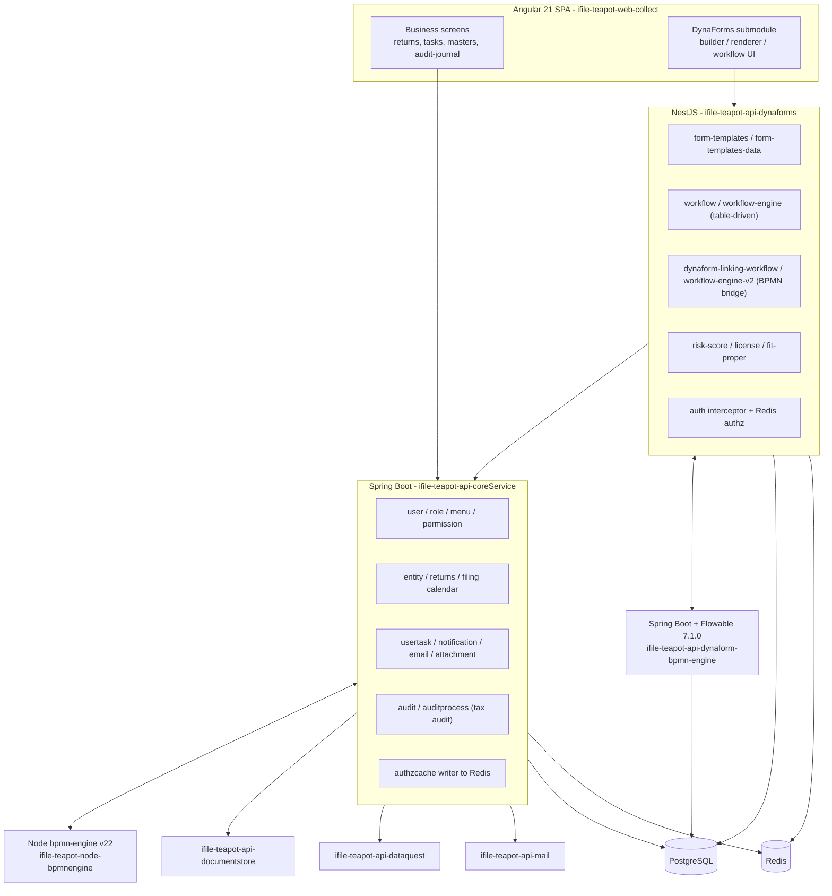

**[E]** — relationships verified in `Backend/ifile-teapot-node-bpmnengine/docs/BPMN_SYSTEM_UNDERSTANDING.md`, `Backend/ifile-teapot-api-dynaforms/docs/bpmn/bpmn-implementation-reference.md`, `Backend/ifile-teapot-api-dynaforms/src/core-communication/`, `Backend/ifile-teapot-api-dynaforms/docs/authorization-plan.md`.

### 3.3 Technology stack and versions

**[E]**

| Layer | Technology | Version evidence |
|---|---|---|
| Front end | Angular | `^21.2.17` — `Frontend/ifile-teapot-web-collect/package.json` |
| UI kit | PrimeNG + `@primeuix/themes` + Tailwind | `^21.1.9` / `^2.0.3` |
| Charts | ApexCharts / `ng-apexcharts` | `^5.15.0` / `^2.4.0` |
| BPMN authoring | `bpmn-js` | `^17.0.1` |
| Diagrams | `mermaid` | `^11.12.2` |
| PDF/report (client) | `html2pdf.js`, `html2canvas`, `qrcode` | — |
| DynaForms API | NestJS | `^11.0.1` |
| ORM (Nest) | Sequelize + `sequelize-typescript` + `@nestjs/sequelize` | `^6.37.7` / `^2.1.6` / `^11.0.0` |
| Migrations (Nest) | `sequelize-cli` | `^6.6.3`, 270 migration files |
| Rules (Nest) | `json-logic-engine` | `^5.0.6` |
| Formula (Nest) | `expr-eval` | `^2.0.2` |
| Cache | `ioredis` | `^5.10.0` |
| PDF (server) | `puppeteer` | `^24.15.0` |
| Logging (Nest) | `winston` + daily rotate | `^3.19.0` |
| Core service | Spring Boot | 3.4.x |
| BPMN engine | Spring Boot + **Flowable** | Boot `3.4.13`, Flowable `7.1.0`, Java `25`, WAR packaging |
| Migrations (Java) | Liquibase | `liquibase-core` in `ifile-teapot-api-dynaform-bpmn-engine/pom.xml` |
| DB | PostgreSQL | `pg`, `postgresql` driver, `GTA` schema referenced |
| Legacy engine | `bpmn-engine` + `camunda-bpmn-moddle` | `^22.0.3` / `^7.0.1`, TypeScript 5.5, Express 4 |
| Build | Maven (JDK 25) + npm | `build-all.bat` sets `JAVA_HOME` to JDK 25 |
| CI | Jenkins | `Jenkinsfile` per module |
| Test | Jest (116 specs in api‑dynaforms), Jest (53 `.jest.spec.ts` in dynaforms FE), Playwright, JUnit (11 test classes in the Flowable engine) | — |

> **[A]** The Java `workflow-engine` referred to in `bpmn-implementation-reference.md` as an "external repo" is present in this repository as `Backend/ifile-teapot-api-dynaform-bpmn-engine` (same package `com.example.workflow`, same class names `ProcessService`, `WorkflowTaskService`, `GlobalFlowableEventListener`, `JsonLogicConditionEvaluator`, `StatusUpdaterDelegate`). Confirm with the platform team that these are the same artefact and not a fork.

### 3.4 Naming and code conventions observed

**[E]**

| Concern | Convention |
|---|---|
| Java packages | `com.iris.ifile.teapot.<domain>.{controller,service,service.impl,dto,mapper,transformer,filter,validator,constants}` |
| Java layering | Controller → Transformer → Service → Repository (`transformer` sits between controller and service and resolves display keys) |
| Java tables | `TBL_<UPPER_SNAKE>`, PK `<ENTITY>_ID`, FKs suffixed `_FK`, soft delete `IS_ACTIVE` |
| Nest modules | `src/<kebab-domain>/{controller,service,model,dto}` |
| Nest tables | `tbl_dynaform_<snake>` |
| Nest models | `sequelize-typescript` with `underscored: true`, `timestamps: true`, `declare` fields |
| Audit columns | `created_at`, `created_by`, `updated_at`, `updated_by`, `is_active` on virtually every table |
| i18n | Every user‑visible label is a **display key** (`df.field.…`, `dynaform.field.…`) resolved per language |
| Permissions | Every API route is registered in `TBL_ACTION_MENU_MAPPING` by a migration |
| Migrations | Timestamped `sequelize-cli` files; menus, display keys and action mappings are seeded by migration, not by hand |

Any new Tax Assessment component must follow all of the above. **[R]**

---

## 4. Existing DynaForms Architecture

### 4.1 Where DynaForms lives

**[E]**

| Concern | Location |
|---|---|
| Extracted core package | `Backend/ifile-teapot-api-dynaforms-standalone/packages/dynaforms-api` (`@iris/dynaforms-api`) |
| Host application | `Backend/ifile-teapot-api-dynaforms` (imports the package via `file:` dependency) |
| Host integration seam | `Backend/ifile-teapot-api-dynaforms/src/dynaforms-integration/` (access policy, file storage, execution context, model associations, API adapters) |
| Builder + renderer UI | `Frontend/ifile-teapot-web-collect/src/ifile-teapot-web-dynaforms/components/{dynaform-builder,dynaform-builder-v2,form-renderer}` |
| Renderer engine | `.../components/form-renderer/engine/` |
| Widget documentation | `Frontend/ifile-teapot-web-collect/technical-resources/technical-documentation/dynaforms-widgets/` |

The package/host split is an active decoupling programme, documented under `Frontend/ifile-teapot-web-collect/docs/dynaforms-decoupling/`. **[E]** New Tax Assessment work must respect the "fence" between package and host — domain‑specific code belongs in the host, never in `@iris/dynaforms-api`. **[R]**

### 4.2 Persistence model

**[E]** — `packages/dynaforms-api/src/persistence/sequelize/*.model.ts`

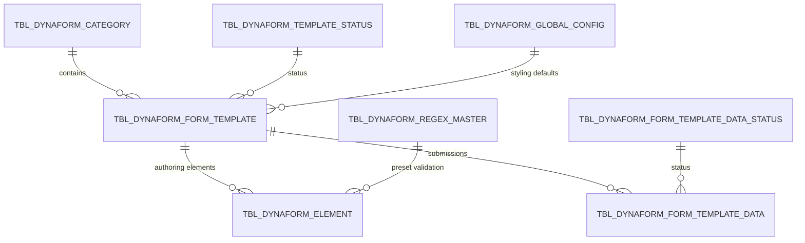

**`tbl_dynaform_form_template`** — key columns **[E]**

| Column | Type | Meaning |
|---|---|---|
| `category_id` | int | Owning category |
| `form_template_name`, `form_template_description` | varchar/text | — |
| `form_template_definition` | **jsonb** | The complete form tree (the actual form) |
| `schema_version` | varchar(50) | Definition schema version |
| `global_config` | jsonb | Theme/layout defaults |
| `status_id` | int | DRAFT / PUBLISHED / ARCHIVED |
| `is_login_required` | bool | Public (open) vs authenticated form |
| `is_non_xbrl` | bool | Non‑XBRL filing form |
| `is_dms` | bool | Document‑management form |
| `metadata` | jsonb | Free metadata |
| `preview_path` | varchar | Gallery preview image |

**`tbl_dynaform_form_template_data`** — key columns **[E]**

| Column | Type | Meaning |
|---|---|---|
| `form_template_id` | int | Template |
| `json` | **jsonb** | The submitted payload |
| `status` | int | DRAFT(0) / SUBMITTED_BY_USER(1) / APPROVED(2) / REJECTED(3) |
| `uuid` | uuid unique | External handle |
| `license_reference_number` | varchar unique | Category‑generated business reference |
| `submission_unique_identifier` | text | Business key captured from a flagged form field |
| `submission_username` | text | Username captured from a flagged form field |
| `previous_form_template_data_uuid` | uuid | **Revision / supersession chain** |
| `approved_by`, `comment` | int / text | Approval outcome |
| `view_document_url`, `audit_trail_url` | text | DMS links |
| `user_id`, `user_info` | int / jsonb | Submitter identity |
| `metadata` | jsonb | — |

> **Significance for Tax Assessment:** `previous_form_template_data_uuid` already gives a supersession chain — the natural mechanism for **reassessment / revised assessment**. `license_reference_number` already gives a category‑configured reference‑number generator — the natural mechanism for **assessment case numbers and notice numbers**. **[E]** for the columns; **[R]** for the proposed use.

### 4.3 Form definition model

The form definition is a **nested tree of element nodes** in JSONB. Node key inventory (extracted from the eight sample definitions in `Backend/ifile-teapot-api-dynaforms/dynaform-json/`): **[E]**

| Group | Keys |
|---|---|
| Identity | `uuid`, `id`, `parentId`, `jsonKey`, `fieldName`, `defaultFieldName`, `type`, `fieldType`, `elementType`, `element_version` |
| Data | `value`, `typeOfData` (`fact`), `options`, `isChecked` |
| Behaviour | `required`, `hidden`, `disabled`, `visible`, `clearOnHide`, `dependsOn`, `rules`, `condition`, `conditions`, `effects`, `controllerKey` |
| Validation | `regexConfig`, `pattern`, `presetRefId`, `presetErrorKey`, `errorMsgMetadata`, `minlength`, `maxlength`, `min`, `max`, `minDate`, `maxDate` |
| Calculation | `formula`, `formulaId`, `outputType`, `outputCurrency` |
| Lookup / API | `apiEndPoint`, `apiType`, `importCURL`, `requestBody`, `optionLabelFromResponse`, `optionValueFromResponse`, `actionsOnChange`, `commaSeparatedValues` |
| Numeric | `numberType`, `currency`, `locale`, `useGrouping`, `minFractionDigits`, `maxFractionDigits`, `step`, `suffix` |
| Files | `accept`, `acceptFileTypes`, `multiple`, `fileLimit`, `maxFileSize` |
| Table/matrix | `columns`, `columnGroups`, `rows`, `cols`, `matrixKey`, `stickyHeader` |
| i18n | `displayKey`, `displayLabel`, `placeholderKey` |
| Presentation | `boxModel`, `elementStyles`, `elementTypography`, `width`, `labelPosition`, `background`, `layout`, … |

**Field types** — `Backend/ifile-teapot-api-dynaforms/src/elements/constants/field-type.enum.ts` **[E]**

```
1 TEXTBOX      2 CHECKBOX     3 TEXTAREA     4 SECTION      5 DATEPICKER
6 DROPDOWN     7 TOGGLESWITCH 8 RADIOGROUP   9 DIVIDER     10 MULTISELECT
11 NUMBER     12 PASSWORD    13 HEADER      14 BUTTON      15 CONTAINER
16 TAB        17 DIV         18 FILE        19 TIMEPICKER  20 BOXWIDGET
21 TABLE      22 BUTTONGROUP 23 FORMULA     24 SIGNATURE   25 PHONE
26 EMAIL      27 CAPTCHA     28 AUTOCOMPLETE 29 BANNER
```

Container rule: **[E]** a form must contain at least one `Section`, `Div` or `Tab` wrapper for data patching to work (`dynaforms-widgets/README.md`).

### 4.4 Calculation — capability and hard limits

**[E]** — `technical-resources/technical-documentation/dynaforms-widgets/widgets/formula.md` (435 lines, "Last verified: 03‑08‑2026"), backed by `expr-eval` server‑side (`/api/formula/validate`, `/api/formula/evaluate`, `/api/formula/evaluate-batch`) and `formula-rule-evaluator.util.ts` client‑side.

**Supported**

- `+ - * / ( )` with normal precedence, over Number, Formula, Date Picker and table numeric cells.
- Percentage fields auto‑insert `/100`.
- Currency output when all currency operands share one currency code.
- Date arithmetic: `Date ± days`, `Date − Date` → whole days.
- **Formula selection rules**: an ordered rule list; each rule has an AND/OR condition tree over field comparisons (`> < >= <= == !=`, static or field right‑hand side); **first match wins**, otherwise a default formula runs.
- **Formula validations** in the Error tab: one boolean comparison per rule, with its own error key and message.
- Table/matrix aggregates: row totals, column totals, row count, formula columns.

**Explicitly not supported**

- `SUM`, `AVERAGE`, `COUNT`, `ROUND`, `MIN`, `MAX`, `IF`, `VLOOKUP`, any function call syntax
- Ternaries, `&&`, `||`, `%` (modulo), `^`/`**`, arrays, property access
- Boolean Formula widget output; text results; string concatenation
- Mixed currency, mixed date/number comparisons, static date literals
- Circular references between formula widgets

**Consequences for tax computation** **[R]**

| Tax requirement | Feasible in DynaForms formula? | Approach |
|---|---|---|
| `Taxable income = Gross − Deductions − Exemptions` | Yes | Standard formula |
| `Tax = Taxable income × Flat rate` | Yes | Standard formula |
| Progressive slab tax (3–7 bands) | **Partially** — expressible as formula‑selection rules where each band is a separate library formula and rules test the band boundary | Works, but the rule set must be re‑authored per rate change; unsuitable as the *authoritative* computation |
| Rounding to statutory precision | **No** | Server‑side |
| `SUM` over N dynamic adjustment rows | **No** (only table aggregates) | Server‑side or fixed table |
| Interest accrued day‑count over multiple rate periods | **No** | Server‑side |
| Penalty = greater of (fixed, % of tax) | **No** (`MAX` absent) | Server‑side |
| Loss carry‑forward across years with expiry | **No** | Server‑side |

> **Design conclusion.** DynaForms formulas are excellent for **on‑screen assistance, cross‑checks and validation**, and must be used for that. They are **not** an acceptable system of record for statutory tax computation. A server‑side **Tax Calculation Service** is required, and the form must display server‑computed values as read‑only. **[R]**

### 4.5 Conditional logic (dependency engine)

**[E]** — `dynaforms-widgets/common/dependencies.md` + `components/form-renderer/engine/dependency-engine.service.ts`

- Rules stored on the dependent field under `dependsOn.rules`.
- Operators: `eq`, `neq`, `contains`, `lt`, `gt`, `lte`, `gte`, `empty`, `notEmpty`.
- Effects: `setVisibility`, `setRequired`, `setFieldProps` (currently `minLength` / `maxLength`), `filterOptions` (with `allowedValues`) for static Dropdown / Multi Select targets.
- On no match, the authored baseline is restored.
- Formula widget does **not** support dependencies.

Sufficient for "show WHT schedule only when WHT applies", "make justification mandatory when an adjustment is made", "restrict adjustment‑reason list by adjustment type". **[R]**

### 4.6 Validation

**[E]**

| Mechanism | Storage | Notes |
|---|---|---|
| Built‑in per field type | `errorMsgMetadata` | Auto‑generated defaults |
| Regex, incl. presets | `regexConfig`, `pattern`, `presetRefId`, `presetErrorKey` | Presets from `tbl_dynaform_regex_master` (migration `20260102120000-create-dynaform-regex-master.js`); each preset carries `regex`, `javaRegex`, `fusionRegex`, `errorKey` |
| Length / range / date bounds | `minlength`, `maxlength`, `min`, `max`, `minDate`, `maxDate` | — |
| Formula validations | `validationRules[]` = `{uuid, formula, errorKey}` + `errorMsgMetadata[errorKey]`; display key `df.error.<jsonKey>.<errorKey>` | One boolean comparison each |
| Submission identity | `isSubmissionUniqueIdentifier`, `isSubmissionUsername` | Single‑select per form; populates `submission_unique_identifier` / `submission_username` |
| Server‑side | `class-validator` DTOs in Nest | — |

The **multi‑flavour regex master** (`regex` / `javaRegex` / `fusionRegex` with a shared error key) is directly reusable for **TIN format per jurisdiction**. **[E]** for the mechanism, **[R]** for the use.

### 4.7 Lookup / master data in forms

**[E]**

- Dropdown / Multi Select / Autocomplete support `apiEndPoint`, `apiType`, `importCURL`, `requestBody`, `optionLabelFromResponse`, `optionValueFromResponse`, `actionsOnChange`.
- Outbound calls are brokered by `Backend/ifile-teapot-api-dynaforms/src/third-party-service/` (`curl-request.dto.ts`, `direct-api-request.dto.ts`).
- Cascading masters also available from `ifile-teapot-api-clientmasterdata` → `/linkedMasters/fetchLinkedMastersListByLinkedMastersGroup/{groupCode}` and `/fetchLinkedMastersListByReturnCode/{returnCode}`.

This is the mechanism by which an assessment form fetches **taxpayer name from TIN**, **tax type list**, **period list**, **adjustment reason codes** — without new code. **[R]**

### 4.8 Form versioning

**[E]**

- Templates carry `schema_version` and a status (`DRAFT` → `PUBLISHED` → `ARCHIVED`, migration `20260226120000-add-archived-template-status.js`).
- Clone endpoint `POST /api/formTemplates/:id/clone`; XLSX export/import (`GET :id/export/xlsx`, `POST :id/import/xlsx`).
- `element_version` appears in definitions; `docs/dynaforms-template-schema-versioning.md` exists.
- **Gap [E]:** there is no `version` column on `tbl_dynaform_form_template`, and no explicit "effective from / effective to" on a template. Versioning is achieved by cloning to a new template row.

> **Implication.** Tax forms change every assessment year. The clone‑per‑year pattern works, but the assessment case must record **which template id/version produced the submission** so historic cases stay renderable. **[R]** `tbl_dynaform_form_template_data.form_template_id` already provides this. **[E]**

### 4.9 DynaForms API surface (existing, reusable as‑is)

**[E]** — `packages/dynaforms-api/src/http/controllers/*`

| Route | Purpose |
|---|---|
| `GET /api/formTemplates/search`, `/published`, `/openTemplates`, `/getNonXBRLFormTemplates` | Template discovery |
| `POST /api/formTemplates/create`, `/withFile`, `PATCH /updateStatus`, `POST /:id/clone` | Template lifecycle |
| `GET /api/formTemplates/:id/export/xlsx`, `POST /:id/import/xlsx` | Template export/import |
| `GET /api/formTemplateData/paginated`, `/getByUUID/:uuid`, `/json/:id`, `/:id` | Submission read |
| `POST /api/formTemplateData/createOrUpdate` | **Submission write** |
| `PATCH /api/formTemplateData/updateStatus` | Approve / reject |
| `POST /api/formTemplateData/clone/:uuid` | **Revision creation** |
| `GET /api/formTemplateData/statusList`, `/unique-identifier`, `/getByLicense/:licenseNumber` | Lookups |
| `POST /api/files/upload`, `GET /download`, `DELETE /delete` | Attachments |
| `POST /api/formula/validate`, `/evaluate`, `/evaluate-batch` | Formula service |
| `GET /api/categories/getAuthorizedActiveCategories`, `/getAllActiveCategories`, `POST /create` | Categories |
| `GET /api/regex-master` | Validation presets |
| `GET /open-dynaform/template/:id`, `/form-template-data/byUUID` | Public/open forms |

---

## 5. Existing BPMN / Workflow Architecture

Teapot contains **three** workflow execution paths. This must be understood before designing.

### 5.1 Path A — Flowable BPMN (the current strategic path)

**[E]** — `Backend/ifile-teapot-api-dynaforms/docs/bpmn/bpmn-implementation-reference.md` (786 lines, "last verified against code 2026‑03‑18") plus source verification.

```mermaid
sequenceDiagram
  autonumber
  participant UI as web-collect (linking BPMN modeler)
  participant NEST as api-dynaforms linking-workflow
  participant FLOW as Flowable engine
  participant V2 as api-dynaforms workflow-engine-v2

  UI->>NEST: POST /api/linking-workflows (workflowXml, DRAFT)
  UI->>NEST: publish
  NEST->>FLOW: POST /api/process/deploy (text/xml)
  FLOW-->>NEST: deploymentId + generated processDefinitionKey
  NEST->>NEST: store deployment_id, definition_key; status PUBLISHED
  UI->>NEST: start
  NEST->>FLOW: POST /api/process/start (definitionKey, businessKey, variables)
  FLOW->>V2: POST /api/workflow/snapshot (PROCESS_STARTED, TASK_CREATED)
  FLOW->>V2: POST /api/workflow/progress (ACTIVITY_STARTED, ACTIVITY_COMPLETED)
  V2->>V2: upsert snapshot, active tasks, task role codes, progress log
  UI->>V2: GET /api/bpmn/active-tasks (filtered by logged-in role codes)
  UI->>V2: POST /api/bpmn/submit-task (taskId, stepCode, actionCode, formData)
  V2->>V2: persist tbl_dynaform_workflow_form_data (transactional)
  V2->>FLOW: POST /api/task/complete (taskId, variables)
  FLOW->>V2: further snapshot and progress webhooks
```

**Design‑time storage** — `tbl_dynaform_linking_workflows` **[E]**

`workflow_code`, `workflow_name`, `uuid`, `status`, `workflow_xml`, `workflow_deployment_id`, `definition_key`, `published_at`, `instance_per_user`, `first_step_code`, `first_step_form_template_id`, `first_step_is_open`, `first_default_status`, `is_active`, audit columns. Plus `tbl_dynaform_linking_workflow_role_code`.

**Runtime storage** **[E]**

| Table | Content |
|---|---|
| `tbl_dynaform_engine_process_snapshot` | One row per process instance: `process_instance_id`, `process_definition_key`, `business_key`, `event_type`, `process_status`, `current_step_code`, `status`, `variables`, `is_active`, `is_ended` |
| `tbl_dynaform_engine_active_tasks` | `task_id`, `task_definition_key`, `step_code`, `form_template_id`, `assignee`, `is_open`, **`sla_due_at`**, `task_created_at`, `is_active` |
| `tbl_dynaform_engine_active_task_role_code` | Normalised task → role code |
| `tbl_dynaform_engine_activity_progress` | Append‑only activity log (`element_id`, `element_name`, `element_type`, `event_type`) |
| `tbl_dynaform_workflow_form_data` | Submitted BPMN task form payloads |

**BPMN authoring contracts** **[E]**

| Element | Contract |
|---|---|
| **User task** | `flowable:candidateGroups` (role codes) **and** `flowable:properties`: `stepCode`, `formId`, `roles`. Without these, task routing/authorization/form loading break. |
| **Service task** | Currently only `flowable:delegateExpression="${statusUpdater}"` + `flowable:field name="statusValue"`, handled by `StatusUpdaterDelegate`. **Generic API service tasks are not supported by the linking‑workflow editor.** |
| **Sequence flow** | Structured AST in `flowable:conditionJson` (CDATA) + runtime EL `${jsonLogicCondition.evaluate(execution,'<flowId>')}`. Leaves reference `<stepCode>.action` or `<stepCode>.data.<fieldPath>`. |
| **Process variables** | `{ "<stepCode>": { "action": "<ACTION_CODE>", "data": { … } } }` |
| **Action codes** | Come from `buttonGroup` children of the linked form template (`defaultFieldName` upper‑cased). The BPMN layer does not define actions. |

**Verified engine internals** **[E]** — `Backend/ifile-teapot-api-dynaform-bpmn-engine/src/main/java/com/example/workflow/`: `ProcessController`, `TaskController`, `ProcessService` (rewrites `<process id>` to `proc-<uuid>` on deploy), `WorkflowTaskService`, `GlobalFlowableEventListener` (PROCESS_STARTED / TASK_CREATED / TASK_COMPLETED / PROCESS_COMPLETED + ACTIVITY_STARTED / ACTIVITY_COMPLETED), `JsonLogicConditionEvaluator`, `StatusUpdaterDelegate`, `BpmnExtensionUtil`.

**Known limitations of Path A** **[E]** — from the reference document and code:

1. Webhooks are fire‑and‑forget with 3 retries and `isFailOnException() == false`; the API‑side runtime tables are **eventually consistent** and can lag or diverge if delivery fails permanently.
2. `taskName` is often null because the snapshot payload does not carry it.
3. A task with no stored role rows is treated as **open to any authenticated user**.
4. Journey rendering uses the stored XML, not XML fetched back from Flowable.
5. Timers/boundary events are authorable in the *other* modeler (`app/bpmn-workflow`), not necessarily wired through the linking‑workflow path.

### 5.2 Path B — Table‑driven step engine (`workflow-engine`)

**[E]** — `Backend/ifile-teapot-api-dynaforms/src/workflow/`, `src/workflow-engine/`, `src/dynaform-workflow-*`

A fully configurable, non‑BPMN workflow: definitions, steps, actions, role codes, rules, transitions, statuses, cases, step data, history, instances.

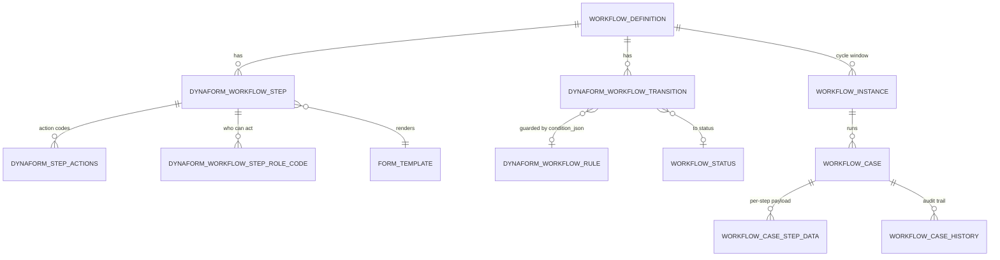

Field‑level evidence **[E]**:

- `DynaformWorkflowStep`: `stepCode`, `stepName`, `stepOrder`, `formTemplateId`, `isOpen`, role codes, actions.
- `DynaformWorkflowTransition`: `fromStepId`, `toStepId`, `toStatusId`, `fromStepActionId`, `ruleId`, `successMessage`, `failureMessage`, `priority`.
- `DynaformWorkflowRule`: `ruleCode`, `ruleName`, `conditionJson`, `severity`, `severityWarningMessage`, `severityColor`.
- `WorkflowInstance`: `effectiveOn`, `expireOn`, `isOpen`, `startedBy` — i.e. **assessment cycles/windows**.
- `WorkflowCaseHistory`: `action`, `fromStepId/toStepId`, `fromStatusId/toStatusId`, `transitionId`, `ruleId`, `ruleResult`, `metadataJson`, `performedBy`, `performedByOpenUser`, `performedAt`, `notes`.
- Event listeners: `listeners/audit.listener.ts`, `email.listener.ts`, `history.listener.ts`.
- Rule evaluation: `services/rule-engine.service.ts` (`json-logic-engine`), `condition-converter.service.ts`, `rule-evaluator.service.ts`, `transition-resolver.service.ts`.
- API: `/api/workflow-engine/{workflows, initiate/:workflowCode, pending-cases, all-cases, case/:caseId, submit-step, start-submit-step, case/:caseId/history, create-instance}` plus `public/*` variants.
- Reporting view: `vw_workflow_unified_cases` (migrations `20260225175713`, `20260619135500`, `20260623140000`, `20260624100000`, `20260625120000`).

**Path B strengths for Tax Assessment [R]:** cycle windows (`effective_on`/`expire_on`) map to assessment periods; the history table already records rule outcomes; transitions carry priorities and messages; everything is queryable in one SQL view. It has **no timers, no parallelism, no sub‑processes, no escalation events**.

### 5.3 Path C — Legacy Node `bpmn-engine` (returns pipeline)

**[E]** — `Backend/ifile-teapot-node-bpmnengine/` + `Backend/ifile-teapot-api-coreService/.../workflow/`. Uses the npm `bpmn-engine` v22 with IRIS extensions (`irisbpmn:taskType`, `userRoles`, `slaDuration`, `notificationInterval`, `endpoint`, `inputScript`, `outputScript`, `resumeSignal`), file/Postgres state persistence, host registry `TBL_BPMN_HOST`, failover, and a suspended‑call retry queue `TBL_SUSPENDED_API_CALLS`. Tables: `TBL_WORKFLOW_MASTER`, `TBL_WORKFLOW_VERSION` (DRAFT→PUBLISHED→EFFECTIVE), `TBL_WORKFLOW_TRACKER`, `TBL_WORKFLOW_RETURN_MAPPING`. User tasks materialise as `TBL_USER_TASK` with `TBL_USER_TASK_ROLE_MAPPING`, `TASK_STATUS`, `TASK_TYPE`, `DEADLINE_AT`, `IS_PAUSABLE`, `PAUSE_STATE`.

**[R]** Path C should **not** be used for Tax Assessment. It is coupled to the return‑upload pipeline and to a different modeler. However, `TBL_USER_TASK` + `DEADLINE_AT` + `TBL_SUSPENDED_API_CALLS` are useful precedents for SLA and retry design.

### 5.4 Engine selection recommendation

| Criterion | Path A (Flowable) | Path B (table‑driven) |
|---|---|---|
| Timers, escalation, boundary events, parallel/sub‑process | Yes (Flowable native) | No |
| Visual process journey for auditors/regulators | Yes | No |
| Configuration effort for a linear review chain | Higher | Lower |
| Consistency guarantees on the API side | Eventual (webhooks) | Transactional |
| Cycle/period windows out of the box | No | Yes (`WorkflowInstance`) |
| Rich queryable case history | Progress log + snapshot | `vw_workflow_unified_cases` + history table |

> **[R] Recommendation — dual‑track, not dual‑build.**
> - **MVP (Phases 1–4):** run the assessment lifecycle on **Path B**, because it is transactional, has cycle windows, has a rich history table, and needs no BPMN authoring skill. Statuses, steps, actions and role codes are pure configuration.
> - **From Phase 5 onward:** publish the *same* lifecycle as a **Path A** BPMN definition to gain statutory timers (objection windows, appeal windows, SLA escalation), parallel review, and the process‑journey view for audit defence.
> - Insulate the domain from the choice by putting a **single `TaxAssessmentCaseService`** in front of both, keyed by `tbl_tax_assessment_case.workflow_binding` (`{engine: 'STEP'|'BPMN', caseId|processInstanceId}`). Do this from day one so the Phase‑5 switch is not a rewrite.

---

## 6. Existing Reusable Capabilities

This section answers step 5 of the analysis brief: what exists, and how it is reused. Nothing here is proposed for rebuild.

### 6.1 Identity, roles and permissions

**[E]**

| Component | Path | Reuse for Tax Assessment |
|---|---|---|
| `UserMaster`, `UserRole` (`roleCode`, `roleName`, `roleType`, `regulatorIdFk`, `ownedByDepIdFk`, `entityIdFk`), `UserMasterRoleMapping`, `UserRoleEntityMapping`, `Department` | `Backend/ifile-teapot-component-orm/src/main/java/com/iris/ifile/teapot/model/` | Assessment roles are **existing `UserRole` rows with new `role_code`s** — no new role model |
| `Menu`, `ActionMenuMapping`, `Action` (10 VIEW / 20 EDIT / 30 FULL), `MenuRoleMap`, `MenuRoleActionMap`, `Menu.maxPermissionLevel` | same | Every assessment screen + API route gets a menu and action mapping via migration |
| Redis authorization cache `ifile:authorizationCache:{endpoint:*, endpoint:route:*, role:*:endpointIds, version, last_refresh_at}` | `coreService/.../authzcache/`, `Backend/ifile-teapot-api-dynaforms/docs/authorization-plan.md` | Assessment endpoints are authorised with zero new code once registered in `TBL_ACTION_MENU_MAPPING` |
| `AuthInterceptor` → `RequestContextStoreService.setLoggedInUserContext({userId, userName, roleCodes})`, `@Public()` | `Backend/ifile-teapot-api-dynaforms/src/auth/` | Assessment controllers inherit auth/authz automatically |
| `TeapotDynaformsAccessPolicy` | `src/dynaforms-integration/teapot-access.policy.ts` | Category‑scoped data access for assessment submissions |

### 6.2 Forms and submissions

Fully covered in §4. Reused unchanged for **all** assessment data capture. **[E]**

### 6.3 Workflow

Both engines described in §5, reused as configuration. **[E]**

### 6.4 Rules

**[E]**

| Component | Path | Reuse |
|---|---|---|
| `RuleEngineService` (`json-logic-engine`), `ConditionConverterService`, `RuleEvaluatorService.extractConditionDetails()` | `src/workflow-engine/services/` | Assessment routing rules, eligibility rules, escalation triggers |
| `tbl_dynaform_workflow_rule` (`condition_json`, `severity` LOW/MEDIUM/HIGH, warning message, colour) | `src/dynaform-workflow-rule/` | "Adjustment exceeds threshold → route to senior officer" |
| **Risk score engine**: `tbl_dynaform_risk_score_model` (versioned, `aggregation_strategy` SUM/WEIGHTED_SUM/MAX_DIMENSION/FORMULA, `status` DRAFT/PUBLISHED/ARCHIVED), `tbl_dynaform_risk_score_rule` (`condition_json`, `score_action`, `weight`, `dimension_code`, `max_contribution`, `priority`, `stop_processing`), `tbl_dynaform_risk_category_band`, `tbl_dynaform_risk_score_result` | `src/risk-score/`, `docs/rule-based-risk-score-engine-implementation-plan.md`, migrations `20260425120000`, `20260425121000` | **Case selection for assessment / audit risk scoring** — directly reusable with a new published model, zero code |
| Sequence‑flow condition builder (AST → JSON‑Logic) | `sequence-condition-builder.component.ts` + `JsonLogicConditionEvaluator.java` | BPMN gateway conditions on assessment outcomes |

> The risk‑score engine is the single most under‑appreciated reuse opportunity: **it already is a versioned, configurable, explainable, dimensioned scoring engine with published/draft lifecycle.** Tax risk‑based case selection needs configuration, not code. **[E]** for the engine; **[R]** for the use.

### 6.5 Tax‑domain assets already present

**[E]** — this is the decisive finding.

| Asset | Path | What it gives Tax Assessment |
|---|---|---|
| `POST /taxpayer-audit/audit-data` → `GTA.sp_get_taxpayer_audit_data(:tin, :years)` | `coreService/.../audit/{controller,service,transformer}` + `component-orm/.../repository/TaxpayerAuditRepository.java` | Year‑wise **operating revenues, operating expenses, other revenues, non‑operating costs, non‑deductible expenses, tax due, adjustments, losses carried forward**, plus `taxRate`, `serviceProvided`, `beneficiaryServices`, `currency`, `totalContractValue`, and **previous withholding‑tax statements** — for up to 5 assessment years |
| `POST /taxpayer-audit/validateTIN` | same | **TIN validation + taxpayer name resolution** |
| `TBL_AUDIT_PROCESS` (`audit_process_slug`, `tin`, `taxpayer_name`, `year_of_assessment` jsonb, `initiated_by_fk`, `fs_year_1..5` + `fs_*_file_path`, `tax_inspector_fk`, `expert_fk`, `head_of_section_fk` + `*_action_on`, `audit_status_fk`, **`audit_data_json` jsonb**, `prefill_excel_file_path`, `excel_generated`) | `component-orm/.../model/AuditProcess.java` | Proven case shape: subject + periods + role assignment slots + JSONB payload + generated artefact |
| `TBL_AUDIT_ACTION` (`action_type_fk`, `action_date`, `action_by_fk`, `action_role_fk`, `action_completed_on`, `remarks`, `json`, `previous_status_fk`, `new_status_fk`, `assign_to_fk`) | `.../model/AuditAction.java` | Proven **state‑transition audit record** |
| `TBL_AUDIT_STATUS`, `TBL_AUDIT_PROCESS_STATUS_MASTER` | same | Status masters |
| `/auditService/*` — 19 endpoints incl. `processTIN`, `initiateAuditProcess`, `editAuditProcess`, `assignTo`, `fetchAssignees`, `proceedToClosure`, `fetchAuditProcessData`, `downloadExcel`, `searchAuditProcesses`, `uploadFile`, `uploadImage`, `loadImage`, `removeImage`, `status` (OCR ratio) | `coreService/.../auditprocess/controller/AuditServiceController.java` | Proven API shape for a case‑based assessment process |
| Domain DTOs: `AssessmentDataDto`, `PresumptiveTaxAssessmentDto`, `AdjustmentDto`, `AuditorOpinionDto`, `ClarificationNoteDto`, `CarryForwardLossRowDto`, `DepreciationRowDto`, `ProvisionRowDto`, `ReconciliationRowDto`, `PeerComparisonDto`, `Part1GeneralInformationDto`…`Part3AuditFinancialDataAndItrDto` | `coreService/.../auditprocess/dto/` | **A complete, validated tax‑assessment field dictionary** — reuse as the source of the DynaForms field catalogue |
| `AuditExcelGenerationService` + `AuditExcelMappingConfig`, `ReconciliationConfig`, `FinancialItrInfoConfig`, `ExcelCellReference`, `JsonPathResolver` | `.../auditprocess/{service,config,util}` | Configurable JSON→Excel report generation |
| `OcrHelperService` | `.../auditprocess/service/impl/` | Financial‑statement PDF ingestion via OCR |
| Masters: `TaxPayerTypeMaster`, `CountryMaster`, `NationalityMaster`, `PercentageMaster`, `RelationshipTypeMaster`, `Currency`, `ProvisionType`, `FinancialYearFormat`, `Frequency`, `FrequencyPeriod`, `Holiday`, `DateMasterConfig` | `component-orm/.../model/` + `coreService/*master*` | Assessment dropdowns without new masters |
| Angular module `src/app/audit-journaling/` + 1,292‑line module documentation + 770‑line manual test suite + Playwright `demo-flow-1.spec.ts` | `Frontend/ifile-teapot-web-collect/src/app/audit-journaling/` | **The functional specification** for the assessment worksheet, formulas, RBAC matrix and status machine |

> **This changes the plan's centre of gravity.** The tax domain content largely exists. The work is to **re‑platform it onto DynaForms + workflow configuration** and to **extend it to the parts of the lifecycle it does not cover** (notice, communication, objection, appeal, reassessment, liability/payment, statutory deadlines). **[R]**

### 6.6 Filing and taxpayer data access

**[E]**

| Component | Path | Reuse |
|---|---|---|
| **DataQuest** — `POST /apiDataQuest/facts/extract` with `{filingDetails:{returnCode, entityCode, reportingEndDate}}`; resolves effective‑dated `DataConfig` rows (`data_code`, `source_return_code`, `filters[{concept, entity, period, unit, explicitMember[]}]`, `allow_provisional_filing`), locates the latest successful non‑error filing, reads the OIM JSON, and returns matched facts | `Backend/ifile-teapot-api-dataquest/` | **The configurable "retrieve filed return data" capability.** Assessment retrieves declared figures per concept per period without bespoke code |
| `ReturnsUploadDetails` (`return_id_fk`, `entity_id_fk`, `filing_status_id_fk`, `start_date`, `end_date`, `revised_filing_end_date`, `uploaded_date`, `previous_upload_id`, `frequency_period_id_fk`, `bpmn_process_id`) | `component-orm/.../model/ReturnsUploadDetails.java` | Links assessment to the **filed return** and its revision chain |
| `Return`, `ReturnType`, `ReturnGroup`, `Frequency`, `FrequencyPeriod`, `FilingCalendar` (window extension, grace days, holidays/weekends, e‑mail notification days), `FilingStatus` (`is_final_status`, `is_error`) | same | **Tax type, tax period and statutory due‑date computation** |
| `EntityBean` (`entity_code`, `entity_name`, sub‑category, company type, financial‑year format), `EntityDetail`, `UserEntityMapping`, `UserEntityReturnMapping` | same | **Taxpayer master** |
| `FilingHistoryView`, `CompletedReturnsUploadDetailsView`, `InProgressReturnsUploadDetailsView`, `MisPendingReturnFilingDetails`, `MisUpcomingReturnFilingDetails` | same | Compliance history for the assessment file |
| `NonXbrlDynaformPartialData`, `XBRLWebFormPartialData`, `DynaformReturnFormTemplateMapping`, `tbl_dynaform_return_form_template_mapping` | same + dynaforms migrations | Ties DynaForm submissions to returns |

### 6.7 Documents and evidence

**[E]**

| Component | Path | Reuse |
|---|---|---|
| Document store: `FileManagementController`, `FolderManagementController`, `DMSMetadata`, `FileAccessHistory`, `FileCheckSumUtil`, `CompressDecompressUtil`, `DocumentValidations`/`FileValidationHandler` | `Backend/ifile-teapot-api-documentstore/` | Evidence, financial statements, notices, objection attachments — with **checksum integrity and access history** |
| `TeapotDynaformsFileStorage` (atomic write via temp + rename, key validation, configurable roots) | `src/dynaforms-integration/teapot-file.storage.ts` | DynaForms `File` widget storage |
| `Attachment` + `Comments` (`ref_master_identifier_id_fk` + `ref_master_id_fk` polymorphic anchor, `for_completion`) | `component-orm/.../model/` | **Assessment notes, queries and their attachments against any assessment entity** |
| `form_template.is_dms`, `form_template_data.view_document_url`, `audit_trail_url` | dynaforms | DMS‑backed viewing and audit trail links |
| `ifile-teapot-api-digisign` (emSigner, eMudhra, Embridge), `SignStatus`, DynaForms `Signature` widget (fieldType 24) | `Backend/ifile-teapot-api-digisign/` | **Digitally signing the assessment notice / order** |

### 6.8 Notifications

**[E]**

| Component | Path | Reuse |
|---|---|---|
| Core: `TBL_EMAIL_ALERT` (`alert_type`, `is_group`, `menu_id_fk`, `to_expression`, `cc_expression`, `bcc_expression`), `EmailBody`, `EmailRoleMapping`, `EmailAlertRequest` + attachments, `EmailSentHistory`, `EmailTemplate`, `EmailFormatter`, `EmailAlertVariableKeyMapping`, `EmailUnsubscribe` | `component-orm` + `coreService/{email,emailSetting,emailtemplate,emailalertrequest}` | Notification without code |
| DynaForms mirror: `tbl_dynaform_email_alert` / `_body` (per `language_code`) / `_role_mapping` / `_alert_request` / `_sent_history` + `DynaformEmailScheduler` + `DynaformEmailBodyTransformerService` + `DynaformUserEmailResolverService` | `src/common/dynaform-email/` | Assessment alerts, **multi‑language bodies**, role‑resolved recipients, delivery history |
| Registered alert types (evidence of the pattern) | migrations `20260429193000` (`field.emailAlert.fitProper.initiated`), `20260519143000` (`field.emailAlert.dynaform.submitted`), `20260619125000` (custom workflow step) | New alert types added by migration |
| SMS: `SMSGatewayProperty`, `SMSHistory`; OTP: `OTPSetting`, `OTPHistory` | `component-orm` | Optional taxpayer channels |
| In‑app: `NotificationController` | `coreService/notification/` | Portal notifications |

### 6.9 Audit and history

**[E]**

| Mechanism | Path | What it captures |
|---|---|---|
| `HistoryTableMaster` (`TBL_HISTORY_MASTER`: `table_name`, `master_ref_fk`, `snapshot` CLOB, `last_updated_on`), `HistoryTableMapping`, `HistoryFKTransformations`, `SnapshotDAO` | `Backend/ifile-teapot-component-history-plugin/` | **Generic before/after row snapshots for any registered table** |
| `tbl_dynaform_workflow_case_history` | `src/workflow-engine/models/workflow-case-history.model.ts` | Step/status transitions, transition + rule + rule result, `metadata_json`, actor, notes |
| `tbl_dynaform_engine_activity_progress` | `src/workflow-engine-v2/models/` | BPMN activity trace |
| `TBL_AUDIT_ACTION` | `component-orm` | Tax audit action ledger with previous/new status |
| `HttpTraceEventLog`, `HttpTraceLogUrlConfiguration`, `ApiLogBatchScheduler`, `ExternalApiLogs` | `component-auditor-plugin`, `api-auditor` | API‑level audit, configurable per URL, batched |
| `ExceptionTraceLog`, `ExceptionLogConfig` | `component-orm`, dynaforms `exception-config` migration | Error auditing |
| `EmailSentHistory`, `FileAccessHistory`, `license_event` | various | Communication + document + artefact access audit |
| UI: `it-admin/audits`, `it-admin/audit-timeline`, `it-admin/exception-trace-logs` | `web-collect` routes | Existing audit viewers |

### 6.10 Lifecycle artefact generation (the Licence pattern)

**[E]** — `Backend/ifile-teapot-api-dynaforms/src/license/`

This is the closest existing analogue to **assessment notice / assessment order** generation and the post‑decision lifecycle:

- `tbl_dynaform_license`: `form_template_data_id`, `license_reference_number`, `status`, `effective_date`, `expiration_date`, `previous_license_number`, `renewal_license_number`, `qr_data`, `key_binding`, `other_data`.
- Related tables: `license_suspension`, `license_revocation` (+ attachments), `license_reactivation`, `license_event` (`VIEW`/`DOWNLOAD`/`RENEW_CLICK`/`RENEW_SUCCESS`/`API_ERROR`), `license_filing_scope`.
- `LicenseService.generateLicense()` renders an HTML certificate template with key bindings, generates a **QR code**, produces a **PDF via Puppeteer**, stores artefacts under a per‑submission path, and exposes a **public verification HTML** page.
- `LicenseSchedulerService.handleStatusTransitions()` performs date‑driven status changes.
- Six dashboard endpoints (`summary`, `trends`, `expiry-buckets`, `renewal-funnel`, `risk`, `cross-category`) built on raw SQL over `tbl_dynaform_license` ⨝ `form_template_data` ⨝ `form_template`.
- Reference numbers generated from `tbl_dynaform_category.license_ref_gen_pattern` (e.g. `FPA{SEQ:10}`).

> **[R]** Assessment notices should reuse this machinery by **generalising it**, not by copying it: extract the template‑render + QR + PDF + reference‑number + verification‑page pipeline into a reusable "issued document" service, with `license` as its first consumer and `assessment notice` as its second.

### 6.11 Case‑management precedent (Fit & Proper)

**[E]** — `src/form-templates/fp-*.model.ts`, `src/fp-commitee-opinion/`, `src/fit-proper-dashboard/`, `docs/rbi-fit-proper-assessment-implementation-plan.md`, `technical-resources/.../fit-proper-initiation-requirements.md`

| Table | Columns of interest |
|---|---|
| `tbl_fit_proper_initiation` | `form_template_id`, `cycle_schedule_id`, `return_id`, `filing_id_fk`, **`trigger_initiation_path`**, **`assignment_mode`**, `initiation_notes` |
| `tbl_fp_initiation_user_assignment` | `initiation_id`, `user_id`, `form_template_data_id`, `filing_id` |
| `tbl_fp_cycle_schedule` | `assignment_mode`, `assigned_entity_ids[]`, `assigned_user_ids[]`, `cycle_value`, `cycle_unit`, `last_run_date`, `status` |
| `tbl_fp_commitee_opinion` | `fp_initiation_user_assignment_id`, `notes`, **`vote`** |

Four documented initiation paths — *new licence, ongoing monitoring, ad‑hoc supervisory action, cycle‑based trigger* — plus a `FpSchedulerService`, a dashboard, and e‑mail alerts. **[E]**

> **[R]** Tax Assessment initiation is structurally identical: *risk‑based selection, random selection, filing‑anomaly trigger, campaign/cycle trigger, taxpayer‑request trigger, non‑filer trigger*. Model it on `tbl_fit_proper_initiation` + `tbl_fp_cycle_schedule`, not from scratch.

### 6.12 Search, grids, dashboards, export

**[E]**

| Component | Path | Reuse |
|---|---|---|
| `GridColDefs` / `tbl_grid_col_defs` (`grid_key_name`, `col_defs`), `GridConfigurationController` | `component-orm`, `coreService/grid/`, `dynaforms src/grid-defs/` | **Configurable assessment list columns** |
| CSV export convention `GET /<domain>/search…/downloadcsv/{gridKeyName}` | `AuditServiceController` | Assessment register export |
| XLSX export/import for templates | dynaforms `templates.controller.ts` | Bulk template management |
| `vw_workflow_unified_cases`, `vw_dynaform_engine_*` views | dynaforms migrations | **Single search surface across workflow cases** |
| Dashboards: `fit-proper-dashboard`, `license-dashboard`, `chart`, `dashboard`, `sysdashboard`, `entityDashboard`, SLA dashboard UI at `/dashboard/sla` | dynaforms + coreService + web-collect | Assessment dashboards by reuse of the category‑dashboard pattern (`category.dashboardEnable`) |
| Server‑side pagination + criteria search filters (`*CriteriaSearchFilter.java`) | coreService per domain | Assessment register filtering |

### 6.13 Localisation

**[E]** `DisplayKey`, `DisplayKeyLabel`, `LanguageMaster`, `MasterLabel`, dynaforms `display-key` / `display-label` / `translations` / `language-master` modules, per‑language e‑mail bodies, `rtl.scss`, `dynaforms-rtl-audit-2026-03-31.md`, `add-dynaform-multi-language-display-keys` migration.

Every assessment label, error and notice must be a display key. **[R]**

---

## 7. Tax Assessment Domain Overview

### 7.1 Generic concepts (jurisdiction‑neutral core)

These belong in the platform data model and process. **[R]**

| Concept | Definition used in this plan |
|---|---|
| **Taxpayer** | Legal or natural person subject to tax; maps to `EntityBean` (+ individual extension) |
| **TIN** | Jurisdiction‑issued identifier; format is configuration |
| **Tax type** | CIT, PIT, VAT, WHT, excise, etc.; maps to `ReturnType` / `Return` |
| **Tax period** | The period assessed (`start_date`/`end_date`); maps to `FrequencyPeriod` |
| **Assessment year** | Label for the year of assessment; already present as `TBL_AUDIT_PROCESS.YEAR_OF_ASSESSMENT` |
| **Tax return / filed return** | The taxpayer's declaration; `ReturnsUploadDetails` + facts via DataQuest |
| **Declared figures** | Amounts as filed |
| **Assessed figures** | Amounts as determined by the authority |
| **Assessment item** | One line of the assessment (a concept, e.g. "operating revenue") carrying declared vs assessed vs difference |
| **Adjustment** | A change from declared to assessed, with type, reason code, amount, evidence, officer opinion |
| **Taxable base** | Assessed income / turnover / value after adjustments |
| **Tax liability** | Base × rate structure |
| **Credits / WHT / advance tax / payments** | Amounts reducing liability |
| **Penalty / interest** | Statutory additions |
| **Net payable / refundable** | Final position |
| **Assessment decision** | The determination (no change / additional / refund / nil) |
| **Assessment notice / order** | The served legal instrument |
| **Service of notice** | The act and proof of delivery, and the date from which appeal periods run |
| **Objection** | First‑instance challenge to the authority |
| **Appeal** | Escalation to tribunal/court/higher authority |
| **Settlement / agreed assessment** | Negotiated closure |
| **Reassessment / revision / amended assessment** | New assessment superseding a prior one |
| **Closure** | Terminal state; case archived |
| **Statutory deadline** | Time limit governing an action |
| **Limitation period** | Time limit on the authority's power to assess/reassess |

### 7.2 Assessment archetypes to support

**[R]** — the design must accommodate all of these through configuration:

| Archetype | Characteristics |
|---|---|
| **Self‑assessment acceptance** | Return accepted as filed; system‑generated, no officer |
| **Desk / summary assessment** | Automated checks + officer confirmation; adjustments from arithmetic and matching |
| **Best‑judgement / presumptive assessment** | Officer determines base from indirect evidence (already implemented as `PresumptiveTaxAssessmentDto`) **[E]** |
| **Audit‑based assessment** | Full field/desk audit → adjustments (the current Audit Journaling module) |
| **Non‑filer assessment** | No return filed; base estimated |
| **Amended / reassessment** | Triggered by new information, appeal outcome, or taxpayer application |
| **Protective / provisional assessment** | Interim liability pending final determination |

### 7.3 Generic vs jurisdiction‑specific split

**[R]** — the core design decision for reusability.

| Aspect | Generic (platform) | Jurisdiction‑specific (configuration) |
|---|---|---|
| Case, item, adjustment, decision, notice, objection, appeal entities | ✔ | — |
| State machine skeleton (draft→review→approve→issue→dispute→close) | ✔ | State names, extra states, transition permissions |
| Role concept and permission checks | ✔ | Role codes, hierarchy, approval thresholds, delegation rules |
| Adjustment classification | ✔ (type + reason code + amount + evidence) | The reason‑code catalogue |
| Calculation *pipeline* (base → liability → credits → penalty → interest → net) | ✔ | Rates, slabs, thresholds, rounding, day‑count, minimum tax, surcharges, cess |
| Deadlines *engine* (event + offset + calendar) | ✔ | Objection window, appeal window, limitation period, holidays |
| Notice *generation* | ✔ (template + merge + PDF + sign + serve + verify) | Notice templates, legal wording, languages, statutory references |
| Numbering | ✔ (pattern generator) | The pattern |
| Currency and rounding | ✔ | Currency code, decimal places, rounding rule |
| Interest computation *engine* | ✔ | Rate schedule with effective dates, compounding, grace |
| Evidence and audit | ✔ | Retention periods |

---

## 8. Tax Assessment Functional Scope

### 8.1 Lifecycle overview

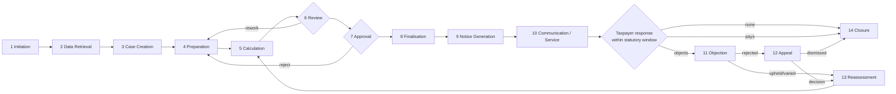

### 8.2 Stage‑by‑stage specification

For each stage: objective, actors, inputs, outputs, DynaForms, workflow tasks, gateways, validations, rules, data, APIs, notifications, audit, exceptions, escalation, status transitions.

---

#### Stage 1 — Assessment Initiation

| | |
|---|---|
| **Objective** | Create a candidate assessment for a taxpayer / tax type / period and decide whether it proceeds |
| **Actors** | System scheduler, Tax Officer, Supervisor; (taxpayer, for taxpayer‑requested revisions) |
| **Inputs** | Selection criteria, risk score, filing anomaly, campaign definition, manual request |
| **Outputs** | `tbl_tax_assessment_case` row in `INITIATED`; workflow case/process started |
| **DynaForms** | *Assessment Initiation Form* (trigger path, tax type, period(s), TIN, reason, priority, proposed officer) |
| **Workflow** | Start event (message/timer/manual) → service task `resolveTaxpayer` → user task `Confirm Initiation` (optional) |
| **Gateways** | `triggerPath` ∈ {RISK, RANDOM, ANOMALY, CAMPAIGN, TAXPAYER_REQUEST, NON_FILER, COURT_DIRECTION} |
| **Validations** | TIN exists and is active; period is closed for filing; no open assessment for same (TIN, taxType, period) unless reassessment; within limitation period |
| **Business rules** | Risk score ≥ band threshold; campaign membership; officer workload cap; conflict‑of‑interest exclusion |
| **Data** | TIN, taxpayer name, tax type, period, assessment year, trigger path, risk score + model version, priority, statutory limitation date |
| **APIs — reuse [E]** | `POST /taxpayer-audit/validateTIN`; `GET /api/formTemplates/assignable-users`, `/:id/assignable-entities`; `POST /api/workflow-engine/initiate/:workflowCode`; risk‑score APIs under `src/risk-score/` |
| **APIs — new [R]** | `POST /api/tax-assessment/cases` (create case + bind workflow); `POST /api/tax-assessment/selection/run` (batch selection) |
| **Notifications** | Alert type `field.emailAlert.taxAssessment.initiated` → assigned officer + supervisor |
| **Audit** | Case creation, trigger path, selection model + version, selection score, selector identity |
| **Exceptions** | TIN not found; duplicate open case; limitation expired; no eligible officer |
| **Escalation** | Unassigned > N days → supervisor |
| **Status** | `—` → `INITIATED` |

---

#### Stage 2 — Taxpayer and Filing Data Retrieval

| | |
|---|---|
| **Objective** | Assemble the authoritative evidence pack: taxpayer profile, filing history, declared figures, payments, prior assessments |
| **Actors** | System (service tasks); Tax Officer (manual supplement) |
| **Inputs** | TIN, tax type, period(s) |
| **Outputs** | Immutable **evidence snapshot** stored on the case |
| **DynaForms** | *Taxpayer Information Form* — read‑only, prefilled |
| **Workflow** | Service tasks: `fetchTaxpayerProfile`, `fetchFilingHistory`, `fetchDeclaredFacts`, `fetchPayments`, `fetchPriorAssessments`, `fetchAuditFindings` |
| **Gateways** | Return filed? → desk/audit path; not filed → non‑filer path |
| **Validations** | At least one successful non‑error filing for the period, unless non‑filer path; snapshot completeness |
| **Business rules** | Use latest **final, non‑error** filing; honour `allow_provisional_filing`; revised returns supersede |
| **Data** | Entity profile, `ReturnsUploadDetails` rows, DataQuest facts, GTA stored‑function figures, payment/WHT records, prior `TBL_AUDIT_PROCESS`/assessment cases |
| **APIs — reuse [E]** | `POST /apiDataQuest/facts/extract`; `POST /taxpayer-audit/audit-data`; entity/return search APIs in coreService; `GET /api/formTemplateData/getByUUID/:uuid` |
| **APIs — new [R]** | `POST /api/tax-assessment/cases/:id/evidence/refresh`; `GET /api/tax-assessment/cases/:id/evidence` |
| **Notifications** | On retrieval failure → officer + IT |
| **Audit** | Source system, query parameters, retrieval timestamp, **hash of retrieved payload** |
| **Exceptions** | Source unavailable; no filing; conflicting revisions; stale data |
| **Escalation** | Retry with backoff; after N failures raise an exception task |
| **Status** | `INITIATED` → `DATA_READY` |

> **[R] Immutability requirement.** The evidence snapshot must be frozen at retrieval and versioned. An assessment defended in court must be reproducible from the data as it stood. `previous_form_template_data_uuid` and an append‑only evidence table give this.

---

#### Stage 3 — Assessment Case Creation

| | |
|---|---|
| **Objective** | Materialise the working case: number it, scope it, assign it |
| **Actors** | System; Supervisor / Team Lead |
| **Inputs** | Initiation + evidence snapshot |
| **Outputs** | Case number, scope (tax type + period + items), assigned assessor, statutory dates |
| **DynaForms** | *Assessment Case Creation Form* (scope, assessment type, complexity, target date, assignment) |
| **Workflow** | Service task `generateCaseNumber` → user task `Assign Assessor` |
| **Gateways** | Assessment type → DESK / AUDIT / BEST_JUDGEMENT / NON_FILER / AMENDED |
| **Validations** | Assessor has the assessor role and no conflict; target date ≤ limitation date |
| **Business rules** | Number pattern from category config (reuse `license_ref_gen_pattern` mechanism **[E]**); complexity drives approval threshold |
| **APIs — reuse [E]** | `FormTemplatesDataService.generateLicenseReferenceNumber()` pattern; `GET /api/formTemplates/assignable-users` |
| **APIs — new [R]** | `POST /api/tax-assessment/cases/:id/assign` |
| **Notifications** | Assignment notice to assessor |
| **Audit** | Number allocation, assignment, scope |
| **Status** | `DATA_READY` → `ASSIGNED` |

---

#### Stage 4 — Assessment Preparation

| | |
|---|---|
| **Objective** | Record the officer's findings, adjustments and evidence |
| **Actors** | Tax Assessor; Taxpayer (responding to information requests) |
| **Inputs** | Evidence pack, taxpayer submissions, third‑party data |
| **Outputs** | Assessment items, adjustments with reasons and evidence, officer opinion, information‑request log |
| **DynaForms** | *Assessment Details Form*; *Income / Tax Base Form*; *Adjustment Form* (repeating table); *Supporting Documents Form*; *Information Request / Clarification Form* (taxpayer‑facing) |
| **Workflow** | User task `Prepare Assessment` (loop) with boundary timers; optional sub‑process `Request Information` (send → wait → receive → evaluate) |
| **Gateways** | Clarification required? Response received in time? |
| **Validations** | Every adjustment has type, reason code, amount, period, and (per config) mandatory evidence and narrative; adjusted values within tolerance; totals reconcile |
| **Business rules** | Adjustment reason catalogue is configurable; evidence mandatory above a threshold amount; taxpayer response window per statute |
| **Data** | Declared vs assessed per item, adjustment rows, evidence file references, clarification notes |
| **APIs — reuse [E]** | `POST /api/formTemplateData/createOrUpdate`; `POST /api/files/upload`; `POST /api/bpmn/submit-task` or `POST /api/workflow-engine/submit-step`; Comments/Attachment APIs in coreService |
| **APIs — new [R]** | `POST /api/tax-assessment/cases/:id/adjustments` (validated persistence into `tbl_tax_assessment_adjustment`) |
| **Notifications** | Information request to taxpayer; reminder before response deadline; escalation on non‑response |
| **Audit** | Every field change (old → new), evidence upload, clarification sent/received |
| **Exceptions** | Taxpayer non‑response; contradictory evidence; assessor unavailable |
| **Escalation** | Non‑response → best‑judgement path; assessor inactivity → reassign |
| **Status** | `ASSIGNED` → `IN_PREPARATION` (⇄ `AWAITING_TAXPAYER`) |

---

#### Stage 5 — Assessment Calculation

| | |
|---|---|
| **Objective** | Produce the authoritative liability computation |
| **Actors** | System (authoritative); Assessor (inputs and override with justification) |
| **Inputs** | Assessed base after adjustments, credits, payments, dates |
| **Outputs** | Computation result: taxable base, tax before credits, credits, tax after credits, penalty, interest, net payable/refundable — with a full, stored trace |
| **DynaForms** | *Tax Calculation Form* — read‑only computed values, with formula widgets for indicative on‑screen figures only; *Penalty and Interest Form* |
| **Workflow** | Service task `calculateAssessment` (idempotent, re‑runnable) |
| **Gateways** | Net position → payable / refund / nil |
| **Validations** | Rate set effective for the period exists; currency consistent; no negative base unless loss allowed; refund ≤ payments |
| **Business rules** | **All jurisdiction‑specific — must be configuration.** Rate/slab tables, minimum tax, surcharge/cess, rounding, loss set‑off order and expiry, credit ordering, penalty basis (fixed / % of tax / greater‑of), interest rate schedule with day count and compounding, grace periods |
| **APIs — new [R]** | `POST /api/tax-assessment/cases/:id/calculate` → `{result, trace[], ruleSetVersion}`; `POST /api/tax-assessment/calculate/preview` (what‑if, no persistence) |
| **APIs — reuse [E]** | `POST /api/formula/evaluate-batch` for indicative UI figures |
| **Notifications** | Calculation failure → assessor |
| **Audit** | Rule‑set code + version, inputs hash, each pipeline step's intermediate value, overrides with justification and actor |
| **Exceptions** | No effective rate set; ambiguous overlapping rules; divide‑by‑zero; currency mismatch |
| **Escalation** | Configuration error → tax‑configuration administrator |
| **Status** | `IN_PREPARATION` → `CALCULATED` |

> **[R] Non‑negotiable design rules for calculation:**
> 1. Server‑side only; the renderer never computes the legal figure.
> 2. Exact decimal arithmetic (`NUMERIC`/`BigDecimal`), never floating point.
> 3. Every run stores an explainable trace (mirroring the risk engine's explainability pattern **[E]**).
> 4. Rule sets are **versioned and effective‑dated**; a case pins the version it used.
> 5. Recalculation must be idempotent and must produce a new versioned result, never overwrite.

---

#### Stage 6 — Assessment Review

| | |
|---|---|
| **Objective** | Independent quality and legal check before approval |
| **Actors** | Tax Reviewer / Senior Tax Officer |
| **Inputs** | Prepared case + computation |
| **Outputs** | Review outcome (accept / return for rework / escalate), review comments per item |
| **DynaForms** | *Assessment Review Form* (checklist, per‑adjustment concurrence, comments, recommendation) |
| **Workflow** | User task `Review Assessment` + exclusive gateway on `actionCode` |
| **Gateways** | `APPROVE` / `RETURN` / `ESCALATE` |
| **Validations** | Reviewer ≠ preparer (segregation of duties); all mandatory checklist items answered; comments mandatory on `RETURN` |
| **Business rules** | Review mandatory above a monetary threshold; second review for complex cases; time limit for review |
| **APIs — reuse [E]** | Active‑task list + submit APIs (`/api/bpmn/active-tasks`, `/api/bpmn/submit-task`); `tbl_dynaform_workflow_rule` for threshold routing |
| **Notifications** | Task assigned; rework returned to assessor; SLA warning |
| **Audit** | Reviewer identity, decision, comments, timestamps, elapsed time |
| **Exceptions** | Reviewer conflict of interest; reviewer absent |
| **Escalation** | Timer boundary event → supervisor reassignment |
| **Status** | `CALCULATED` → `UNDER_REVIEW` → (`REVIEW_RETURNED` \| `REVIEWED`) |

---

#### Stage 7 — Assessment Approval

| | |
|---|---|
| **Objective** | Obtain the authority to issue |
| **Actors** | Approver / Head of Section / Commissioner (by threshold) |
| **Inputs** | Reviewed case |
| **Outputs** | Approval decision, digital sign‑off, approval conditions |
| **DynaForms** | *Assessment Approval Form* (decision, conditions, remarks, signature widget) |
| **Workflow** | User task `Approve Assessment`; multi‑level via gateway on threshold |
| **Gateways** | Amount ≥ threshold₁ → level 2; ≥ threshold₂ → level 3 |
| **Validations** | Approver level ≥ required level; delegation valid and within its window; signature captured where required |
| **Business rules** | **Approval thresholds are configuration.** Delegation rules (who may act for whom, for how long). Segregation of duties |
| **APIs — reuse [E]** | `PATCH /api/formTemplateData/updateStatus` (approve/reject with `approved_by` + `comment`); digisign APIs |
| **APIs — new [R]** | `POST /api/tax-assessment/cases/:id/approve` \| `/reject` (records level, delegation, signature reference) |
| **Notifications** | Approval request; approved/rejected outcome to assessor |
| **Audit** | Approver, level, delegation used, decision, conditions, signature id |
| **Exceptions** | Approver unavailable; threshold changed mid‑case |
| **Escalation** | Timer → next approver in hierarchy |
| **Status** | `REVIEWED` → `PENDING_APPROVAL` → (`APPROVED` \| `REJECTED`) |

---

#### Stage 8 — Assessment Finalisation

| | |
|---|---|
| **Objective** | Freeze the assessment as a legal determination |
| **Actors** | System |
| **Inputs** | Approved case |
| **Outputs** | Immutable assessment record + version; liability posted |
| **DynaForms** | *Assessment Decision Form* (read‑only summary) |
| **Workflow** | Service tasks `freezeAssessment`, `postLiability`, `computeStatutoryDates` |
| **Validations** | All mandatory data present; computation matches approved figures; no open clarification |
| **Business rules** | Finalisation locks the case for editing; supersession of a prior assessment recorded; statutory objection/appeal windows computed from the **service date**, not the finalisation date |
| **APIs — new [R]** | `POST /api/tax-assessment/cases/:id/finalise`; `POST /api/tax-assessment/cases/:id/liability` (or integration to an external revenue‑accounting system) |
| **Notifications** | Internal confirmation |
| **Audit** | Finalisation event, version number, superseded case reference |
| **Exceptions** | Liability posting failure → compensating action, case held in `FINALISATION_FAILED` |
| **Status** | `APPROVED` → `FINALISED` |

---

#### Stage 9 — Assessment Notice Generation

| | |
|---|---|
| **Objective** | Produce the legally serviceable instrument |
| **Actors** | System; Authorised signatory |
| **Inputs** | Finalised assessment |
| **Outputs** | Notice number, rendered PDF (multi‑language), digital signature, verification QR, stored artefact |
| **DynaForms** | *Assessment Notice Form* — merge fields; notice HTML template per notice type per language |
| **Workflow** | Service tasks `renderNotice`, `signNotice`, `storeNotice` |
| **Gateways** | Notice type: additional assessment / refund / nil / amended / best‑judgement |
| **Validations** | Template exists for (notice type, language, jurisdiction); all merge fields resolvable; signature succeeded |
| **Business rules** | Notice numbering pattern; mandatory statutory content blocks; language(s) per taxpayer preference |
| **APIs — reuse [E]** | Licence render pipeline (`LicenseService.generatePdf`, Puppeteer, QRCode, verification HTML) — to be generalised; digisign controllers |
| **APIs — new [R]** | `POST /api/tax-assessment/cases/:id/notices` ; `GET /api/tax-assessment/notices/:number/pdf` ; `GET /public/tax-assessment/verify/:number` |
| **Notifications** | Notice ready for despatch |
| **Audit** | Template + version used, merge data, signature id, artefact checksum |
| **Exceptions** | Render/sign failure → retry, then manual task |
| **Status** | `FINALISED` → `NOTICE_GENERATED` |

---

#### Stage 10 — Taxpayer Communication / Service of Notice

| | |
|---|---|
| **Objective** | Serve the notice and prove service; start statutory clocks |
| **Actors** | System; Despatch officer; Taxpayer |
| **Inputs** | Notice artefact, taxpayer contact and preference |
| **Outputs** | Delivery records per channel, **service date**, acknowledgement |
| **DynaForms** | *Notice Despatch Form* (channels, addresses, dispatch reference); taxpayer portal view |
| **Workflow** | Service tasks `sendEmail`, `publishToPortal`, `sendSms`, optional user task `Record Physical Service`; intermediate catch for acknowledgement |
| **Gateways** | Channel selection; acknowledgement received? |
| **Validations** | At least one valid channel; e‑mail deliverable; portal account active |
| **Business rules** | **Deemed service rules are jurisdiction configuration** (e.g. portal publication = service; post = service + N days) |
| **APIs — reuse [E]** | `tbl_dynaform_email_alert` + `_body` + `_alert_request` + `_sent_history` + `DynaformEmailScheduler`; `ifile-teapot-api-mail`; SMS gateway; `NotificationController`; `license_event` view/download tracking pattern |
| **APIs — new [R]** | `POST /api/tax-assessment/notices/:id/serve`; `GET /api/tax-assessment/notices/:id/service-proof` |
| **Notifications** | Notice to taxpayer; internal despatch confirmation; reminder before the objection deadline expires |
| **Audit** | Per‑channel send record, bounce/failure, open/download event, acknowledgement, computed service date |
| **Exceptions** | Bounced e‑mail; unreachable taxpayer; portal not activated |
| **Escalation** | Failed service → alternative channel → physical service task |
| **Status** | `NOTICE_GENERATED` → `NOTICE_SERVED` → `AWAITING_TAXPAYER_RESPONSE` |

---

#### Stage 11 — Objection / Dispute

| | |
|---|---|
| **Objective** | Handle a first‑instance challenge |
| **Actors** | Taxpayer; Objection Officer; Objection Review Committee; Approver |
| **Inputs** | Objection application, grounds, supporting documents, disputed items |
| **Outputs** | Objection decision (allowed / partly allowed / rejected), revised figures where applicable |
| **DynaForms** | *Objection Form* (taxpayer‑facing, public or authenticated); *Objection Assessment Form* (officer); *Objection Decision Form* |
| **Workflow** | Separate workflow `TAX_ASSESSMENT_OBJECTION`, linked to the parent case: `Validate Admissibility` → `Assign Objection Officer` → `Examine` → `Committee Opinion` (reuse voting pattern) → `Decide` → `Issue Objection Decision Notice` |
| **Gateways** | Admissible? (filed in time, fee/deposit paid, grounds stated); outcome branch |
| **Validations** | Filed within window from **service date**; disputed items belong to the case; required deposit satisfied |
| **Business rules** | Objection window, extension/condonation rules, deposit percentage, stay of collection, decision deadline — **all configuration** |
| **APIs — reuse [E]** | `POST /api/workflow-engine/start-submit-step` / `public/start-submit-step` for taxpayer‑initiated objections; `tbl_fp_commitee_opinion` voting pattern; Comments/Attachment |
| **APIs — new [R]** | `POST /api/tax-assessment/cases/:id/objections`; `GET /api/tax-assessment/objections/:id` |
| **Notifications** | Objection received (ack to taxpayer); assignment; hearing notice; decision |
| **Audit** | Filing date vs deadline, admissibility decision, committee votes, decision and reasons |
| **Exceptions** | Late filing; incomplete grounds; withdrawal |
| **Escalation** | Decision deadline breach → supervisory escalation (some jurisdictions deem an objection allowed on breach — must be configurable) |
| **Status** | `AWAITING_TAXPAYER_RESPONSE` → `UNDER_OBJECTION` → (`OBJECTION_ALLOWED` \| `OBJECTION_PARTLY_ALLOWED` \| `OBJECTION_REJECTED`) |

---

#### Stage 12 — Appeal

| | |
|---|---|
| **Objective** | Track escalation to tribunal / court / higher authority and implement its outcome |
| **Actors** | Taxpayer; Legal / Appeals Officer; External appellate authority |
| **Inputs** | Appeal filing, objection decision, case bundle |
| **Outputs** | Appeal record, hearing schedule, appellate decision, implementation instruction |
| **DynaForms** | *Appeal Form*; *Appeal Hearing Record*; *Appellate Decision Form* |
| **Workflow** | Workflow `TAX_ASSESSMENT_APPEAL`: `Register Appeal` → `Prepare Bundle` → `Track Hearings` (loop with timers) → `Record Decision` → `Implement Decision` |
| **Gateways** | Decision: upheld / varied / set aside / remanded |
| **Validations** | Appeal window from objection‑decision service date; forum/jurisdiction valid; bundle complete |
| **Business rules** | Appeal window, forum hierarchy, deposit, stay of collection, remand handling |
| **APIs — new [R]** | `POST /api/tax-assessment/cases/:id/appeals`; `POST /api/tax-assessment/appeals/:id/decision` |
| **Integrations [A]** | Court/tribunal case‑management systems are not present in this repository; treat as external, likely manual entry in v1 |
| **Notifications** | Hearing dates, filing deadlines, decision recorded |
| **Audit** | Full appeal chronology, documents, decision text |
| **Escalation** | Missed hearing/filing deadlines |
| **Status** | `OBJECTION_REJECTED` → `UNDER_APPEAL` → (`APPEAL_UPHELD` \| `APPEAL_VARIED` \| `APPEAL_SET_ASIDE` \| `APPEAL_REMANDED`) |

---

#### Stage 13 — Reassessment / Revised Assessment

| | |
|---|---|
| **Objective** | Produce a new assessment superseding the previous one |
| **Actors** | Tax Officer; Approver; System |
| **Inputs** | Trigger: appellate/objection outcome, new information, error rectification, taxpayer application |
| **Outputs** | New assessment case linked to the predecessor; revised liability; revised notice |
| **DynaForms** | *Reassessment Form* (reason, statutory basis, items reopened) — prefilled from the predecessor |
| **Workflow** | Re‑entry to Stages 4–10 with `assessmentType = AMENDED` and `predecessorCaseId` set |
| **Gateways** | Within limitation? Full or partial reopening? |
| **Validations** | Statutory ground cited; within limitation (with extension rules for fraud/concealment); predecessor is `FINALISED` or later |
| **Business rules** | Limitation periods, permitted grounds, whether penalty/interest recomputes from the original due date |
| **APIs — reuse [E]** | `POST /api/formTemplateData/clone/:uuid` + `previous_form_template_data_uuid` chain |
| **APIs — new [R]** | `POST /api/tax-assessment/cases/:id/reassess` |
| **Notifications** | Reassessment initiated; revised notice |
| **Audit** | Trigger, statutory ground, predecessor link, delta between versions |
| **Status** | any terminal‑ish state → `REASSESSMENT_INITIATED` → normal flow with `version = n+1` |

---

#### Stage 14 — Assessment Closure

| | |
|---|---|
| **Objective** | Close the case and set retention |
| **Actors** | System; Supervisor |
| **Inputs** | Payment settled / refund issued / dispute exhausted / time‑barred |
| **Outputs** | Closed case, closure reason, retention date |
| **DynaForms** | *Closure Form* (reason, remarks) |
| **Workflow** | User task `Confirm Closure` → service task `Archive` |
| **Validations** | No open objection/appeal; no outstanding balance unless written off; all documents archived |
| **Business rules** | Auto‑closure after N days with no response; write‑off authority thresholds |
| **APIs — new [R]** | `POST /api/tax-assessment/cases/:id/close` |
| **Notifications** | Closure confirmation to taxpayer where required |
| **Audit** | Closure reason, actor, final balances |
| **Status** | → `CLOSED` (or `TIME_BARRED`, `WRITTEN_OFF`) |

---

## 9. Actors, Roles and Permissions

### 9.1 Existing role model — how it works

**[E]**

- Roles are rows in `TBL_USER_ROLE` with `ROLE_CODE`, `ROLE_NAME`, `ROLE_TYPE_FK`, optional `REGULATOR_ID_FK` (department), `OWNED_BY_DEP_ID_FK`, `ENTITY_ID_FK`.
- Users map to roles via `TBL_USER_MASTER_ROLE_MAPPING`; roles map to entities via `TBL_USER_ROLE_ENTITY_MAPPING`.
- Screen access: `TBL_MENU` ⨝ `TBL_MENU_ROLE_MAP` ⨝ `TBL_MENU_ROLE_ACTION_MAP` ⨝ `TBL_ACTION` (10 VIEW, 20 EDIT, 30 FULL, hierarchical), bounded by `TBL_MENU.MAX_PERMISSION_LEVEL`.
- API access: `TBL_ACTION_MENU_MAPPING(action_name = route key, menu_id_fk, action_id_fk)` → compiled into Redis (`role:{roleCode}:endpointIds`) → checked by the Nest `AuthInterceptor` / core service.
- Workflow access: `tbl_dynaform_workflow_step_role_code` (step engine) and `flowable:candidateGroups` + `roles` extension → `tbl_dynaform_engine_active_task_role_code` (BPMN).

> **[R] Conclusion: no new role *model* is required.** Tax Assessment adds **role codes**, **menus**, **action‑menu mappings** and **step‑role bindings** — all by migration.

### 9.2 Proposed role codes

**[R]** — indicative codes; final codes are jurisdiction configuration.

| Role code | Maps to existing pattern | Responsibilities |
|---|---|---|
| `TA_TAXPAYER` | existing entity user roles | View own assessments/notices, respond to clarifications, file objections/appeals, pay |
| `TA_ASSESSOR` | ≈ `RESEARCHER` in Audit Journaling **[E]** | Prepare assessment, record adjustments, submit for review |
| `TA_SPECIALIST` | ≈ `SPECIALIST` / `TAX_INSPECTOR` **[E]** | Technical opinion on referred cases |
| `TA_REVIEWER` | new | Independent review; return for rework |
| `TA_APPROVER_L1` / `L2` / `L3` | ≈ `EXPERT`, `HEAD_OF_SECTION` **[E]** | Approve by monetary threshold |
| `TA_SUPERVISOR` | new | Assign, reassign, monitor SLA, escalate |
| `TA_OBJECTION_OFFICER` | new | Handle objections |
| `TA_COMMITTEE_MEMBER` | ≈ Fit & Proper committee **[E]** | Vote on objection/settlement outcomes |
| `TA_APPEALS_OFFICER` | new | Manage appeals |
| `TA_NOTICE_ISSUER` | new | Sign and despatch notices |
| `TA_AUDITOR_READONLY` | new | Read‑only oversight and audit access |
| `TA_ADMIN` | existing admin roles | Configure rule sets, templates, workflows, masters |
| `SYSTEM` | service accounts | Scheduled and service‑task actions |

### 9.3 Permission matrix

**[R]** — V = view, C = create, E = edit, S = submit, R = review, A = approve, X = reject, RA = reassign, RO = reopen, CL = close, OB = objection, AP = appeal, AD = admin

| Capability | Taxpayer | Assessor | Specialist | Reviewer | Approver | Supervisor | Objection Off. | Appeals Off. | Auditor RO | Admin |
|---|---|---|---|---|---|---|---|---|---|---|
| View own case | V | V | V | V | V | V | V | V | V | V |
| View all cases | — | own+team | referred | queue | queue | all | objections | appeals | all | all |
| Create case | request | C | — | — | — | C | — | — | — | C |
| Edit assessment data | — | E (own, pre‑review) | E (opinion only) | comments | conditions | — | E (objection) | — | — | — |
| Submit for review | — | S | S | — | — | — | S | S | — | — |
| Review | — | — | — | R | — | — | R | — | — | — |
| Approve / Reject | — | — | — | — | A / X | — | A / X (objection) | — | — | — |
| Reassign | — | — | — | — | — | RA | RA | RA | — | AD |
| Reopen / Reassess | — | request | — | — | A | RO | — | — | — | AD |
| Close | — | — | — | — | — | CL | CL | CL | — | AD |
| File objection | OB | — | — | — | — | — | — | — | — | — |
| File appeal | AP | — | — | — | — | — | — | — | — | — |
| Generate / sign notice | — | — | — | — | — | — | — | — | — | AD |
| View notice | V (own) | V | V | V | V | V | V | V | V | V |
| Configure rules/templates | — | — | — | — | — | — | — | — | — | AD |
| View audit trail | own | own cases | — | V | V | V | V | V | **V (all)** | V |

### 9.4 Field‑level access

**[E]** — precedent exists: Audit Journaling locks Tab 4 recommendation fields by role (`fieldRoleMap`), and `isFormLockedForRole` disables general fields for EXPERT/HOD.

**[R]** Generalise this: express field‑level editability as **step‑scoped form templates** (a different template per step showing only what that role may edit) plus dependency `setFieldProps`. Avoid re‑implementing per‑field role locking in a bespoke component. Where a single template must serve multiple roles, add a **`readOnlyForRoles` element property** to the DynaForms schema — a small, generic renderer extension. *(Gap: minor frontend + package extension.)*

---

## 10. End‑to‑End Tax Assessment Lifecycle

### 10.1 Consolidated state machine

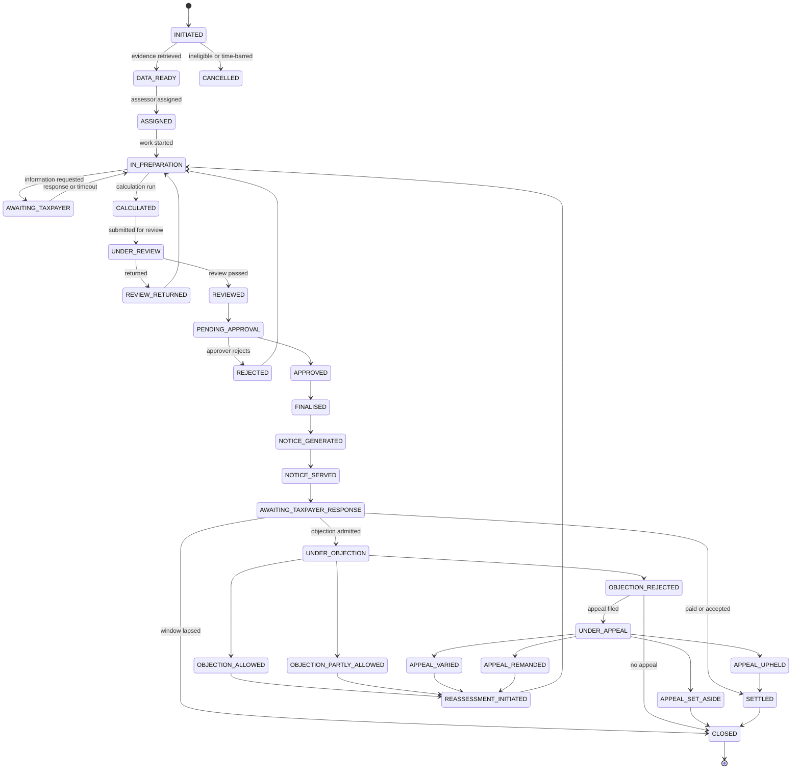

### 10.2 Transition table

**[R]** — every row becomes one `tbl_dynaform_workflow_transition` (Path B) or one sequence flow + gateway (Path A), and one history record.

| # | From | Event / action | To | Actor role | Validation | Task | Audit event |
|---|---|---|---|---|---|---|---|
| 1 | — | `INITIATE` | INITIATED | Supervisor / SYSTEM | TIN valid, no duplicate, in limitation | Start | `CASE_INITIATED` |
| 2 | INITIATED | `RETRIEVE_DATA` | DATA_READY | SYSTEM | Snapshot complete | Service | `EVIDENCE_SNAPSHOT_CREATED` |
| 3 | INITIATED | `CANCEL` | CANCELLED | Supervisor | Reason mandatory | User | `CASE_CANCELLED` |
| 4 | DATA_READY | `ASSIGN` | ASSIGNED | Supervisor | Assessor eligible, no conflict | User | `CASE_ASSIGNED` |
| 5 | ASSIGNED | `START` | IN_PREPARATION | Assessor | Assignee = actor | User | `PREPARATION_STARTED` |
| 6 | IN_PREPARATION | `REQUEST_INFO` | AWAITING_TAXPAYER | Assessor | Query text, deadline | User + timer | `INFO_REQUESTED` |
| 7 | AWAITING_TAXPAYER | `RESPONSE_RECEIVED` | IN_PREPARATION | Taxpayer | Within window | Message catch | `INFO_RECEIVED` |
| 8 | AWAITING_TAXPAYER | `TIMEOUT` | IN_PREPARATION | SYSTEM | Window elapsed | Timer boundary | `INFO_TIMEOUT` |
| 9 | IN_PREPARATION | `CALCULATE` | CALCULATED | Assessor / SYSTEM | Adjustments complete + valid | Service | `CALCULATION_RUN` |
| 10 | CALCULATED | `SUBMIT_FOR_REVIEW` | UNDER_REVIEW | Assessor | Mandatory fields, evidence | User | `SUBMITTED_FOR_REVIEW` |
| 11 | UNDER_REVIEW | `RETURN` | REVIEW_RETURNED | Reviewer | Comments mandatory | User | `REVIEW_RETURNED` |
| 12 | UNDER_REVIEW | `ACCEPT` | REVIEWED | Reviewer | Reviewer ≠ preparer, checklist complete | User | `REVIEW_ACCEPTED` |
| 13 | REVIEWED | `ROUTE_APPROVAL` | PENDING_APPROVAL | SYSTEM | Threshold → level | Gateway | `ROUTED_FOR_APPROVAL` |
| 14 | PENDING_APPROVAL | `APPROVE` | APPROVED | Approver(level) | Level sufficient, signature | User | `APPROVED` |
| 15 | PENDING_APPROVAL | `REJECT` | REJECTED | Approver | Reason mandatory | User | `REJECTED` |
| 16 | APPROVED | `FINALISE` | FINALISED | SYSTEM | Figures match approval | Service | `FINALISED` |
| 17 | FINALISED | `GENERATE_NOTICE` | NOTICE_GENERATED | SYSTEM | Template + merge OK | Service | `NOTICE_GENERATED` |
| 18 | NOTICE_GENERATED | `SERVE` | NOTICE_SERVED | SYSTEM / Despatch | ≥1 channel succeeded | Service/User | `NOTICE_SERVED` (+ service date) |
| 19 | NOTICE_SERVED | `START_RESPONSE_WINDOW` | AWAITING_TAXPAYER_RESPONSE | SYSTEM | Deadline computed | Timer | `RESPONSE_WINDOW_OPENED` |
| 20 | AWAITING_TAXPAYER_RESPONSE | `PAYMENT_SETTLED` | SETTLED | SYSTEM | Balance nil | Message | `SETTLED` |
| 21 | AWAITING_TAXPAYER_RESPONSE | `FILE_OBJECTION` | UNDER_OBJECTION | Taxpayer | In time, admissible | Start (sub‑workflow) | `OBJECTION_FILED` |
| 22 | AWAITING_TAXPAYER_RESPONSE | `WINDOW_LAPSED` | CLOSED | SYSTEM | Deadline passed | Timer | `WINDOW_LAPSED` |
| 23 | UNDER_OBJECTION | `DECIDE_*` | OBJECTION_* | Objection Approver | Decision + reasons | User | `OBJECTION_DECIDED` |
| 24 | OBJECTION_ALLOWED / PARTLY | `REASSESS` | REASSESSMENT_INITIATED | SYSTEM | — | Service | `REASSESSMENT_TRIGGERED` |
| 25 | OBJECTION_REJECTED | `FILE_APPEAL` | UNDER_APPEAL | Taxpayer | In time, forum valid | Start | `APPEAL_FILED` |
| 26 | UNDER_APPEAL | `RECORD_DECISION` | APPEAL_* | Appeals Officer | Decision doc attached | User | `APPEAL_DECIDED` |
| 27 | APPEAL_VARIED / REMANDED | `REASSESS` | REASSESSMENT_INITIATED | SYSTEM | Within limitation | Service | `REASSESSMENT_TRIGGERED` |
| 28 | REASSESSMENT_INITIATED | `START` | IN_PREPARATION | Assessor | Ground cited | User | `REASSESSMENT_STARTED` |
| 29 | SETTLED | `CLOSE` | CLOSED | Supervisor / SYSTEM | No open dispute | User/Service | `CASE_CLOSED` |

---

## 11. DynaForms Design

### 11.1 Category and template organisation

**[R]** — following the Licence / Fit & Proper category pattern **[E]**

| Category attribute | Value |
|---|---|
| `name` | `Tax Assessment` |
| `categoryCode` | `TAX` |
| `isGroup` | `true` (sub‑categories per tax type: `TAX-CIT`, `TAX-VAT`, `TAX-WHT`, `TAX-PIT`) |
| `dashboardEnable` | `true` |
| `riskScoreEnable` | `true` (case selection) |
| `licenseEnable` | `true` **only if** the generalised issued‑document pipeline is adopted for notices; otherwise `false` and a dedicated notice service |
| `licenseRefGenPattern` | e.g. `TA{YYYY}{SEQ:8}` |

Menus to create by migration **[R]**: *Assessment Register*, *My Assessments*, *Initiate Assessment*, *Assessment Workbench*, *Review Queue*, *Approval Queue*, *Notices*, *Objections*, *Appeals*, *Tax Rule Configuration*, *Assessment Dashboard*, *Assessment Audit Trail*.

### 11.2 Template catalogue

**[R]** — 18 templates. Field lists are indicative and drawn where possible from existing DTOs **[E]** (`auditprocess/dto/*`) so that the field dictionary is not reinvented.

| # | Template | Stage | Primary role | Persistence |
|---|---|---|---|---|
| TA‑01 | Assessment Initiation | 1 | Supervisor/System | `form_template_data` + `tbl_tax_assessment_case` |
| TA‑02 | Taxpayer Information (read‑only) | 2 | All | Evidence snapshot |
| TA‑03 | Assessment Case Creation | 3 | Supervisor | Case |
| TA‑04 | Assessment Details | 4 | Assessor | Case + submission |
| TA‑05 | Income / Tax Base | 4 | Assessor | `tbl_tax_assessment_item` |
| TA‑06 | Adjustments | 4 | Assessor | `tbl_tax_assessment_adjustment` |
| TA‑07 | Supporting Documents | 4 | Assessor/Taxpayer | Files + DMS |
| TA‑08 | Information Request / Clarification | 4 | Assessor ↔ Taxpayer | Submission + comments |
| TA‑09 | Tax Calculation (read‑only) | 5 | System | `tbl_tax_calculation_result` |
| TA‑10 | Penalty and Interest | 5 | System/Assessor | Calculation result |
| TA‑11 | Assessment Review | 6 | Reviewer | Submission + history |
| TA‑12 | Assessment Approval | 7 | Approver | Submission + history |
| TA‑13 | Assessment Decision (summary) | 8 | System | Case snapshot |
| TA‑14 | Assessment Notice | 9 | System | Notice + artefact |
| TA‑15 | Objection | 11 | Taxpayer / Officer | Objection |
| TA‑16 | Appeal | 12 | Taxpayer / Officer | Appeal |
| TA‑17 | Reassessment | 13 | Assessor | Case v(n+1) |
| TA‑18 | Closure | 14 | Supervisor | Case |

### 11.3 Detailed design of the three critical templates

#### TA‑06 — Adjustment Form

| Property | Design |
|---|---|
| **Purpose** | Capture each change from declared to assessed, with legal basis and evidence |
| **Sections** | *Adjustment Summary* (Div), *Adjustment Lines* (Table, dynamic rows), *Evidence* (Section), *Officer Opinion* (Section), *Actions* (ButtonGroup) |
| **Fields (per line)** | `adjustmentType` (Dropdown, mandatory, static or API options), `taxPeriod` (Dropdown, mandatory), `conceptCode` (Autocomplete from DataQuest concept catalogue), `declaredAmount` (Number/currency, read‑only, prefilled), `assessedAmount` (Number/currency, mandatory), `differenceAmount` (**Formula** `@assessedAmount - @declaredAmount`, read‑only), `reasonCode` (Dropdown from configurable catalogue, mandatory), `statutoryReference` (Textbox, conditional), `narrative` (Textarea, mandatory when `differenceAmount ≠ 0`), `evidence` (File, conditional‑mandatory above a threshold), `officerOpinion` (Textarea) |
| **Calculated** | `differenceAmount`; per‑table aggregate `totalAdjustment` (table column total) |
| **Conditional** | `statutoryReference` visible when `adjustmentType == 'STATUTORY_DISALLOWANCE'`; `evidence` required when `differenceAmount` exceeds threshold — expressed with `dependsOn` `setRequired` + `setVisibility`; `reasonCode` option list filtered by `adjustmentType` using `filterOptions` **[E]** |
| **Validations** | Regex/preset on amounts; formula validation `@assessedAmount >= 0`; `narrative` required (dependency); server‑side: reason code valid for tax type, sum of lines equals the posted adjustment total |
| **Lookup** | `adjustmentType`, `reasonCode`, `conceptCode` via `apiEndPoint` / `importCURL` through `third-party-service` **[E]** |
| **Read‑only** | `declaredAmount`, `differenceAmount`; entire form after `FINALISED` |
| **Role editability** | Editable by `TA_ASSESSOR` at step `PREPARE`; read‑only at `REVIEW`, `APPROVE` (separate step templates) |
| **Workflow stage** | Preparation |
| **Persistence** | Submission JSON **and** normalised rows in `tbl_tax_assessment_adjustment` (written by the domain service on submit) — normalisation is required for reporting, recalculation and objection scoping **[R]** |

> **Why normalise as well as store JSON:** the Licence and Fit & Proper modules already do exactly this — domain tables alongside `form_template_data` **[E]**. Adjustments must be queryable per case, per reason code, per period; JSONB alone makes deadline, ageing and materiality reporting expensive.

#### TA‑09 — Tax Calculation Form

| Property | Design |
|---|---|
| **Purpose** | Present the authoritative computation, transparently and reproducibly |
| **Sections** | *Base Determination*, *Tax Computation*, *Credits and Payments*, *Penalty*, *Interest*, *Net Position*, *Computation Trace* |
| **Fields** | All Number/currency, **read‑only**, populated from the server calculation result: `declaredBase`, `totalAdjustments`, `assessedBase`, `lossesSetOff`, `taxableBase`, `taxBeforeCredits`, `withholdingCredit`, `advanceTaxCredit`, `otherCredits`, `taxAfterCredits`, `penaltyAmount`, `interestAmount`, `totalPayable`, `amountAlreadyPaid`, `netPayableOrRefundable`, `currency`, `ruleSetCode`, `ruleSetVersion`, `calculatedAt` |
| **Calculated in DynaForms** | **Indicative only**, e.g. `@assessedBase - @lossesSetOff`, used for immediate feedback while the officer types; the persisted legal values always come from the server |
| **Formula validations** | `@netPayableOrRefundable == @totalPayable - @amountAlreadyPaid` as a **cross‑check** that surfaces a discrepancy between client display and server result |
| **Trace section** | A read‑only Table rendering the computation trace steps returned by the server |
| **Role editability** | No one; overrides are a separate audited action on a separate template |
| **Workflow stage** | Calculation, and read‑only in every later stage |

#### TA‑15 — Objection Form

| Property | Design |
|---|---|
| **Purpose** | Taxpayer‑facing objection filing |
| **Access** | Authenticated taxpayer portal; optionally an *open* form (`is_login_required = false`) with OTP/captcha for unregistered agents — the open‑form and captcha mechanisms already exist **[E]** |
| **Sections** | *Assessment Reference*, *Grounds of Objection*, *Disputed Items*, *Relief Sought*, *Supporting Documents*, *Declaration*, *Actions* |
| **Fields** | `assessmentNoticeNumber` (Textbox, validated against notices via API lookup), `noticeServiceDate` (read‑only, fetched), `objectionDeadline` (**read‑only, fetched — never client‑computed**), `groundCategory` (Multi Select), `groundsNarrative` (Textarea, mandatory, min length), `disputedItems` (Table: item, disputed amount, reason), `totalDisputedAmount` (table total), `reliefSought` (Dropdown), `depositPaidReference` (conditional on jurisdiction requiring a deposit), `documents` (File, multiple), `declaration` (Checkbox, mandatory), `signature` (Signature widget) |
| **Conditional** | Deposit fields shown only when the configured jurisdiction requires a deposit — driven by a hidden `jurisdictionCode` field and `dependsOn` |
| **Validations** | Notice number exists and belongs to the logged‑in taxpayer (**server‑side**); filing date ≤ deadline (**server‑side, authoritative**); disputed amount ≤ assessed amount; at least one ground; declaration ticked |
| **Persistence** | Submission + `tbl_tax_assessment_objection` |

> **[R] Deadline rule.** Statutory deadlines must never be evaluated in the browser. The form displays a server‑supplied deadline; admissibility is decided server‑side against the stored service date.

### 11.4 Shared conventions for all Tax Assessment forms

**[R]**

1. Every form has exactly one top‑level `Section`/`Div`/`Tab` wrapper (platform requirement **[E]**).
2. Every submit path uses a `ButtonGroup` whose button `defaultFieldName`s become the workflow action codes (`SUBMIT`, `RETURN`, `APPROVE`, `REJECT`, `ESCALATE`, `SAVE_DRAFT`) — this is the contract the BPMN condition builder consumes **[E]**.
3. Every label and error message is a display key (`df.field.tax.*`, `df.error.tax.*`).
4. `isSubmissionUniqueIdentifier` is set on the case number field so submissions are searchable by case number **[E]**.
5. All monetary fields are Number/currency with a single currency code per form; the currency is a jurisdiction configuration value.
6. Read‑only prefilled fields carry `source: 'api_prefill'` semantics analogous to the existing `InputField.source` convention in the Audit Journaling model **[E]**.
7. Each workflow step gets its **own template** where editability differs by role, rather than one template with per‑field role locking.

---

## 12. BPMN Workflow Design

### 12.1 Process decomposition

**[R]**

| Process | Key | Trigger | Notes |
|---|---|---|---|
| Main assessment | `TAX_ASSESSMENT_MAIN` | Manual / timer / message | Stages 1–10, 14 |
| Objection | `TAX_ASSESSMENT_OBJECTION` | Message from taxpayer filing | Linked by business key |
| Appeal | `TAX_ASSESSMENT_APPEAL` | Message | Linked by business key |
| Reassessment | reuses `TAX_ASSESSMENT_MAIN` with `assessmentType=AMENDED` | Message | Predecessor link |
| Case selection campaign | `TAX_ASSESSMENT_SELECTION` | Timer (cycle) | Fans out to main processes |

Separate processes (not one giant diagram) because objection and appeal have independent lifetimes, independent SLAs, and may outlive the main process. **[R]**

### 12.2 Main process design

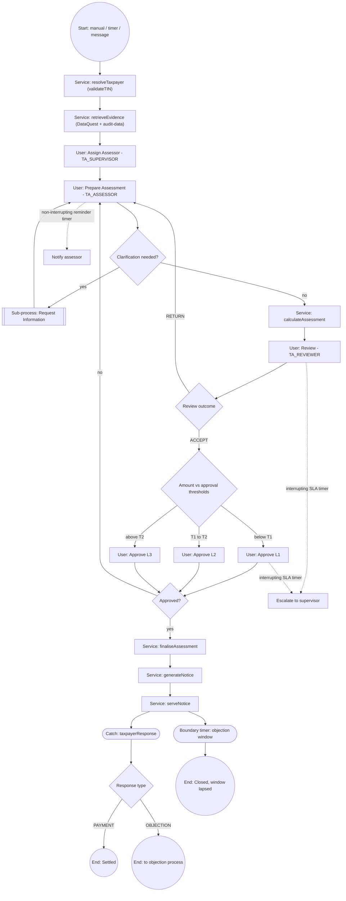

### 12.3 Element specification

**[R]** — conforming to the verified authoring contracts **[E]**

#### User tasks

| Task | `stepCode` | `formId` | `roles` | Action codes | SLA |
|---|---|---|---|---|---|
| Assign Assessor | `TA_ASSIGN` | TA‑03 | `TA_SUPERVISOR` | `ASSIGN` | 2d |
| Prepare Assessment | `TA_PREPARE` | TA‑04/05/06 | `TA_ASSESSOR` | `SAVE_DRAFT`, `REQUEST_INFO`, `SUBMIT` | configurable, e.g. 30d |
| Provide Information | `TA_TP_INFO` | TA‑08 | `TA_TAXPAYER` | `RESPOND` | statutory |
| Specialist Opinion | `TA_SPECIALIST` | TA‑04 (opinion) | `TA_SPECIALIST` | `RESPOND` | 10d |
| Review | `TA_REVIEW` | TA‑11 | `TA_REVIEWER` | `ACCEPT`, `RETURN`, `ESCALATE` | 7d |
| Approve L1/L2/L3 | `TA_APPROVE_L1/2/3` | TA‑12 | `TA_APPROVER_L1/2/3` | `APPROVE`, `REJECT` | 5d |
| Record Physical Service | `TA_SERVE_MANUAL` | TA‑14 despatch | `TA_NOTICE_ISSUER` | `SERVED` | 3d |
| Confirm Closure | `TA_CLOSE` | TA‑18 | `TA_SUPERVISOR` | `CLOSE` | — |

#### Service tasks

**[E] Constraint:** the linking‑workflow editor currently exports service tasks only as `${statusUpdater}` with a `statusValue` field. Generic API service tasks are **not** supported on that path.

**[R] Resolution — two options, recommend (b):**

| Option | Description | Cost |
|---|---|---|
| (a) Model each system step as a user task auto‑completed by a backend job | No engine change | Ugly, pollutes the task list, hard to audit |
| **(b) Extend the platform with a generic `apiInvoker` delegate** — a Flowable `JavaDelegate` reading `endpoint`, `method`, `inputExpression`, `outputVariable`, `retryPolicy`, `idempotencyKey` from `flowable:field`s, plus a linking‑workflow modeler panel to author them | One new Java delegate + one modeler panel; benefits **every** future Teapot workflow, not just tax | **Recommended** |

Service tasks required: `resolveTaxpayer`, `retrieveEvidence`, `calculateAssessment`, `finaliseAssessment`, `postLiability`, `generateNotice`, `signNotice`, `serveNotice`, `computeStatutoryDates`, `archiveCase`.

#### Gateways

| Gateway | Condition source | Expression shape |
|---|---|---|
| Clarification needed | `TA_PREPARE.action` | `conditionJson` leaf: action == `REQUEST_INFO` |
| Review outcome | `TA_REVIEW.action` | action == `ACCEPT` / `RETURN` / `ESCALATE` |
| Approval routing | `TA_PREPARE.data.netPayable` (or a process variable set by `calculateAssessment`) | field ≥ threshold |
| Response type | message payload variable | — |

All expressed as `flowable:conditionJson` AST + `${jsonLogicCondition.evaluate(execution,'<flowId>')}` **[E]**.

#### Timers and escalation

| Timer | Type | Attached to | Effect |
|---|---|---|---|
| Preparation reminder | Non‑interrupting `timeCycle` | Prepare | Reminder e‑mail |
| Review SLA | Interrupting `timeDuration` | Review | Escalate to supervisor, reassign |
| Approval SLA | Interrupting | Approve | Escalate to next level |
| Taxpayer information window | Interrupting | Provide Information | Proceed on best judgement |
| Objection window | Interrupting boundary on the wait state | after service | Close case |
| Limitation warning | Non‑interrupting on the process | process‑level | Alert supervisor |

**[E]** The platform already supports interrupting and non‑interrupting boundary timers in the BPMN modeler (`sla-dashboard-implementation-document.md`, `Backend/ifile-teapot-node-bpmnengine/docs/BOUNDARY-TIMER-EVENT-PLAN.md`, `NON-INTERRUPTING-TIMER-REMINDER-PLAN.md`), and `tbl_dynaform_engine_active_tasks.sla_due_at` exists. **[E] Gap:** there is **no persisted SLA tracker, breach event, or reminder ledger** — the SLA document states this explicitly.

#### Process variables

**[R]** — beyond the platform's `{stepCode:{action,data}}` convention **[E]**

`caseId`, `caseNumber`, `tin`, `taxpayerName`, `taxTypeCode`, `taxPeriodCode`, `assessmentYear`, `assessmentType`, `jurisdictionCode`, `currencyCode`, `assessedBase`, `netPayable`, `riskScore`, `ruleSetVersion`, `assignedAssessorId`, `noticeNumber`, `serviceDate`, `objectionDeadline`, `limitationDate`, `predecessorCaseId`, `status`.

The **business key** must be the assessment case number so that objection/appeal processes can be correlated **[R]**; `ProcessService.startProcess` already accepts `businessKey` **[E]**.

### 12.4 Configuration vs platform service

**[R]**

| Belongs in BPMN configuration | Belongs in a reusable platform service |
|---|---|
| Task order, roles per task, form per task | Task authorisation by role code |
| Gateway conditions on action/field values | JSON‑Logic evaluation |
| SLA durations and reminder cycles | SLA persistence, breach detection, reminder dispatch |
| Which service task runs where | The `apiInvoker` delegate, retries, idempotency |
| Approval levels and thresholds | Threshold evaluation and delegation resolution |
| Notification points | E‑mail alert dispatch and history |
| Statuses reached at each step | Status transition + history writing |
| — | Tax calculation |
| — | Notice rendering, signing, serving |
| — | Statutory date computation |

---

## 13. Logical Data Model

### 13.1 Classification of entities

**[R]**, based on **[E]** inventory

#### A. Reuse unchanged

| Concept | Existing entity/table |
|---|---|
| Taxpayer (legal entity) | `TBL_ENTITY` / `EntityBean`, `TBL_ENTITY_DETAIL` |
| Taxpayer type | `TBL_TAXPAYER_TYPE_MASTER` / `TaxPayerTypeMaster` |
| User, role, permission | `TBL_USER_MASTER`, `TBL_USER_ROLE`, menu/action tables |
| Tax type | `TBL_RETURN`, `TBL_RETURN_TYPE`, `TBL_RETURN_GROUP` |
| Tax period | `TBL_FREQUENCY`, `TBL_FREQUENCY_PERIOD`, `TBL_FINANCIAL_YEAR_FORMAT` |
| Statutory calendar | `TBL_FILING_CALENDAR`, `TBL_HOLIDAY`, `DateMasterConfig` |
| Tax return / filing | `TBL_RETURNS_UPLOAD_DETAILS`, `TBL_FILING_STATUS`, filing views |
| Form definition + submission | `tbl_dynaform_form_template`, `tbl_dynaform_form_template_data` |
| Workflow | workflow definition/step/transition/rule/status/case/step‑data/history/instance; BPMN engine tables |
| Documents | documentstore `DMSMetadata`, `FileAccessHistory`; `TBL_ATTACHMENT` |
| Notes / queries | `TBL_COMMENTS` (+ `MasterIdentifier` anchor) |
| Notification | `TBL_EMAIL_ALERT` family; `tbl_dynaform_email_*` |
| History snapshots | `TBL_HISTORY_MASTER` |
| Currency, country, nationality, percentage, relationship masters | existing master tables |
| Risk scoring | `tbl_dynaform_risk_score_model` / `_rule` / `_category_band` / `_result` |
| Grid configuration | `TBL_GRID_COL_DEFS` |

#### B. Extend

| Existing | Extension | Why |
|---|---|---|
| `tbl_dynaform_category` | Optional `assessment_enable` flag (mirrors `license_enable`, `risk_score_enable`, `dashboard_enable`) | Category‑level feature toggle, consistent with existing pattern **[E]** |
| `tbl_dynaform_engine_active_tasks` | SLA tracker table alongside (not more columns) | Persisted SLA state, breach events |
| Licence artefact pipeline (`LicenseService`) | Generalise into `IssuedDocumentService` | Notices reuse render/QR/PDF/verify |
| `TBL_ACTION_MENU_MAPPING`, `TBL_MENU`, display keys | New rows by migration | Authorisation + i18n for new routes |
| `TBL_AUDIT_PROCESS` / `auditprocess` module | **Do not extend.** Bridge to it read‑only; migrate its content model to DynaForms templates over time | Avoid deepening a hard‑coded module |

#### C. New (Tax Assessment domain)

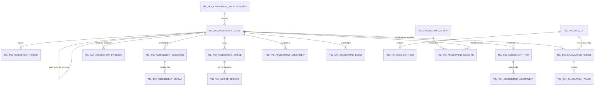

**Table specifications** **[R]**

| Table | Key columns |
|---|---|
| `tbl_tax_assessment_case` | `id`, `uuid`, `case_number` (unique), `entity_id_fk`, `tin`, `taxpayer_name`, `tax_type_code`, `jurisdiction_code`, `assessment_year`, `assessment_type` (DESK/AUDIT/BEST_JUDGEMENT/NON_FILER/AMENDED/SELF), `trigger_path`, `selection_run_id`, `risk_score`, `risk_model_version`, `status_code`, `version`, `predecessor_case_id`, `workflow_engine` (STEP/BPMN), `workflow_case_id`, `process_instance_id`, `business_key`, `currency_code`, `assessed_base`, `net_payable`, `limitation_date`, `target_completion_date`, `opened_at`, `finalised_at`, `closed_at`, `closure_reason`, `is_active`, audit columns |
| `tbl_tax_assessment_period` | `case_id`, `tax_period_code`, `period_start`, `period_end`, `frequency_period_id_fk`, `return_upload_id_fk` |
| `tbl_tax_assessment_item` | `case_id`, `period_id`, `concept_code`, `item_label_key`, `declared_amount`, `assessed_amount`, `difference_amount`, `source` (FILED/OCR/OFFICER/THIRD_PARTY), `sequence` |
| `tbl_tax_assessment_adjustment` | `case_id`, `item_id`, `adjustment_type`, `reason_code`, `statutory_reference`, `amount`, `direction` (ADD/DEDUCT), `narrative`, `evidence_file_key`, `officer_opinion`, `proposed_by`, `approved_by`, `status` |
| `tbl_tax_calculation_result` | `case_id`, `version`, `rule_set_id_fk`, `rule_set_version`, `inputs_hash`, `taxable_base`, `tax_before_credits`, `total_credits`, `tax_after_credits`, `penalty_amount`, `interest_amount`, `total_payable`, `amount_paid`, `net_payable_or_refundable`, `currency_code`, `is_current`, `calculated_at`, `calculated_by` — **all monetary columns `NUMERIC(20,4)` or wider** |
| `tbl_tax_calculation_trace` | `result_id`, `sequence`, `step_code`, `description_key`, `expression`, `inputs_json`, `output_value`, `rule_reference` |
| `tbl_tax_assessment_evidence` | `case_id`, `source_system`, `request_json`, `response_json` (or artefact key), `payload_hash`, `retrieved_at`, `retrieved_by`, `is_current` — **append‑only** |
| `tbl_tax_assessment_notice` | `case_id`, `notice_number` (unique), `notice_type`, `template_id`, `template_version`, `language_code`, `artefact_key`, `artefact_checksum`, `signature_reference`, `generated_at`, `issued_by`, `qr_payload`, `verification_token` |
| `tbl_tax_notice_service` | `notice_id`, `channel` (EMAIL/PORTAL/SMS/POST/HAND), `address`, `dispatched_at`, `delivery_status`, `provider_reference`, `acknowledged_at`, `deemed_service_at`, `failure_reason` |
| `tbl_tax_assessment_objection` | `case_id`, `objection_number`, `filed_at`, `filed_by`, `filing_channel`, `deadline_at`, `is_late`, `condonation_status`, `grounds_json`, `disputed_amount`, `deposit_reference`, `admissibility_status`, `assigned_to`, `decision`, `decision_at`, `decision_by`, `decision_reasons`, `decision_notice_id` |
| `tbl_tax_assessment_appeal` | `objection_id`, `case_id`, `appeal_number`, `forum_code`, `forum_reference`, `filed_at`, `deadline_at`, `stay_granted`, `hearing_json`, `decision`, `decision_at`, `decision_document_key`, `implementation_status` |
| `tbl_tax_assessment_assignment` | `case_id`, `user_id`, `role_code`, `assigned_at`, `assigned_by`, `released_at`, `is_current`, `delegation_id` |
| `tbl_tax_assessment_event` | `case_id`, `event_type`, `from_status`, `to_status`, `actor_user_id`, `actor_role_code`, `occurred_at`, `payload_json`, `correlation_id` — **append‑only, the domain audit ledger** |
| `tbl_tax_assessment_deadline` | `case_id`, `deadline_type` (RESPONSE/OBJECTION/APPEAL/LIMITATION/SLA), `anchor_event`, `anchor_at`, `due_at`, `warned_at`, `breached_at`, `status`, `config_id_fk` |
| `tbl_tax_rule_set` | `code`, `jurisdiction_code`, `tax_type_code`, `version`, `status` (DRAFT/PUBLISHED/ARCHIVED), `effective_from`, `effective_to`, `currency_code`, `rounding_rule`, `published_by`, `published_at` |
| `tbl_tax_rule_set_item` | `rule_set_id`, `item_type` (RATE_BAND/THRESHOLD/CREDIT_ORDER/PENALTY/INTEREST/LOSS_RULE/MIN_TAX/SURCHARGE), `sequence`, `condition_json`, `parameters_json`, `expression`, `description_key` |
| `tbl_tax_deadline_config` | `jurisdiction_code`, `tax_type_code`, `deadline_type`, `anchor_event`, `offset_value`, `offset_unit`, `calendar_rule` (CALENDAR_DAYS/WORKING_DAYS), `extension_rule_json`, `effective_from`, `effective_to` |
| `tbl_tax_assessment_selection_run` | `campaign_code`, `criteria_json`, `risk_model_id`, `run_at`, `candidate_count`, `selected_count`, `run_by`, `status` |

### 13.2 Relationship to platform tables

**[R]**

| New table | Links to platform |
|---|---|
| `tbl_tax_assessment_case` | `TBL_ENTITY.ENTITY_ID`, `tbl_dynaform_workflow_case.id` or `tbl_dynaform_engine_process_snapshot.process_instance_id`, `tbl_dynaform_risk_score_result.id` |
| `tbl_tax_assessment_item` | DataQuest concept codes; `TBL_RETURNS_UPLOAD_DETAILS.UPLOAD_ID` via period |
| Adjustments/evidence/notice artefacts | documentstore keys; `tbl_dynaform_form_template_data.uuid` for the authoring submission |
| Notices | reuse `tbl_dynaform_category.license_ref_gen_pattern` numbering mechanism |
| Events | mirrored into `tbl_dynaform_workflow_case_history` where the workflow engine writes it |

### 13.3 Data‑integrity rules

**[R]**

1. Monetary columns are `NUMERIC`, never `float`/`double`.
2. `tbl_tax_calculation_result` rows are **immutable**; recalculation inserts a new version and flips `is_current`.
3. `tbl_tax_assessment_evidence` and `tbl_tax_assessment_event` are **append‑only** (enforced by DB rules/permissions where possible).
4. Unique constraint on (`entity_id_fk`, `tax_type_code`, `assessment_year`, `version`) for non‑cancelled cases.
5. `case_number` and `notice_number` unique, gapless within a pattern where the jurisdiction requires it.
6. Foreign keys `ON DELETE RESTRICT` — assessments are never hard‑deleted; `is_active` soft delete only, consistent with platform convention **[E]**.

---

## 14. API and Service Architecture

### 14.1 Placement decision

**[R]** — **Build the Tax Assessment domain module inside `Backend/ifile-teapot-api-dynaforms` (NestJS)**, not in the core service, because:

- Forms, submissions, workflow (both engines), rules, risk scoring, licence artefacts, categories and dashboards all live there **[E]** — the assessment domain sits on top of exactly these.
- Sequelize migrations there are already the delivery vehicle for menus, display keys and action mappings **[E]**.
- The core service holds identity, entities, returns and masters, which the module consumes over the existing `core-communication` HTTP client **[E]**.

The **tax calculation engine** is the one component where a Java implementation in the core service would also be defensible (BigDecimal, existing financial code). **[R]** Recommend keeping it in Nest for cohesion, using a decimal library and exhaustive golden‑file tests; revisit only if performance or an existing Java rules asset dictates otherwise. **[A]** Assumes no external commercial tax engine is mandated.

### 14.2 Module structure

**[R]** — following `src/license/` and `src/risk-score/` conventions **[E]**

```
Backend/ifile-teapot-api-dynaforms/src/tax-assessment/
  tax-assessment.module.ts
  controllers/
    tax-assessment-case.controller.ts
    tax-assessment-calculation.controller.ts
    tax-assessment-notice.controller.ts
    tax-assessment-objection.controller.ts
    tax-assessment-appeal.controller.ts
    tax-assessment-dashboard.controller.ts
    tax-assessment-public.controller.ts          # @Public() verification + open objection
  services/
    tax-assessment-case.service.ts               # lifecycle facade over both engines
    tax-assessment-evidence.service.ts           # DataQuest + audit-data + freeze/hash
    tax-assessment-adjustment.service.ts
    tax-calculation.service.ts                   # pipeline orchestrator
    tax-rule-set.service.ts                      # versioned rule sets, effective dating
    tax-deadline.service.ts                      # statutory clocks + calendar
    tax-assessment-notice.service.ts             # render/sign/serve
    tax-assessment-objection.service.ts
    tax-assessment-appeal.service.ts
    tax-assessment-selection.service.ts          # risk-based case selection
    tax-assessment-event.service.ts              # append-only audit ledger
  engines/
    calculation/{base,liability,credits,penalty,interest,rounding}.step.ts
  models/            # sequelize models, one per table in section 13
  dto/
  constants/
  schedulers/
    tax-assessment.scheduler.ts                  # deadlines, reminders, auto-closure
```

### 14.3 API catalogue

**[R]** — new routes; every one registered in `TBL_ACTION_MENU_MAPPING` by migration **[E] convention**

| Method | Route | Purpose | Auth |
|---|---|---|---|
| POST | `/api/tax-assessment/cases` | Create case + bind workflow | `TA_SUPERVISOR`, `TA_ADMIN` |
| GET | `/api/tax-assessment/cases` | Paginated search (register) | role‑scoped |
| GET | `/api/tax-assessment/cases/:id` | Case detail aggregate | role‑scoped |
| POST | `/api/tax-assessment/cases/:id/assign` | Assign / reassign | Supervisor |
| POST | `/api/tax-assessment/cases/:id/evidence/refresh` | Re‑pull evidence (new snapshot) | Assessor |
| GET | `/api/tax-assessment/cases/:id/evidence` | Snapshot list + payloads | role‑scoped |
| POST | `/api/tax-assessment/cases/:id/adjustments` | Upsert adjustment lines | Assessor |
| POST | `/api/tax-assessment/cases/:id/calculate` | Run authoritative calculation | Assessor / SYSTEM |
| POST | `/api/tax-assessment/calculate/preview` | Stateless what‑if | Assessor |
| GET | `/api/tax-assessment/cases/:id/calculation` | Current result + trace | role‑scoped |
| POST | `/api/tax-assessment/cases/:id/approve` \| `/reject` | Approval decision | Approver |
| POST | `/api/tax-assessment/cases/:id/finalise` | Freeze | SYSTEM |
| POST | `/api/tax-assessment/cases/:id/notices` | Generate notice | SYSTEM / Notice issuer |
| GET | `/api/tax-assessment/notices/:number/pdf` | Download artefact | role‑scoped / taxpayer‑own |
| POST | `/api/tax-assessment/notices/:id/serve` | Record service | SYSTEM / Despatch |
| GET | `/api/tax-assessment/notices/:id/service-proof` | Proof of service | role‑scoped |
| POST | `/api/tax-assessment/cases/:id/objections` | File objection | Taxpayer |
| POST | `/api/tax-assessment/objections/:id/decision` | Record objection decision | Objection approver |
| POST | `/api/tax-assessment/cases/:id/appeals` | Register appeal | Taxpayer / Appeals officer |
| POST | `/api/tax-assessment/appeals/:id/decision` | Record appellate decision | Appeals officer |
| POST | `/api/tax-assessment/cases/:id/reassess` | Start reassessment | Assessor / Supervisor |
| POST | `/api/tax-assessment/cases/:id/close` | Close | Supervisor |
| GET | `/api/tax-assessment/cases/:id/timeline` | Unified audit timeline | role‑scoped |
| GET | `/api/tax-assessment/dashboard/*` | KPI endpoints (mirroring licence dashboard) | role‑scoped |
| POST | `/api/tax-assessment/selection/run` | Execute a selection campaign | Admin |
| GET/POST | `/api/tax-rule-sets`, `/:id/publish` | Rule‑set configuration | `TA_ADMIN` |
| GET/POST | `/api/tax-deadline-configs` | Deadline configuration | `TA_ADMIN` |
| GET | `/public/tax-assessment/verify/:token` | Public notice verification | `@Public()` |

### 14.4 Reused APIs (no new code)

**[E]**

| Need | Existing API |
|---|---|
| Render/submit any assessment form | `POST /api/formTemplateData/createOrUpdate`, `GET /api/formTemplates/...` |
| Complete a workflow task | `POST /api/bpmn/submit-task` (BPMN) or `POST /api/workflow-engine/submit-step` (step) |
| List my tasks | `GET /api/bpmn/active-tasks`, `GET /api/workflow-engine/pending-cases` |
| Case history / journey | `GET /api/workflow-engine/case/:caseId/history`, `GET /api/bpmn/journey/:processInstanceId` |
| Upload/download evidence | `POST /api/files/upload`, `GET /api/files/download` |
| TIN validation + taxpayer name | `POST /taxpayer-audit/validateTIN` |
| Historic tax figures | `POST /taxpayer-audit/audit-data` |
| Declared facts from filings | `POST /apiDataQuest/facts/extract` |
| Assignable users/entities | `GET /api/formTemplates/assignable-users`, `/:formTemplateId/assignable-entities` |
| Formula evaluation | `POST /api/formula/evaluate-batch` |
| Risk score | `src/risk-score/` controller |
| E‑mail dispatch | dynaform email alert services + `ifile-teapot-api-mail` |
| Digital signature | `ifile-teapot-api-digisign` controllers |
| Cascading masters | `/linkedMasters/...` |

### 14.5 Calculation service design

**[R]**

```mermaid
flowchart LR
  IN["Inputs: items, adjustments, credits, payments, dates"] --> RS["Resolve rule set<br/>jurisdiction + taxType + period"]
  RS --> P1["1 Base determination"]
  P1 --> P2["2 Loss set-off, ordering and expiry"]
  P2 --> P3["3 Taxable base and rounding"]
  P3 --> P4["4 Rate application: flat / slab / minimum tax"]
  P4 --> P5["5 Surcharge and cess"]
  P5 --> P6["6 Credits: WHT, advance, foreign, ordered"]
  P6 --> P7["7 Penalty: fixed / percent / greater-of"]
  P7 --> P8["8 Interest: rate schedule and day count"]
  P8 --> P9["9 Net position: payable or refundable"]
  P9 --> OUT["Result + trace + ruleSetVersion + inputsHash"]
```

Each step is a small, independently unit‑testable class that consumes `tbl_tax_rule_set_item` rows of its `item_type` and emits trace entries. Conditions on rule items reuse **JSON‑Logic** so that the existing `RuleEngineService` and the existing condition‑builder UI can be reused for authoring. **[R]**, engine **[E]**

### 14.6 Cross‑cutting API concerns

**[R]**, following existing patterns **[E]**

| Concern | Approach |
|---|---|
| Response envelope | `ServiceResponse`/`ServiceResDTO` builder in Java; Nest DTOs + interceptors |
| Errors | Existing Nest exception filters (`src/common/filters/`) + `ExceptionTraceLog` |
| Pagination | Existing `page`/`pageSize` + total pattern |
| Idempotency | `Idempotency-Key` header on `calculate`, `finalise`, `generateNotice`, `serve`; store key + result hash |
| Retry | Reuse the `TBL_SUSPENDED_API_CALLS` pattern for outbound integration failures |
| Logging | Winston (Nest), Log4j2 (Java), HTTP trace via auditor‑plugin |
| Versioning | Path‑stable; behaviour versioned by rule‑set and template version, not by URL |

---

## 15. Business Rules Architecture

### 15.1 Rule taxonomy

**[R]**

| Category | Where it lives | Change process |
|---|---|---|
| **1. Platform‑level reusable** — authorisation, segregation of duties, mandatory‑field enforcement, audit writing | Platform code (existing) | Release |
| **2. Tax‑type‑specific** — which forms, which items, which credits apply to CIT vs VAT vs WHT | DynaForms templates + workflow definition per sub‑category | Configuration |
| **3. Jurisdiction‑specific** — rates, slabs, thresholds, penalties, interest, deadlines, limitation, deemed service, deposit | `tbl_tax_rule_set` + `tbl_tax_deadline_config` (versioned, effective‑dated) | Configuration, published with approval |
| **4. Configurable business rules** — routing, escalation, materiality, evidence requirements, approval thresholds | `tbl_dynaform_workflow_rule.condition_json`, transition priorities, risk‑score models | Configuration |
| **5. Requires custom code** — the calculation pipeline steps themselves, day‑count algorithms, currency conversion, external tribunal integration | Platform code | Release |

### 15.2 Rule inventory by category

**[R]**

| Rule area | Examples | Category |
|---|---|---|
| Case selection | risk score ≥ band, random %, anomaly flags, non‑filer detection | 4 (risk model) |
| Eligibility | in limitation period, no duplicate open case, period closed | 3 + 4 |
| Data validation | TIN format, amount ≥ 0, difference reconciles, evidence mandatory above threshold | 2 + 4 |
| Base determination | which items are addable/deductible, loss set‑off order and expiry | 3 |
| Rates | flat, slab, minimum tax, presumptive percentage, surcharge, cess | 3 |
| Credits | WHT, advance tax, foreign tax credit, ordering and caps | 3 |
| Penalty | fixed, % of tax, greater‑of, capped, waived on voluntary disclosure | 3 (+5 for `greater‑of` primitive) |
| Interest | rate schedule with effective dates, simple/compound, day count, grace | 3 (+5 for the algorithm) |
| Rounding | nearest unit, direction, per‑step vs final | 3 |
| Approval | thresholds by amount and complexity, level count, delegation validity | 4 |
| SLA | per‑task durations, reminder cycles, escalation targets | 4 |
| Deadlines | objection window, appeal window, response window, limitation, extension/condonation | 3 |
| Service | deemed‑service rules per channel | 3 |
| Closure | auto‑close after N days, write‑off thresholds | 3 + 4 |

### 15.3 Rule governance

**[R]**

1. Rule sets follow the **risk‑score model lifecycle**: `DRAFT` → `PUBLISHED` → `ARCHIVED`, with a version number **[E] pattern**.
2. Publishing a rule set is an **audited, permissioned action** (`TA_ADMIN` + approval).
3. A case pins the rule‑set version it used; recalculation under a newer version creates a new result version and is flagged.
4. A **rule simulator** must exist: run a published or draft rule set against a sample or historic case and diff the results. This is the single most valuable safeguard against a bad rate change. **[R]**
5. Rule sets are exportable/importable as JSON for promotion between environments, mirroring the template XLSX export pattern **[E]**.

---

## 16. State / Status Model

### 16.1 Status catalogue

**[R]** — seeded into `tbl_dynaform_workflow_status` (step engine) and/or used as `statusValue` on BPMN status‑updater service tasks **[E]**

| Group | Statuses |
|---|---|
| Initial | `INITIATED`, `DATA_READY`, `ASSIGNED` |
| Working | `IN_PREPARATION`, `AWAITING_TAXPAYER`, `CALCULATED` |
| Review | `UNDER_REVIEW`, `REVIEW_RETURNED`, `REVIEWED` |
| Approval | `PENDING_APPROVAL`, `APPROVED`, `REJECTED` |
| Issue | `FINALISED`, `NOTICE_GENERATED`, `NOTICE_SERVED`, `AWAITING_TAXPAYER_RESPONSE` |
| Dispute | `UNDER_OBJECTION`, `OBJECTION_ALLOWED`, `OBJECTION_PARTLY_ALLOWED`, `OBJECTION_REJECTED` |
| Appeal | `UNDER_APPEAL`, `APPEAL_UPHELD`, `APPEAL_VARIED`, `APPEAL_SET_ASIDE`, `APPEAL_REMANDED` |
| Reassessment | `REASSESSMENT_INITIATED` |
| Terminal | `SETTLED`, `CLOSED`, `CANCELLED`, `TIME_BARRED`, `WRITTEN_OFF` |

### 16.2 Status design rules

**[R]**

1. Status is **derived from the workflow**, never set ad hoc by a controller. Path B sets it through transitions; Path A through `statusUpdater` service tasks **[E]**.
2. Every status change writes exactly one `tbl_tax_assessment_event` row and one workflow history row.
3. Status names are display keys; the same code set is reused across jurisdictions with different labels.
4. Terminal statuses are enforced: no transition out of `CLOSED` except via a new case (`REASSESSMENT_INITIATED` creates a successor, it does not reopen the predecessor).
5. Two independent axes must not be conflated: **case status** (above) and **liability status** (unpaid / partly paid / paid / refunded / written off). Keep them separate columns. **[R]**

---

## 17. Integration Architecture

### 17.1 Integration map

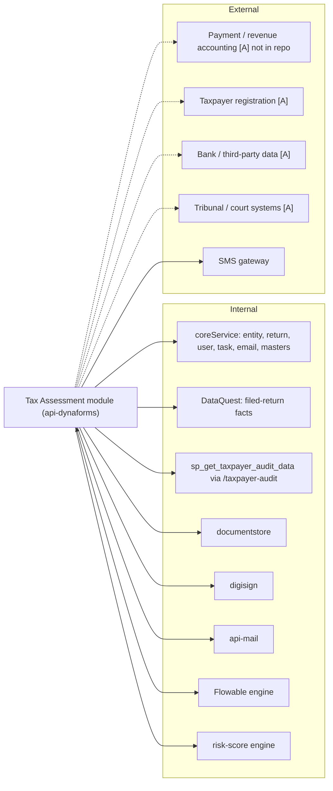

### 17.2 Integration specifications

| Integration | Mode | Existing asset | Gap |
|---|---|---|---|
| Taxpayer master | Sync HTTP | `EntityController`, `EntityService` **[E]** | Add individual‑taxpayer attributes if PIT is in scope **[R]** |
| TIN validation | Sync | `POST /taxpayer-audit/validateTIN` **[E]** | None |
| Filed return data | Sync | `POST /apiDataQuest/facts/extract` **[E]** | New `DataConfig` rows per assessment data code (configuration) |
| Historic tax figures | Sync | `POST /taxpayer-audit/audit-data` **[E]** | Stored function is `GTA`‑schema specific → **must be abstracted behind a provider interface for multi‑jurisdiction** **[R]** |
| Filing status/history | Sync | Filing views, `ReturnsUploadDetails` **[E]** | None |
| Payments / liability ledger | Sync + async | **None found [E]** | **New integration + payment provider interface** |
| Documents | Sync | documentstore APIs **[E]** | None |
| Digital signature | Sync | digisign APIs **[E]** | Wire notice signing |
| Notifications | Async (scheduler) | dynaform e‑mail alert + scheduler **[E]** | New alert types (configuration) |
| Workflow engine | Sync + webhook | Flowable REST + snapshot/progress webhooks **[E]** | Generic service‑task delegate **[R]** |
| Risk scoring | Sync | risk‑score engine **[E]** | New published model (configuration) |
| Court/tribunal | — | **None [A]** | Manual entry v1; API later |
| Bank/third‑party data | — | `third-party-service` generic caller **[E]** | Per‑source configuration |

### 17.3 Reliability patterns

**[R]**, precedents **[E]**

| Concern | Approach | Precedent |
|---|---|---|
| Sync vs async | Sync for lookups in a user's request path; async for notice despatch, liability posting, bulk selection | Existing e‑mail scheduler |
| Retry | Exponential backoff, then persist to a suspended‑call queue | `TBL_SUSPENDED_API_CALLS` + `WorkflowApiFailureHandlerServiceImpl` |
| Idempotency | Idempotency keys on all state‑changing outbound calls; dedupe on `(case_id, operation, key)` | — |
| Circuit breaking | Per‑integration failure counters; degrade to manual task | BPMN host failover pattern |
| Eventual consistency | Reconciliation job comparing Flowable runtime with `tbl_dynaform_engine_*` | Documented webhook risk **[E]** |
| Security | Existing header/token conventions; never log payloads containing taxpayer financial data | `RequestResponseLoggingFilter` URL config |

---

## 18. UI/UX Plan

### 18.1 Screen inventory

**[R]** — with build approach

| # | Screen | Approach | Reused component |
|---|---|---|---|
| 1 | **Assessment Dashboard** | Configure | Category dashboard pattern (`dashboardEnable`), ApexCharts, licence/FnP dashboard components **[E]** |
| 2 | **Assessment Register (list)** | Configure + small extension | `form-template-data-grid`, `GridColDefs`, server‑side pagination, CSV export **[E]** |
| 3 | **My Assessments** | Configure | Same grid, role‑scoped filter |
| 4 | **Task Inbox** | Reuse as‑is | `manage-active-tasks` (BPMN) / workflow active‑case screens **[E]** |
| 5 | **Initiate Assessment** | Configure | DynaForms renderer with TA‑01 |
| 6 | **Assessment Workbench** | **Custom (thin)** | A tabbed shell embedding the DynaForms renderer per section + evidence panel + calculation panel + history panel |
| 7 | **Review Screen** | Configure | Renderer with TA‑11 + read‑only prior sections |
| 8 | **Approval Screen** | Configure | Renderer with TA‑12 |
| 9 | **Calculation Panel** | **Custom (small)** | Read‑only result + expandable trace table |
| 10 | **Notice Screen** | Extension | Generalised from licence preview/download/verification components **[E]** |
| 11 | **Objection Screen** | Configure | Renderer with TA‑15 (+ open‑form variant) |
| 12 | **Appeal Screen** | Configure | Renderer with TA‑16 |
| 13 | **Reassessment Screen** | Configure | Renderer with TA‑17, prefilled by clone |
| 14 | **Process Journey** | Reuse as‑is | `process-journey-viewer` (BPMN diagram + progress markers) **[E]** |
| 15 | **Audit / History View** | Extension | Case timeline merging workflow history, domain events, e‑mail history, document access |
| 16 | **Taxpayer Portal — My Assessments & Notices** | Configure + small extension | Open/authenticated DynaForms + notice download |
| 17 | **Rule Set Configuration** | **Custom** | Reuse the risk‑score‑builder and sequence‑condition‑builder UI patterns **[E]** |
| 18 | **SLA / Ageing View** | Extension | Existing SLA dashboard UI + new tracker data |

### 18.2 The Assessment Workbench

**[R]** — the only substantial new screen.

```
+---------------------------------------------------------------------------+
| TA-2026-00001234 | Acme Trading WLL | TIN 1234567890 | CIT | AY 2025       |
| Status: IN_PREPARATION   Assessor: J. Doe   Due: 12 Oct 2026 (18d)  [SLA]  |
+----------+----------------------------------------------------------------+
| NAV      | WORKING AREA (DynaForms renderer)                              |
| Summary  |  +----------------------------------------------------------+  |
| Taxpayer |  | Adjustments (TA-06)                                      |  |
| Evidence |  | [dynamic table of adjustment lines]                      |  |
| Base     |  |                                                          |  |
| Adjust.  |  +----------------------------------------------------------+  |
| Calc     |                                                                |
| Docs     +----------------------------------------------------------------+
| Notes    | SIDE PANEL (tabbed)                                            |
| History  |  Evidence snapshot | Declared vs assessed | Calculation trace  |
|          |  Prior assessments | Notes and queries     | Risk flags        |
+----------+----------------------------------------------------------------+
| [Save Draft]  [Request Information]  [Recalculate]  [Submit for Review]    |
+---------------------------------------------------------------------------+
```

Design rules **[R]**:
- The working area is **always** the DynaForms renderer — never hand‑written form markup. This is the discipline that Audit Journaling broke, at a cost of a 2,500‑line component **[E]**.
- The side panel is read‑only context; it never edits.
- Action buttons come from the form's `ButtonGroup`, so the workbench does not hard‑code workflow actions.
- Split‑pane behaviour already exists (`form-renderer/split-pane`, `/dynaForm/split-pane-renderer` route) **[E]** and should be reused.

### 18.3 UX requirements

**[R]**

| Requirement | Note |
|---|---|
| Deadline visibility | Every screen shows the governing statutory deadline and days remaining, server‑supplied |
| Declared vs assessed | Always shown side by side with the difference highlighted |
| Explainability | Every computed figure is clickable to its trace |
| Evidence proximity | Evidence viewable without leaving the field being justified |
| Autosave | Draft autosave on the workbench (submissions already support `DRAFT` status **[E]**) |
| Accessibility | Existing `accessibilityFeatures` module and CSS **[E]** |
| RTL + multi‑language | Existing RTL support and display keys **[E]** — mandatory for GTA/MENA deployments |
| Performance | Server‑side pagination on registers; lazy‑load evidence and trace |

---

## 19. Audit and Compliance

### 19.1 What must be auditable

**[R]**

| Event | Captured by |
|---|---|
| Case created — who, when, why, on what selection basis | `tbl_tax_assessment_event` + `tbl_tax_assessment_selection_run` |
| Evidence retrieved — source, parameters, payload hash | `tbl_tax_assessment_evidence` (append‑only) |
| Every field change — old value → new value | `TBL_HISTORY_MASTER` snapshots **[E]** + submission version chain |
| Adjustment proposed/changed/removed | `tbl_tax_assessment_adjustment` + event ledger |
| Calculation run — inputs, rule‑set version, every intermediate step | `tbl_tax_calculation_result` + `tbl_tax_calculation_trace` |
| Manual override of a computed figure | Event + mandatory justification + actor |
| Workflow transitions | `tbl_dynaform_workflow_case_history` / `tbl_dynaform_engine_activity_progress` **[E]** |
| Review and approval decisions, including delegation used | Event ledger + submission `approved_by`/`comment` **[E]** |
| Reassignment | `tbl_tax_assessment_assignment` history |
| Notice generated — template version, merge data, checksum, signature | `tbl_tax_assessment_notice` |
| Notice served — channel, timestamps, delivery status, acknowledgement | `tbl_tax_notice_service` + `EmailSentHistory` **[E]** |
| Taxpayer communication read/downloaded | `license_event`‑style event log **[E] pattern** + `FileAccessHistory` **[E]** |
| Document uploaded/viewed/deleted | documentstore `FileAccessHistory` **[E]** |
| Objection, appeal, decisions | Domain tables + event ledger |
| Reassessment linkage | `predecessor_case_id` + `previous_form_template_data_uuid` **[E]** |
| API access | `HttpTraceEventLog` (configurable per URL) **[E]** |
| Errors | `ExceptionTraceLog` **[E]** |

### 19.2 Reuse plan for audit mechanisms

**[R]**

1. **Register the new tables with the history plugin** (`TBL_HISTORY_MASTER` mapping) so before/after snapshots are automatic **[E] mechanism**.
2. **Reuse `tbl_dynaform_workflow_case_history`** for all workflow transitions — do not duplicate them in the domain ledger; the domain ledger records *domain* events (calculation run, notice served, deadline breached).
3. **Reuse the auditor plugin** for API‑level tracing, with tax endpoints registered in `HttpTraceLogUrlConfiguration`, and with **payload redaction** for financial data **[R]**.
4. **Reuse `EmailSentHistory`** as the communication audit — no new table.
5. Provide a single **case timeline API** that merges these sources for the audit view, rather than a new consolidated table.

### 19.3 Audit integrity

**[R]**

| Control | Implementation |
|---|---|
| Append‑only | DB‑level revoke of UPDATE/DELETE on `tbl_tax_assessment_event` and `tbl_tax_assessment_evidence` for the application role |
| Tamper evidence | Payload hashes on evidence; artefact checksums on notices (documentstore already computes checksums **[E]**) |
| Retention | Configurable per record class; assessments typically 7–10 years, appeal‑linked cases longer |
| Non‑repudiation | Digital signature on issued notices **[E] capability** |
| Segregation of duties | Enforced at transition level (reviewer ≠ preparer, approver ≠ reviewer) |
| Access audit | Reads of taxpayer financial data logged for privileged roles |

---

## 20. Security

**[R]**, reusing **[E]** mechanisms

| Area | Approach |
|---|---|
| **Authentication** | Existing token flow: `ifile-teapot-api-authenticator` + core `validate-token`, consumed by the Nest `AuthInterceptor`; MFA/OTP mechanisms already present (`OTPSetting`, `MFAActionMapping`) |
| **Authorisation** | Redis endpoint/role cache; every new route registered in `TBL_ACTION_MENU_MAPPING`; **fail‑closed** on cache miss or Redis outage (existing principle **[E]**) |
| **Workflow task authorisation** | Role codes on steps/tasks; **note the platform default that a task with no role rows is open to any authenticated user [E]** — Tax Assessment must therefore *assert* role codes on every task and add a startup validation that rejects publishing a tax workflow with a role‑less user task **[R]** |
| **Record‑level access** | Taxpayers see only their own cases (entity mapping); officers see their queue/team; auditors read‑all. Enforced in the service layer with a mandatory scope predicate, not in the controller |
| **Field‑level access** | Step‑specific templates; optional `readOnlyForRoles` element property |
| **Document access** | documentstore + signed, expiring URLs; `FileAccessHistory` logging; never expose raw filesystem paths (current `fileId`‑as‑path usage in Audit Journaling is flagged as temporary in its own docs **[E]** and must not be replicated) |
| **Sensitive data** | Taxpayer financial data classified; redact from HTTP trace logs and application logs; encryption at rest for evidence artefacts (`ifile-teapot-component-encryptde` available **[E]**) |
| **Public endpoints** | Only notice verification and (optionally) objection filing; captcha + rate limiting; verification returns *status only*, never financial detail |
| **Input security** | Existing XSS validation stacks (`@AppIdLangCodeAccessTokenXssValidationStack` **[E]**), `class-validator` DTOs, parameterised SQL |
| **Calculation integrity** | Server‑authoritative; client values never trusted; results immutable and versioned |
| **Audit integrity** | See §19.3 |
| **Segregation** | Reviewer ≠ preparer; approver ≠ reviewer; rule‑set publisher ≠ case worker |

---

## 21. Reporting and Search

### 21.1 Search dimensions

**[R]** — every one must be indexed

| Dimension | Source |
|---|---|
| Case number, status, assessment type, trigger path | `tbl_tax_assessment_case` |
| Taxpayer name, TIN, entity code, taxpayer type, sector | case + `TBL_ENTITY` |
| Tax type, tax period, assessment year | case + period |
| Assessed amount, adjustment amount, net payable, outstanding | case + current calculation result |
| Assessing officer, reviewer, approver, current assignee | assignment table |
| Initiation date, finalisation date, notice date, service date, closure date | case + notice |
| Objection status, objection deadline, appeal status, forum | objection/appeal |
| SLA status (on track / warning / breached), ageing bucket | deadline table |
| Risk score, risk band, selection campaign | case + risk result |

### 21.2 Implementation approach

**[R]**

1. Create a **`vw_tax_assessment_register`** SQL view joining case, current calculation result, current assignment, latest notice, open deadline and objection/appeal status — mirroring `vw_workflow_unified_cases` **[E]**.
2. Drive the list UI from `GridColDefs` with a `grid_key_name` such as `taxAssessmentRegisterConfig` **[E] mechanism**.
3. Provide CSV export at `GET /api/tax-assessment/cases/downloadcsv/{gridKeyName}`, matching the platform convention **[E]**.
4. Dashboards as KPI endpoints in the licence‑dashboard style **[E]**.

### 21.3 Report catalogue

**[R]**

| Report | Purpose |
|---|---|
| Assessment register | Operational list with all dimensions |
| Ageing & SLA | Cases by age band and SLA state, by officer/team |
| Revenue impact | Additional tax assessed, by tax type, period, officer, adjustment reason |
| Adjustment analysis | Frequency and value by reason code — feeds policy and risk model tuning |
| Notice register | Notices issued, served, unserved, acknowledged |
| Dispute register | Objections and appeals: volumes, ageing, success rate, revenue at risk |
| Reassessment analysis | Volume and cause of reassessment — a quality indicator |
| Officer productivity | Cases handled, cycle time, rework rate, upheld‑on‑objection rate |
| Statutory compliance | Deadlines met vs breached; limitation exposure |
| Audit extract | Full case history export for external audit |
| Risk model performance | Selected vs yielding cases — closes the loop with the risk engine |

---

## 22. Non‑Functional Requirements

**[R]** — targets to be confirmed with the customer **[A]**

| NFR | Target / approach |
|---|---|
| **Scalability** | 1M+ taxpayers; 100k+ cases/year; 500 concurrent officers. Stateless services behind a load balancer; Flowable async job executor; batch selection runs off‑peak |
| **Performance** | Register search p95 < 2 s at 1M rows (view + indexes); form render < 1.5 s; calculation < 3 s for a typical case; notice PDF < 10 s (Puppeteer is the constraint **[E]** — pre‑render asynchronously) |
| **Availability** | 99.5% business hours; the assessment module degrades gracefully if DataQuest or the payment integration is down (evidence marked stale, case continues) |
| **Security** | Section 20 |
| **Maintainability** | Zero hard‑coded tax logic; module boundaries per §14.2; existing lint/format/test tooling |
| **Configurability** | New jurisdiction = new rule set + deadline config + templates + workflow + display keys + masters. **No code change.** This is the acceptance criterion for "reusable across jurisdictions" |
| **Extensibility** | New tax type = new sub‑category + templates + rule set. New calculation primitive = new pipeline step class |
| **Observability** | Structured logs with `caseId`/`correlationId`; metrics for calculation latency, notice generation, webhook lag, SLA breaches; actuator endpoints exist on the Flowable engine **[E]** |
| **Logging** | Winston + daily rotate (Nest **[E]**), Log4j2 (Java); no financial payloads in logs |
| **Auditing** | Section 19 |
| **Data retention** | Configurable per class; legal hold flag on cases under appeal |
| **Disaster recovery** | RPO ≤ 15 min, RTO ≤ 4 h **[A]**; PostgreSQL PITR; artefact storage replicated; Flowable state is in the DB so recovery is DB‑centric |
| **Localisation** | All labels/errors/notices via display keys; per‑language notice templates and e‑mail bodies **[E]**; RTL support **[E]**; locale‑aware number and date formatting |
| **Multi‑jurisdiction** | `jurisdiction_code` on rule sets, deadline configs, templates and cases; a jurisdiction resolver in the request context |
| **Multi‑tax‑type** | `tax_type_code` throughout; sub‑categories per tax type |

---

## 23. Existing Functionality Reuse Matrix

**[E]** for all "Existing" entries; **[R]** for "How used".

| # | Capability needed | Existing Teapot functionality | Location | How used | Change |
|---|---|---|---|---|---|
| 1 | Form definition & rendering | DynaForms templates + renderer | `packages/dynaforms-api`, `web-dynaforms/components/form-renderer` | All 18 assessment forms | None |
| 2 | Form builder | Builder v1/v2 | `web-dynaforms/components/dynaform-builder*` | Authoring by product team | None |
| 3 | Submission storage | `tbl_dynaform_form_template_data` | dynaforms | All form data | None |
| 4 | Draft/submit/approve status | `tbl_dynaform_form_template_data_status` | dynaforms | Submission status | None |
| 5 | Revision chain | `previous_form_template_data_uuid`, `clone/:uuid` | dynaforms | Reassessment versions | None |
| 6 | Reference numbering | `license_ref_gen_pattern` + generator | `src/license`, `form-templates-data.service` | Case & notice numbers | Generalise |
| 7 | On‑screen calculation | Formula widget + `expr-eval` | dynaforms + renderer | Indicative figures, cross‑checks | None |
| 8 | Conditional fields | Dependency engine | `form-renderer/engine/dependency-engine.service.ts` | Conditional sections | None |
| 9 | Field validation | `errorMsgMetadata`, regex master, formula validations | dynaforms | Input validation | None |
| 10 | Lookup fields | `apiEndPoint`/`importCURL` + `third-party-service` | dynaforms | TIN, masters, concepts | None |
| 11 | File upload | DynaForms File widget + `TeapotDynaformsFileStorage` | dynaforms | Evidence | None |
| 12 | Digital signature | digisign + Signature widget | `api-digisign` | Notice signing | Wire up |
| 13 | BPMN authoring | Linking BPMN modeler | `web-dynaforms/components/workflow` | Assessment processes | None |
| 14 | BPMN execution | Flowable 7.1.0 | `api-dynaform-bpmn-engine` | Process execution | Add `apiInvoker` delegate |
| 15 | BPMN runtime bridge | `workflow-engine-v2` | dynaforms | Tasks, snapshots, journey | None |
| 16 | Table‑driven workflow | `workflow` + `workflow-engine` | dynaforms | MVP lifecycle | None |
| 17 | Workflow cycles/windows | `WorkflowInstance` (`effective_on`/`expire_on`) | dynaforms | Assessment campaigns | None |
| 18 | Task inbox | Active tasks / pending cases screens | web‑collect | Officer inbox | Filter extension |
| 19 | Process journey | `process-journey-viewer` | web‑collect | Audit view | None |
| 20 | Rule engine | `RuleEngineService` (JSON‑Logic) | dynaforms | Routing, eligibility | None |
| 21 | Condition builder UI | `sequence-condition-builder` | web‑collect | Rule authoring | Reuse for rule sets |
| 22 | Risk scoring | risk‑score model/rule/band/result | dynaforms | Case selection | New model (config) |
| 23 | Roles & permissions | `UserRole`, menus, actions, Redis authz | coreService + dynaforms | All access control | New rows only |
| 24 | Authentication | authenticator + `AuthInterceptor` | multiple | All APIs | None |
| 25 | Category model | `tbl_dynaform_category` (+ dashboard/risk/licence flags) | dynaforms | `TAX` category | Optional flag |
| 26 | Menus & display keys | `TBL_MENU`, `DisplayKey(Label)` | coreService | Navigation, i18n | New rows only |
| 27 | Taxpayer master | `EntityBean` + details | coreService | Taxpayer | Extend for individuals |
| 28 | Tax type / period | `Return`, `ReturnType`, `Frequency`, `FrequencyPeriod` | coreService | Scope | None |
| 29 | Statutory calendar | `FilingCalendar`, `Holiday`, `DateMasterConfig` | coreService | Deadline calendar | Reuse in deadline engine |
| 30 | Filed return data | DataQuest | `api-dataquest` | Declared figures | New `DataConfig` rows |
| 31 | Historic tax figures | `sp_get_taxpayer_audit_data` | coreService + orm | Prior‑year data | Abstract per jurisdiction |
| 32 | TIN validation | `/taxpayer-audit/validateTIN` | coreService | TIN check | None |
| 33 | Tax field dictionary | `auditprocess` DTOs | coreService | Source for form fields | Read‑only reference |
| 34 | Presumptive assessment logic | `PresumptiveTaxAssessmentDto` + FE formula service | coreService + web‑collect | Rule‑set seed content | Re‑express as config |
| 35 | Excel report generation | `AuditExcelGenerationService` + mapping config | coreService | Assessment worksheet export | Generalise |
| 36 | OCR ingestion | `OcrHelperService` | coreService | FS ingestion | Reuse |
| 37 | Document store | documentstore | `api-documentstore` | Evidence, notices | None |
| 38 | Notes & attachments | `Comments` + `Attachment` (polymorphic) | coreService | Case notes | New `MasterIdentifier` |
| 39 | E‑mail alerting | `TBL_EMAIL_ALERT` + dynaform e‑mail tables + scheduler | both | All notifications | New alert types |
| 40 | Multi‑language e‑mail | `dynaform_email_body.language_code` | dynaforms | Taxpayer comms | None |
| 41 | SMS / OTP | `SMSGatewayProperty`, `OTPSetting` | coreService | Optional channel | None |
| 42 | Entity history | `TBL_HISTORY_MASTER` | history‑plugin | Field‑level audit | Register new tables |
| 43 | API trace audit | auditor‑plugin | component | API audit | Register URLs + redaction |
| 44 | Exception logging | `ExceptionTraceLog` | coreService/dynaforms | Error audit | None |
| 45 | Grid configuration | `GridColDefs` | both | Register columns | New config rows |
| 46 | CSV export | `downloadcsv/{gridKeyName}` | coreService | Register export | New endpoint, same pattern |
| 47 | XLSX template export/import | templates controller | dynaforms | Template promotion | None |
| 48 | Dashboards | licence/FnP dashboards, chart module, ApexCharts | both | Assessment dashboards | New endpoints, same pattern |
| 49 | Artefact generation | Puppeteer PDF + QR + verification page | `src/license` | Notice generation | Generalise |
| 50 | Lifecycle events on artefacts | `license_event` | dynaforms | Notice view/download tracking | Generalise |
| 51 | Scheduled jobs | `@nestjs/schedule`, `LicenseSchedulerService`, `FpSchedulerService`, `SchedulerMaster` | both | Deadlines, reminders, selection | New scheduler |
| 52 | Public/open forms | `is_login_required`, `open-dynaform` controller, captcha | dynaforms | Public objection filing | None |
| 53 | Localisation & RTL | display keys, `LanguageMaster`, `rtl.scss` | both | Multi‑jurisdiction | None |
| 54 | Deployment | Docker, Jenkins, per‑host env, `build-all.bat` | `ifile-teapot-docker` | Release | New module in pipeline |
| 55 | Migrations | sequelize‑cli, Liquibase | both | Schema + seed | New migrations |

---

## 24. Gap Analysis

| # | Capability | Existing Teapot functionality | Reuse approach | Gap | Proposed solution | Config vs Code | Complexity | Dependencies | Risks |
|---|---|---|---|---|---|---|---|---|---|
| G1 | Assessment case entity & lifecycle facade | `tbl_dynaform_workflow_case`, `tbl_dynaform_license`, `tbl_fit_proper_initiation` | Same wrapper pattern | No tax‑assessment domain entity | `tbl_tax_assessment_case` + `TaxAssessmentCaseService` fronting both engines | **Code** | M | Workflow engines | Engine abstraction leaks if rushed |
| G2 | Tax calculation engine | Formula widget (client), `expr-eval` (server) | Client formulas for indicative UI only | No `IF`/`ROUND`/`SUM`/`MAX`, no slabs, no day‑count, no decimal guarantee | Server pipeline + versioned `tbl_tax_rule_set` | **Code + Config** | **H** | Rule sets, masters | **Highest risk item.** Correctness, precision, jurisdiction variance |
| G3 | Jurisdiction rule configuration | Risk‑score model versioning; workflow rule `condition_json` | Same versioned‑model lifecycle | No tax rate/threshold/penalty/interest configuration store | `tbl_tax_rule_set` + `_item` + admin UI + simulator | **Code + Config** | H | G2 | Bad publish → wrong assessments at scale |
| G4 | Statutory deadline engine | `FilingCalendar`, `Holiday`, BPMN timers | Calendar + timers | No configurable anchor→offset deadline model, no persisted clocks | `tbl_tax_deadline_config` + `tbl_tax_assessment_deadline` + scheduler | **Code + Config** | M | Calendar masters | Legal exposure if wrong |
| G5 | SLA tracking & breach events | BPMN timer authoring; `sla_due_at` column; SLA dashboard UI | Timers raise events | **No SLA tracker, breach ledger or reminder store** (explicitly documented) | Generic `tbl_sla_tracker` + breach events + reminder job — **platform‑level, benefits all modules** | **Code** | M | Workflow events | Duplicate SLA notions if built tax‑only |
| G6 | Generic BPMN service task | Only `${statusUpdater}` supported by the linking editor | — | Cannot call arbitrary APIs from a linking workflow | `apiInvoker` Flowable delegate + modeler panel | **Code** | M | Flowable engine, modeler | Modeler regression risk |
| G7 | Notice generation & service | Licence PDF/QR/verification pipeline | Generalise | Tied to `tbl_dynaform_license`; no service/proof‑of‑service model | `IssuedDocumentService` + `tbl_tax_assessment_notice` + `tbl_tax_notice_service` | **Code + Config** | M | digisign, DMS | Puppeteer performance; legal wording |
| G8 | Objection management | Workflow engine, committee voting (FnP) | New workflow + domain tables | No objection concept | `tbl_tax_assessment_objection` + `TAX_ASSESSMENT_OBJECTION` workflow | **Code + Config** | M | G4 | Admissibility rules vary widely |
| G9 | Appeal management | Workflow engine | New workflow + domain tables | No appeal concept; no tribunal integration | `tbl_tax_assessment_appeal`; manual entry v1 | **Code + Config** | M | G8 | External system unknown **[A]** |
| G10 | Reassessment / supersession | `previous_form_template_data_uuid`, clone | Reuse chain | No case‑level supersession or limitation control | `predecessor_case_id`, `version`, limitation checks | **Code** | M | G1, G4 | Version explosion if uncontrolled |
| G11 | Immutable evidence snapshot | DataQuest, `audit-data`, submission JSON | Both as sources | No frozen, hashed, versioned snapshot | `tbl_tax_assessment_evidence`, append‑only | **Code** | M | DataQuest | Storage growth |
| G12 | Payments / liability ledger | **None found** | — | Cannot compute outstanding balance, refunds, or interest to date | Integrate an external revenue‑accounting system behind a provider interface | **Code + Integration** | **H** | External system | **Blocking for "outstanding amount" reporting.** Must be scoped early |
| G13 | Individual taxpayer master | `EntityBean` (organisations) | Reuse for entities | PIT needs natural persons | Extend entity model or add a taxpayer profile table | **Code** | M | coreService | Only if PIT is in scope |
| G14 | Multi‑jurisdiction data provider | `sp_get_taxpayer_audit_data` is `GTA`‑schema specific | Wrap it | Not portable | Provider interface + per‑jurisdiction implementations | **Code** | M | — | Hidden coupling if skipped |
| G15 | Field‑level role read‑only | Step templates; FE role locking in Audit Journaling | Step templates first | No generic per‑field role read‑only | Optional `readOnlyForRoles` element property in renderer | **Code (small)** | L | DynaForms package fence | Package/host boundary discipline |
| G16 | Assessment workbench UI | Split‑pane renderer, grids, journey viewer | Compose existing | No case‑centric shell | Thin Angular shell embedding the renderer | **Code (FE)** | M | Forms, APIs | Risk of re‑creating a 2,500‑line component |
| G17 | Assessment register & search | `vw_workflow_unified_cases`, GridColDefs, CSV export | Same pattern | No tax register view | `vw_tax_assessment_register` + grid config + export | **Code + Config** | L | Data model | View performance at 1M rows |
| G18 | Dashboards & KPIs | Licence/FnP dashboards | Same pattern | No tax KPIs | New dashboard endpoints + widgets | **Code + Config** | M | Register view | Raw‑SQL maintainability |
| G19 | Notification content | E‑mail alert framework | Same pattern | No tax alert types/templates | Migrations seeding alert types + multilingual bodies | **Config** | L | — | Template sprawl |
| G20 | Audit registration | History plugin, auditor plugin | Register tables/URLs | New tables unregistered; no redaction policy | Migrations + redaction config | **Config + small Code** | L | — | Sensitive data in logs |
| G21 | Migrating Audit Journaling | Existing module | Bridge read‑only, migrate content later | Two overlapping tax modules would coexist | Explicit convergence plan + read‑only bridge | **Code + Decision** | M | Stakeholders | Duplication and user confusion |
| G22 | Rule simulator / regression harness | Risk‑score preview idea in plan docs | Same idea | No way to test a rate change safely | Golden‑case harness + simulator UI | **Code** | M | G2, G3 | Without it, G2/G3 risk is unmanaged |
| G23 | Idempotency & retry for domain ops | `TBL_SUSPENDED_API_CALLS` pattern | Same pattern | Not applied to tax ops | Idempotency keys + suspended‑op queue | **Code** | M | — | Duplicate notices/liability postings |
| G24 | Webhook consistency (BPMN) | Documented eventual consistency | Accept + reconcile | Runtime tables can diverge | Reconciliation job + alert | **Code** | M | Flowable | Silent divergence in audit records |
| G25 | Decimal precision | Sequelize/JSONB | — | JSON numbers and JS floats are unsafe for money | `NUMERIC` columns + decimal library + no float in the pipeline | **Code** | M | G2 | Rounding disputes |

---

## 25. Phased Implementation Roadmap

> Durations are indicative for a team of **2 backend (Nest) + 1 backend (Java) + 2 frontend + 1 BA/tax SME + 1 QA**. **[A]**

### Phase 0 — Repository & architecture validation (2–3 weeks)

| Aspect | Detail |
|---|---|
| **Objectives** | Confirm the findings of this document with the platform team; make the binding decisions |
| **Functional scope** | None (discovery) |
| **Key decisions to close** | (1) Workflow engine choice and the Phase‑5 migration commitment. (2) Whether `Backend/ifile-teapot-api-dynaform-bpmn-engine` is the same artefact as the "external" `workflow-engine`. (3) Whether Audit Journaling converges into Tax Assessment, and on what timeline. (4) Payments/ledger integration target. (5) Target jurisdictions for v1 and v2. (6) PIT in scope or CIT/VAT/WHT only. (7) Calculation engine language (Nest vs Java) |
| **Backend** | Spike: `apiInvoker` delegate feasibility; spike: decimal calculation in Nest |
| **Frontend** | Spike: workbench shell embedding the renderer with a side panel |
| **DynaForms** | Build one throwaway adjustment form to prove table + dependency + formula behaviour against real tax data |
| **BPMN** | Publish a 3‑step throwaway workflow end to end to validate the toolchain |
| **DB** | None |
| **Testing** | Establish the golden‑case corpus format |
| **Dependencies** | Access to a populated environment; tax SME availability |
| **Risks** | Decisions deferred → design churn later |
| **Deliverables** | Signed‑off architecture decision record; validated spikes; confirmed scope |

### Phase 1 — Core Tax Assessment foundation (4–6 weeks)

| Aspect | Detail |
|---|---|
| **Objectives** | Case entity, roles, menus, permissions, register, basic lifecycle |
| **Scope** | Stages 1–3: initiation, evidence retrieval, case creation, assignment |
| **Backend** | `tax-assessment` module skeleton; `TaxAssessmentCaseService`; evidence service over DataQuest + `audit-data`; event ledger; selection service (manual only) |
| **Frontend** | Assessment register (grid config), initiate screen (DynaForms), case summary |
| **DynaForms** | `TAX` category + sub‑categories; TA‑01, TA‑02, TA‑03 |
| **BPMN/Workflow** | Path B workflow definition with steps `TA_ASSIGN` → `TA_PREPARE`; statuses seeded |
| **DB** | `tbl_tax_assessment_case`, `_period`, `_assignment`, `_event`, `_evidence`, `_selection_run`; `vw_tax_assessment_register` |
| **API** | Cases CRUD/search/assign; evidence refresh/read |
| **Integration** | DataQuest `DataConfig` rows; `validateTIN`; `audit-data` behind a provider interface |
| **Testing** | Unit (services), integration (evidence retrieval), E2E (create → assign) |
| **Dependencies** | Phase 0 decisions |
| **Risks** | Evidence source data quality; entity↔TIN mapping gaps |
| **Deliverables** | A case can be created, evidenced, numbered, assigned and found |

### Phase 2 — Assessment workflow & DynaForms (5–7 weeks)

| Aspect | Detail |
|---|---|
| **Objectives** | The officer can do the work |
| **Scope** | Stage 4 fully; the workbench |
| **Backend** | Adjustment service + normalisation from submissions; information‑request sub‑flow; notes/attachments via `Comments`; draft autosave support |
| **Frontend** | **Assessment Workbench** shell; evidence side panel; declared‑vs‑assessed view; notes panel |
| **DynaForms** | TA‑04, TA‑05, TA‑06, TA‑07, TA‑08 — with dependencies, validations, lookups, formula cross‑checks |
| **Workflow** | `TA_PREPARE` loop + `REQUEST_INFO` sub‑flow; statuses `IN_PREPARATION`, `AWAITING_TAXPAYER` |
| **DB** | `tbl_tax_assessment_item`, `_adjustment` |
| **API** | Adjustment upsert; case detail aggregate |
| **Integration** | Document store for evidence |
| **Testing** | Form behaviour tests (Jest), workbench component tests, E2E prepare‑and‑submit |
| **Risks** | Workbench scope creep; form complexity in the builder |
| **Deliverables** | End‑to‑end preparation of an assessment on configured forms |

### Phase 3 — Calculation & decisioning (6–8 weeks) — *the critical phase*

| Aspect | Detail |
|---|---|
| **Objectives** | Authoritative, explainable, configurable computation |
| **Scope** | Stage 5 |
| **Backend** | Calculation pipeline (9 steps); `tax-rule-set` service with draft/publish/version/effective dating; trace persistence; override with justification; **rule simulator + golden‑case regression harness** |
| **Frontend** | Calculation panel with expandable trace; rule‑set configuration UI (reusing condition‑builder patterns) |
| **DynaForms** | TA‑09, TA‑10 (read‑only, server‑fed) |
| **Workflow** | `calculateAssessment` service task (needs G6 `apiInvoker`, or a Path‑B service hook) |
| **DB** | `tbl_tax_rule_set`, `_item`, `tbl_tax_calculation_result`, `_trace` |
| **API** | `calculate`, `calculate/preview`, rule‑set CRUD/publish |
| **Testing** | **Golden‑file tests per jurisdiction and tax type**; property tests for rounding; regression harness in CI |
| **Dependencies** | Tax SME sign‑off on every rule; masters |
| **Risks** | **Highest.** Correctness, precision, jurisdiction variance, SME availability |
| **Deliverables** | A rate change is a configuration change, provably safe |

### Phase 4 — Review & approval (3–4 weeks)

| Aspect | Detail |
|---|---|
| **Objectives** | Governance chain |
| **Scope** | Stages 6–8 |
| **Backend** | Approval routing by threshold; delegation resolution; segregation‑of‑duties checks; finalisation and freezing |
| **Frontend** | Review screen, approval screen, queues |
| **DynaForms** | TA‑11, TA‑12, TA‑13 |
| **Workflow** | Review/approve tasks, threshold gateways, SLA timers, escalation |
| **DB** | Extend event ledger; approval fields |
| **API** | approve/reject/finalise |
| **Testing** | RBAC matrix tests; segregation tests; threshold routing tests |
| **Risks** | Delegation semantics vary by authority |
| **Deliverables** | A case can be reviewed, approved and finalised with full audit |

### Phase 5 — Notice & taxpayer communication (4–5 weeks)

| Aspect | Detail |
|---|---|
| **Objectives** | Legally serviceable notices, provable service, statutory clocks |
| **Scope** | Stages 9–10; **BPMN migration** |
| **Backend** | `IssuedDocumentService` generalised from `LicenseService`; notice templates per type/language; digisign integration; multi‑channel service + proof; **deadline engine** + scheduler; **SLA tracker (G5)** |
| **Frontend** | Notice preview/download/verify; despatch screen; taxpayer portal notices |
| **DynaForms** | TA‑14 + notice HTML templates |
| **BPMN** | Publish `TAX_ASSESSMENT_MAIN` on Flowable with timers; `apiInvoker` delegate (G6) |
| **DB** | `tbl_tax_assessment_notice`, `_notice_service`, `tbl_tax_deadline_config`, `tbl_tax_assessment_deadline`, SLA tracker |
| **API** | notices, serve, service‑proof, public verify |
| **Integration** | digisign, mail, SMS, DMS |
| **Testing** | PDF rendering across languages/RTL; signature verification; deadline computation across calendars and holidays |
| **Risks** | Legal wording sign‑off; Puppeteer performance; deemed‑service rules |
| **Deliverables** | Notices issued, served, tracked; statutory clocks running |

### Phase 6 — Objection & appeal (5–6 weeks)

| Aspect | Detail |
|---|---|
| **Objectives** | Dispute handling |
| **Scope** | Stages 11–12 |
| **Backend** | Objection service (admissibility, deposit, committee opinion, decision); appeal service (forum, hearings, decision, implementation) |
| **Frontend** | Objection/appeal screens (taxpayer + officer); dispute register |
| **DynaForms** | TA‑15, TA‑16 + decision forms |
| **BPMN** | `TAX_ASSESSMENT_OBJECTION`, `TAX_ASSESSMENT_APPEAL` correlated by business key |
| **DB** | `tbl_tax_assessment_objection`, `_appeal` |
| **API** | objections, appeals, decisions |
| **Integration** | Taxpayer portal; optional external tribunal (deferred) |
| **Testing** | Deadline/admissibility edge cases; committee voting; stay‑of‑collection effects |
| **Risks** | Jurisdictional variety is greatest here |
| **Deliverables** | Full dispute lifecycle with deadlines and outcomes |

### Phase 7 — Reassessment & closure (3–4 weeks)

| Aspect | Detail |
|---|---|
| **Objectives** | Versioned reassessment and clean closure |
| **Scope** | Stages 13–14 |
| **Backend** | Reassessment service (limitation checks, ground capture, prefill from predecessor, delta computation); closure service; auto‑closure scheduler; retention/legal hold |
| **Frontend** | Reassessment screen; version comparison view; closure screen |
| **DynaForms** | TA‑17, TA‑18 |
| **Workflow** | Re‑entry path with `assessmentType=AMENDED` |
| **DB** | Version columns, closure fields |
| **Testing** | Multi‑version chains; limitation boundaries; comparison correctness |
| **Risks** | Version proliferation; interest recomputation semantics |
| **Deliverables** | Reassessment and closure with full lineage |

### Phase 8 — Reporting, optimisation, hardening (4–5 weeks)

| Aspect | Detail |
|---|---|
| **Objectives** | Production readiness |
| **Scope** | Reporting, performance, security, operability |
| **Backend** | Report endpoints; index and query tuning; reconciliation job (G24); idempotency (G23); observability metrics |
| **Frontend** | Dashboards; SLA/ageing views; export |
| **DB** | Indexes, partitioning for event/evidence tables if volumes demand |
| **Testing** | Load and soak tests; security review (`/security-review`); DR rehearsal; UAT with tax officers |
| **Risks** | Late discovery of performance issues — mitigate by load‑testing the register view from Phase 1 |
| **Deliverables** | Production‑ready system with reports, dashboards and runbooks |

### Phase dependency view

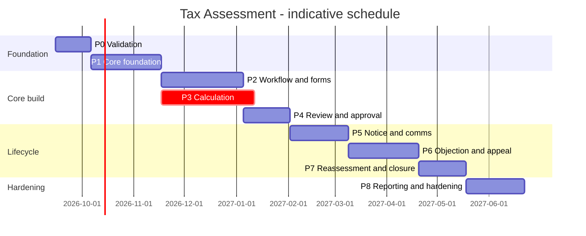

P3 runs in parallel with P2 because the calculation engine has the longest lead time and the greatest SME dependency. **[R]**

---

## 26. Testing Strategy

### 26.1 Existing testing assets

**[E]**

| Layer | Framework | Present |
|---|---|---|
| Nest unit/integration | Jest + `ts-jest` | 116 `.spec.ts` in `api-dynaforms/src` |
| Nest live API tests | `node --test` against a started app | `npm run test:api` |
| Migration tests | `node --test` | `npm run test:db-migrate` |
| Flowable engine | JUnit + H2 + Spring Boot Test | 11 test classes incl. `TwoLevelApprovalIntegrationTest`, `WorkflowIntegrationTest`, `EventListenerIntegrationTest` |
| Frontend unit/integration | Jest (`.jest.spec.ts`) | 53 files in the DynaForms submodule |
| Frontend E2E | Playwright (POM: `e2e/{tests,flows,pages,pages/selectors,support}`) | incl. `audit-journaling/demo-flow-1.spec.ts`, a 10‑phase multi‑role tax‑audit flow |
| Test doctrine | `technical-resources/technical-documentation/testing/` + `AGENTS.md` rules | Layer order unit → integration → E2E; `.jest.spec.ts` counts as real coverage, plain `.spec.ts` treated as legacy placeholders |
| Core service | — | **No test sources found** under `ifile-teapot-api-coreService/src/test` |

### 26.2 Test plan

**[R]**

| Level | Scope | Tooling | Gate |
|---|---|---|---|
| **Unit** | Calculation pipeline steps, rule resolution, deadline computation, admissibility, numbering, hashing | Jest | ≥ 90% on the calculation and deadline packages; 100% branch on rounding |
| **Golden‑file / regression** | Whole‑case calculation fixtures per jurisdiction × tax type × scenario (nil, refund, penalty, interest, loss set‑off, presumptive, multi‑year) with expected outputs **and** expected traces | Jest snapshot + committed fixtures | **Blocking in CI.** Any rule‑set change must show an intentional diff |
| **Property‑based** | Rounding, non‑negativity, monotonicity (more adjustment ⇒ not less tax), idempotency of recalculation | `fast-check` **[A]** (add dependency) | Advisory then blocking |
| **Integration** | Evidence retrieval (DataQuest, `audit-data`), submission persistence, workflow transitions, notice render+sign, e‑mail dispatch | Jest + test DB; existing `test:api` harness | Blocking |
| **Workflow** | Each BPMN path incl. timers, escalation, boundary events; each Path‑B transition | JUnit (Flowable) + Jest (bridge) | Blocking |
| **Contract** | Nest ↔ core service, Nest ↔ Flowable, Nest ↔ documentstore | Recorded fixtures | Blocking |
| **Security** | RBAC matrix per role × route; record‑level scoping; public endpoint exposure; `/security-review` on each PR touching auth | Jest + manual | Blocking |
| **E2E** | Multi‑role journeys: initiate→prepare→review→approve→notice→serve→objection→appeal→reassess→close | Playwright, POM per `AGENTS.md` | Blocking on the main flow |
| **Performance** | Register at 1M cases; calculation throughput; notice generation concurrency | k6/JMeter **[A]** | Non‑blocking gate with thresholds |
| **UAT** | Tax officers on real anonymised cases, per jurisdiction | Manual script derived from the Audit Journaling manual test suite **[E]** | Sign‑off |

### 26.3 Test data

**[R]**

- Anonymised production‑shaped taxpayer, filing and payment data.
- A curated set of ~30 **canonical cases** per jurisdiction covering every calculation branch and every lifecycle branch; these double as the golden files and the UAT script.
- No real taxpayer data in non‑production environments.

---

## 27. Deployment and Configuration Strategy

### 27.1 Existing deployment model

**[E]**

- Docker Compose (`frontend`, `backend`, `teapot-network`) plus `docker-compose-prod.yml`; Dockerfiles for backend, WAR backend and frontend; nginx configs; Kubernetes assets for at least one deployment (`kubernetes_pfrda_dev`).
- Per‑host environment files (`15.207.65.115.env`, `3.108.12.49.env`, `3.6.183.244.env`) and an `environment-property-list`.
- `Jenkinsfile` per module; separate build/deploy pipelines for the BPMN platform and DynaForms.
- `build-all.bat` builds Maven modules in dependency order on JDK 25, auto‑detecting `pom.xml` vs `package.json`.
- Migrations: `sequelize-cli` for `api-dynaforms` (`npm run db:migrate`, plus `db:migrate:refresh-cache-authz` which refreshes the Redis authorization cache after migrating); Liquibase for Java modules.
- Runtime property management via `ifile-teapot-api-propertyMngt` and the dynaforms `property` module.

### 27.2 Tax Assessment deployment additions

**[R]**

| Item | Approach |
|---|---|
| New module | Ships inside `ifile-teapot-api-dynaforms` — **no new deployable unit** (except the Flowable delegate, which ships with the existing BPMN engine) |
| Schema | New sequelize migrations, run via `npm run db:migrate:refresh-cache-authz` so authz cache refresh is not forgotten **[E] script exists** |
| Menus, display keys, action mappings | Seeded by migration, as all existing modules do |
| Rule sets | **Not** migrations — data managed through the admin UI, with JSON export/import for promotion between environments |
| Form templates | Authored in the builder; promoted via XLSX export/import or a JSON promotion script **[E] capability** |
| BPMN definitions | Authored in the modeler; promoted by exporting/importing `workflowXml` and re‑publishing per environment (note: `definitionKey` is generated per deployment **[E]**, so environment‑specific keys must not be hard‑coded anywhere) |
| Notice templates | Stored as HTML templates per notice type and language, promoted like licence templates |
| Configuration | Environment properties for integration endpoints, storage roots, jurisdiction default |
| Feature flags | Category flags (`assessment_enable`) + property‑based toggles, following the manage‑approvals feature‑flag precedent **[E]** |

### 27.3 Environment promotion

**[R]**

```
DEV -> SIT -> UAT -> PROD
```

| Artefact | Promotion mechanism |
|---|---|
| Code | Jenkins pipeline per module |
| Schema | Migrations, forward‑only, reversible `down` where feasible |
| Menus/permissions/display keys | Migrations |
| Form templates | Export/import + version pinning |
| Workflows | Export XML → import → publish → make effective |
| Rule sets | Export/import JSON → publish with approval in PROD |
| Masters | Seed migrations or admin UI |

**[R] Rule‑set promotion must require dual control in production** (author ≠ publisher), given that a wrong rate affects every case computed thereafter.

### 27.4 Operational runbook items

**[R]**

- Reconciliation job status (BPMN runtime vs API tables).
- Suspended/failed outbound operation queue.
- Notice generation backlog and failures.
- Deadline scheduler health and last run.
- E‑mail dispatch backlog (existing scheduler).
- Rule‑set version currently effective per jurisdiction/tax type.

---

## 28. Risks and Mitigations

| # | Risk | Likelihood | Impact | Mitigation |
|---|---|---|---|---|
| R1 | **Incorrect tax computation** reaches production | Medium | **Critical** (legal, financial, reputational) | Server‑side decimal engine; golden‑file regression gate in CI; rule simulator; dual control on rule‑set publish; parallel‑run against the existing module for a pilot period |
| R2 | Tax logic leaks into DynaForms formulas or Angular | High | High | Architectural rule: forms display, server decides. Code review checklist. A lint/CI check that no monetary field is authoritative client‑side |
| R3 | Statutory deadline computed wrongly (holidays, deemed service, extensions) | Medium | **Critical** | Configurable deadline engine using the existing holiday/calendar masters; exhaustive tests around boundaries; never compute deadlines client‑side |
| R4 | Two tax modules coexist (Audit Journaling + Tax Assessment) confusing users and data | **High** | High | Explicit convergence decision in Phase 0; read‑only bridge; migration plan for historic audit cases; single register UI |
| R5 | No payments/ledger system available | Medium | High | Scope decision in Phase 0; provider interface with a manual‑entry fallback; defer "outstanding balance" reporting if unresolved |
| R6 | BPMN webhook eventual consistency corrupts the audit trail | Medium | High | Reconciliation job; treat the domain event ledger (not the BPMN tables) as the audit system of record; alert on divergence |
| R7 | Linking‑workflow service tasks limited to `statusUpdater` blocks the design | **High** (certain, unless addressed) | Medium | Build the `apiInvoker` delegate in Phase 5 (spike in Phase 0); use Path B until then |
| R8 | Assessment workbench becomes another 2,500‑line component | Medium | Medium | Hard rule: all form rendering through the DynaForms renderer; component size budget in review |
| R9 | Jurisdiction requirements discovered late | **High** | High | Phase 0 jurisdiction workshop; configuration‑first design; deliver v1 for one jurisdiction, validate configurability on a second before Phase 8 |
| R10 | Tax SME availability | Medium | High | Named SME allocated per phase; golden cases signed off, not just described |
| R11 | Performance at 1M+ cases | Medium | Medium | Register view load‑tested from Phase 1; indexes designed with the model; consider partitioning event/evidence tables |
| R12 | Puppeteer PDF generation bottleneck | Medium | Medium | Asynchronous generation with a queue; pre‑render on finalisation; cache artefacts |
| R13 | Sensitive taxpayer data in logs/traces | Medium | High | Redaction policy configured in the auditor plugin; log review in security testing |
| R14 | Form template proliferation across years and tax types | **High** | Medium | Naming and versioning convention; clone‑per‑year discipline; template registry documentation |
| R15 | DynaForms package/host fence violated by domain code | Medium | Medium | Follow `docs/dynaforms-decoupling/rules.md`; domain code only in the host |
| R16 | Core service has no automated tests | **High** (existing condition) | Medium | Do not add tax logic to the core service; where core changes are needed, add tests with them |
| R17 | Rule‑set change applied retroactively by accident | Medium | High | Version pinning on results; recalculation is explicit and audited; effective dating enforced |
| R18 | Objection/appeal deadlines vary so much that the model does not fit | Medium | Medium | Anchor+offset+calendar model with an extension‑rule JSON escape hatch; validate against 3 jurisdictions in design |

---

## 29. Open Questions / Decisions Required

| # | Question | Owner | Needed by | Impact if unresolved |
|---|---|---|---|---|
| Q1 | Which workflow engine for the MVP — table‑driven (Path B) or BPMN (Path A)? Is the Phase‑5 migration accepted? | Architecture | Phase 0 | Blocks workflow design |
| Q2 | Is `ifile-teapot-api-dynaform-bpmn-engine` the same artefact as the "external `workflow-engine`" in the reference doc? | Platform team | Phase 0 | Deployment and ownership confusion |
| Q3 | Does Tax Assessment **replace** Audit Journaling, coexist with it, or absorb it over time? | Product | Phase 0 | R4; scope and data migration |
| Q4 | Which jurisdictions are in v1? Which in v2? | Product | Phase 0 | Configuration model validation |
| Q5 | Which tax types are in v1 (CIT / VAT / WHT / PIT)? | Product | Phase 0 | G13 (individual taxpayers) |
| Q6 | What is the payments / liability ledger system, and is an API available? | Customer/IT | Phase 1 | G12; outstanding balances, interest, refunds |
| Q7 | Is `GTA.sp_get_taxpayer_audit_data` jurisdiction‑specific? What is the equivalent elsewhere? | Platform + customer | Phase 1 | G14 portability |
| Q8 | Calculation engine in NestJS or Java? | Architecture | Phase 0 | Team allocation, Phase 3 |
| Q9 | Are notices legally valid when served electronically? What constitutes deemed service per jurisdiction? | Legal | Phase 5 | Statutory clocks, R3 |
| Q10 | Is a digital signature on notices mandatory? Which provider? | Legal + IT | Phase 5 | digisign integration |
| Q11 | Objection: deposit required? Percentage? Stay of collection? | Tax SME | Phase 6 | Objection model |
| Q12 | Appeal forums and whether any external case system must be integrated | Tax SME + IT | Phase 6 | G9 |
| Q13 | Limitation periods, and extended limitation for fraud/concealment | Tax SME | Phase 3 | Reassessment guardrails |
| Q14 | Approval thresholds and delegation rules | Customer | Phase 4 | Approval routing |
| Q15 | Data retention and legal hold policy | Legal + IT | Phase 8 | Retention design |
| Q16 | Expected volumes: taxpayers, cases/year, concurrent officers | Customer | Phase 0 | NFR targets, R11 |
| Q17 | Is a taxpayer self‑service portal in scope for v1, or officer‑only? | Product | Phase 1 | Stage 10/11 UI scope |
| Q18 | Languages required, and is RTL needed in v1? | Product | Phase 1 | Template and notice effort |
| Q19 | Should SLA tracking be built as a **platform** capability (benefiting FnP and licensing too) or tax‑only? | Architecture | Phase 5 | G5 scope and funding |
| Q20 | Is OCR‑based financial‑statement ingestion in scope for Tax Assessment, or audit‑only? | Product | Phase 2 | Reuse of `OcrHelperService` |

---

## 30. Recommended Next Steps

**Immediate (next 2 weeks)**

1. **Review this document** with platform architecture, the DynaForms team, the BPMN team and a tax SME; capture corrections against the **[E]** claims.
2. **Close Q1, Q2, Q3, Q4, Q5, Q8** — these six decisions determine the shape of everything else.
3. **Run the three Phase‑0 spikes**: `apiInvoker` delegate, decimal calculation in Nest, workbench shell.
4. **Convene a jurisdiction workshop** for the v1 jurisdiction to extract rates, thresholds, penalties, interest rules and deadlines into the `tbl_tax_rule_set` shape — this is the long‑lead item.

**Short term (weeks 3–8)**

5. Produce the **canonical case corpus** (~30 cases) with SME‑signed expected outputs; this becomes both the golden‑file suite and the UAT script.
6. Author **TA‑01/02/03** in the builder against real data and validate the register end to end.
7. Write the **architecture decision record** covering engine choice, module placement, calculation authority and the Audit Journaling convergence path.
8. Establish the **rule‑set governance process** (who authors, who publishes, what evidence is required).

**Do not start before Phase 0 closes**

- Any Angular component that renders assessment fields outside the DynaForms renderer.
- Any calculation logic in the front end.
- Any extension of `TBL_AUDIT_PROCESS` or the `auditprocess` Java module.

---

## 31. Implementation Readiness Summary

### 31.1 What Teapot already provides

- A mature **form platform**: JSONB definitions, 29 widget types, builder, renderer, dependency engine, validation engine, regex presets, formula engine, table/matrix, file upload, signature, captcha, open forms, multi‑language display keys, XLSX export/import, submission storage with draft/approve statuses and a revision chain.
- **Two working workflow engines** — Flowable BPMN with visual authoring, task role authorisation, journey view, and a table‑driven step engine with transitions, JSON‑Logic rules, statuses, cycle windows, cases, step data and a rich history table — plus a third legacy engine for the returns pipeline.
- A **configurable rule engine** (JSON‑Logic) and a **versioned, dimensioned, explainable risk‑scoring engine** with a draft/publish lifecycle.
- A complete **RBAC and menu/permission stack** with a Redis‑backed endpoint authorisation cache and fail‑closed semantics.
- **Document management** with checksums and access history, **digital signature** integration, **multi‑channel notification** with multi‑language bodies and delivery history, **generic entity history snapshots**, **API trace auditing** and **exception logging**.
- A proven **lifecycle‑artefact pipeline** (licence: reference numbering, HTML template merge, QR, Puppeteer PDF, public verification, suspension/revocation/reactivation, event log, scheduler, dashboards).
- A proven **case‑management pattern** (Fit & Proper: multiple initiation paths, cycle scheduling, user assignment, committee voting, dashboards, e‑mail alerts).
- **Configurable filed‑return data extraction** (DataQuest) and **existing tax‑domain data services** (`validateTIN`, `sp_get_taxpayer_audit_data`).
- A **complete, validated tax‑assessment field dictionary and formula catalogue** already implemented in the Audit Journaling module, with 1,292 lines of documentation and a multi‑role Playwright E2E flow.
- Grids, CSV/XLSX export, dashboards, charts, localisation, RTL, Docker/Jenkins deployment, and migration‑driven configuration seeding.

### 31.2 What can be achieved through configuration

- The `TAX` category and per‑tax‑type sub‑categories, with menus, display keys and permissions seeded by migration.
- **All 18 assessment forms** as DynaForms templates, including conditional sections, validations, lookups and indicative calculations.
- The **entire lifecycle** as a workflow definition — steps, actions, role codes, transitions, rules, statuses (Path B) or a BPMN diagram with timers and gateways (Path A).
- **Role codes, permission mappings and step‑role bindings**.
- **Risk‑based case selection** as a published risk‑score model.
- **Notification content and routing** as e‑mail alert types with multi‑language bodies.
- **Register columns, filters and CSV export** as grid configuration.
- **Jurisdiction rules** (rates, thresholds, penalties, interest, deadlines) once the rule‑set store exists — configuration thereafter.
- **Master data**: adjustment reasons, notice types, objection grounds, forums.

### 31.3 What requires extensions to existing components

| Extension | Component |
|---|---|
| Generic `apiInvoker` service‑task delegate + modeler panel | Flowable engine + linking BPMN modeler |
| Generalise the licence artefact pipeline into an `IssuedDocumentService` | `src/license` |
| Persisted SLA tracker, breach ledger and reminder job | Workflow platform (benefits all modules) |
| `readOnlyForRoles` element property | DynaForms renderer (host‑side extension) |
| Provider interface around jurisdiction‑specific tax data sources | coreService `audit` package |
| Register new tables with the history plugin; redaction policy in the auditor plugin | history/auditor plugins |
| Optional `assessment_enable` category flag | `tbl_dynaform_category` |
| Reconciliation job for BPMN runtime vs API tables | `workflow-engine-v2` |

### 31.4 What requires new development

| New component | Why it cannot be configured |
|---|---|
| **Tax calculation engine** (9‑step pipeline, decimal‑exact, traced) | The formula engine has no `IF`/`ROUND`/`SUM`/`MAX`, no slabs, no day‑count, and no decimal guarantee |
| **Versioned tax rule‑set store + admin UI + simulator** | No equivalent configuration store exists |
| **Statutory deadline engine** (anchor + offset + calendar + extensions) with persisted clocks | Only BPMN timers exist, with no persisted deadline model |
| **Assessment case domain module** (case, item, adjustment, evidence, notice, service, objection, appeal, deadline, event tables + services) | No tax‑assessment domain exists |
| **Notice service & proof‑of‑service model** | Licence pipeline has no service/acknowledgement concept |
| **Objection and appeal domain services** | Absent |
| **Reassessment/version lineage at case level** | Only submission‑level chaining exists |
| **Assessment workbench shell** | No case‑centric UI shell exists |
| **Payments/liability integration** | No payment or ledger module in the repository |
| **Golden‑case regression harness** | No equivalent exists |

### 31.5 Biggest technical risks

1. Calculation correctness and decimal precision (R1, R2, G2, G25).
2. Coexistence of two workflow engines and BPMN eventual consistency (R6, R7, G6, G24).
3. Duplication with the existing Audit Journaling module (R4, G21).
4. Absence of a payments/ledger system (R5, G12).
5. Performance of the register and of notice generation at scale (R11, R12).

### 31.6 Biggest domain risks

1. Statutory deadlines and deemed service computed incorrectly (R3, Q9).
2. Jurisdictional variance in objection/appeal procedure exceeding the configuration model (R18, Q11, Q12).
3. Limitation and reassessment grounds (Q13).
4. Legal validity and wording of electronically served notices (Q9, Q10).
5. Tax SME availability to sign off rules and golden cases (R10).

### 31.7 Recommended MVP scope

**One jurisdiction, one tax type (CIT), desk and audit assessment, officer‑facing only.**

| In | Out (deferred) |
|---|---|
| Initiation (manual + risk‑based), evidence retrieval, case creation and assignment | Taxpayer self‑service portal |
| Preparation with adjustments and evidence | Objection and appeal |
| Server‑side calculation with a versioned rule set (flat rate + slab + penalty + simple interest) | Reassessment |
| Review and single‑level approval | Payments/ledger integration |
| Finalisation, notice generation and e‑mail service | Multi‑level approval, delegation |
| Register, basic dashboard, CSV export | OCR ingestion |
| Full audit trail | Multi‑jurisdiction, multi‑language |

MVP corresponds to **Phases 0–5 (partial)** — approximately **5–6 months** with the assumed team. **[A]**

### 31.8 Recommended long‑term scope

- All tax types (CIT, VAT, WHT, PIT, excise) as sub‑categories.
- Multi‑jurisdiction with the rule set and deadline config proven on at least two jurisdictions.
- Full dispute lifecycle: objection, appeal, settlement, reassessment, closure.
- Taxpayer self‑service portal for notices, clarifications, objections and payment.
- BPMN‑executed lifecycle with timers, escalation and process journey for audit defence.
- Platform‑wide SLA tracking, benefiting licensing and Fit & Proper as well.
- Risk‑model feedback loop: selection performance measured against assessment yield.
- Convergence of the Audit Journaling module into the configured Tax Assessment category.
- Analytics: adjustment‑reason analysis, officer productivity, dispute outcome prediction.

### 31.9 Immediate next steps

1. Circulate this document; validate the **[E]** claims with the platform team.
2. Decide Q1–Q5 and Q8 (workflow engine, engine artefact identity, Audit Journaling convergence, jurisdictions, tax types, calculation language).
3. Run the three Phase‑0 spikes.
4. Hold the jurisdiction rules workshop and start the rule‑set extraction.
5. Build the canonical case corpus with SME sign‑off.
6. Write the architecture decision record and open the Phase‑1 backlog.

---

---

## Appendix A — Target Conceptual Architecture

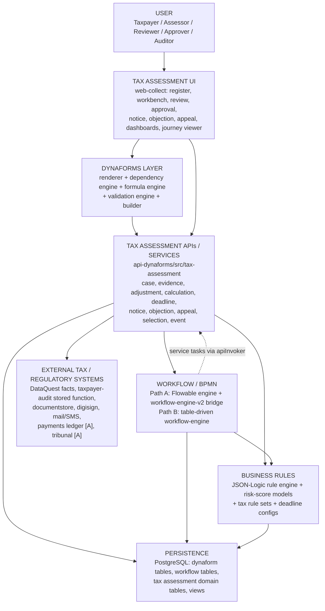

### Layer responsibilities and reuse

| Layer | Responsibility | Existing Teapot components reused | New |
|---|---|---|---|
| **User** | Officers, taxpayers, auditors, administrators | `UserMaster`, `UserRole`, entity mappings, authenticator | Role codes only |
| **Tax Assessment UI** | Navigation, case shell, queues, dashboards | web‑collect shell, grids, task screens, journey viewer, dashboard patterns, split‑pane renderer | Workbench shell, calculation panel, rule‑set admin |
| **DynaForms** | All data capture and display; conditional logic; client‑side assistance and validation | Renderer, builder, dependency engine, formula engine, validation engine, file/signature widgets | 18 template configurations |
| **Tax Assessment APIs/Services** | Domain orchestration; the only writer of assessment truth | Nest module conventions, auth interceptor, exception filters, schedulers | The whole `tax-assessment` module |
| **Workflow / BPMN** | Lifecycle sequencing, task assignment, timers, escalation, status transitions, history | Flowable engine + bridge, or table‑driven engine; both with role‑based task authorisation and history | Workflow configuration; `apiInvoker` delegate |
| **Business Rules** | Routing, eligibility, scoring, tax computation parameters, deadlines | JSON‑Logic engine, risk‑score engine, workflow rules, condition‑builder UI | Tax rule sets, deadline configs, calculation pipeline |
| **Persistence** | Durable state, audit, reporting | PostgreSQL, Sequelize/JPA conventions, migrations, views, history plugin | Tax domain tables + register view |
| **External systems** | Source data and downstream effects | DataQuest, taxpayer‑audit, documentstore, digisign, mail, SMS, third‑party‑service | Payments/ledger and tribunal integrations |

---

## Appendix B — Repository Mapping

Concrete mapping of each proposed capability onto the existing repository. Paths are actual **[E]**; the *New component* column is proposed **[R]**.

| Capability | Existing module | Package / directory | Class / component | Existing API | Existing config | Existing table | Reuse | Extension | New component |
|---|---|---|---|---|---|---|---|---|---|
| Assessment forms | `Backend/ifile-teapot-api-dynaforms` + standalone package | `packages/dynaforms-api/src/{http,persistence,domain}` | `DynaformsFormTemplateModel`, `DynaformsFormTemplateDataModel` | `/api/formTemplates/*`, `/api/formTemplateData/*` | `tbl_dynaform_category` flags, `global_config` | `tbl_dynaform_form_template`, `..._data` | Full | — | 18 template configurations |
| Form rendering | `Frontend/ifile-teapot-web-collect` | `src/ifile-teapot-web-dynaforms/components/form-renderer` | `form-engine.service.ts`, `dependency-engine.service.ts`, `formula-rule-evaluator.util.ts`, `field-registry.ts` | — | element JSON | — | Full | `readOnlyForRoles` property | — |
| Form authoring | web‑collect | `components/dynaform-builder`, `dynaform-builder-v2` | builder panels, `formula-builder` | — | — | `tbl_dynaform_element` | Full | — | — |
| Validation presets | api‑dynaforms | `src/` (regex master) | — | `GET /api/regex-master` | `tbl_dynaform_regex_master` | same | Full | TIN presets per jurisdiction (data) | — |
| Formula evaluation | standalone package | `src/domain/formula/safe-formula.ts`, `src/http/controllers/formula.controller.ts` | — | `/api/formula/{validate,evaluate,evaluate-batch}` | — | — | Indicative UI only | — | Server calculation pipeline |
| BPMN authoring | web‑collect | `src/ifile-teapot-web-dynaforms/components/workflow/components/create-linking-workflow` | `linking-bpmn-modeler.component.ts`, `sequence-condition-builder` | `/api/linking-workflows` | `flowable:*` extensions | `tbl_dynaform_linking_workflows` | Full | Service‑task panel for `apiInvoker` | Tax BPMN definitions |
| BPMN execution | `Backend/ifile-teapot-api-dynaform-bpmn-engine` | `src/main/java/com/example/workflow` | `ProcessService`, `WorkflowTaskService`, `GlobalFlowableEventListener`, `JsonLogicConditionEvaluator`, `StatusUpdaterDelegate` | `/api/process/{deploy,start}`, `/api/task/complete` | `application.yml` webhook URLs | Flowable schema | Full | `ApiInvokerDelegate` | — |
| BPMN runtime bridge | api‑dynaforms | `src/workflow-engine-v2` | `bpmn-engine.service.ts`, `bpmn-webhook.controller.ts` | `/api/workflow/{snapshot,progress}`, `/api/bpmn/*` | — | `tbl_dynaform_engine_*` | Full | Reconciliation job | — |
| Table‑driven workflow | api‑dynaforms | `src/workflow`, `src/workflow-engine`, `src/dynaform-workflow-*`, `src/dynaform-step-actions`, `src/dynaform-step-role-code` | `workflow-engine.service.ts`, `transition-resolver.service.ts`, `rule-engine.service.ts`, listeners | `/api/workflow-engine/*`, `/api/workflows/*` | steps, transitions, rules, statuses | `tbl_dynaform_workflow_*`, `..._case*` | Full (MVP engine) | — | Tax workflow definition |
| Rules | api‑dynaforms | `src/workflow-engine/services`, `src/dynaform-workflow-rule` | `RuleEngineService`, `ConditionConverterService` | `/api/dynaform-workflow-rule` | `condition_json` | `tbl_dynaform_workflow_rule` | Full | — | Tax rule sets |
| Risk scoring | api‑dynaforms | `src/risk-score` | `risk-score-engine.service.ts`, `risk-score-field-catalog.service.ts` | risk‑score controller | model/rule/band config | `tbl_dynaform_risk_score_*` | Full | — | Tax selection model (config) |
| Authorisation | api‑dynaforms + coreService | `src/auth`, `coreService/.../authzcache`, `src/dynaforms-integration/teapot-access.policy.ts` | `AuthInterceptor`, authz writers | all | `TBL_ACTION_MENU_MAPPING` | menus/roles/actions | Full | — | New mapping rows |
| Taxpayer / entity | coreService + orm | `entity/entitybean`, `model/EntityBean.java` | `EntityServiceImpl` | `/entity/*` | — | `TBL_ENTITY` | Full | Individual attributes if PIT | — |
| Tax type / period / calendar | coreService + orm | `returns`, `returntype`, `frequency`, `filingcalendar`, `holiday` | `ReturnServiceImpl` etc. | `/return/*`, `/filingCalendar/*` | masters | `TBL_RETURN`, `TBL_FREQUENCY_PERIOD`, `TBL_FILING_CALENDAR`, `TBL_HOLIDAY` | Full | Used by deadline engine | — |
| Filed return facts | `Backend/ifile-teapot-api-dataquest` | `dataQuest/{controller,service,util}` | `DataQuestServiceImpl`, `FactFilterUtil` | `POST /apiDataQuest/facts/extract` | `DataConfig` rows | data config table | Full | — | Assessment `DataConfig` rows |
| Historic tax figures | coreService + orm | `audit/{controller,service,transformer}`, `repository/TaxpayerAuditRepository.java` | `TaxpayerAuditService` | `/taxpayer-audit/{audit-data,validateTIN}` | — | `GTA.sp_get_taxpayer_audit_data` | Full | Provider interface | — |
| Existing tax audit case | coreService + orm | `auditprocess/*`, `model/AuditProcess.java`, `AuditAction.java` | `AuditProcessServiceImpl`, `AuditExcelGenerationServiceImpl`, `OcrHelperService` | `/auditService/*` | Excel mapping configs | `TBL_AUDIT_PROCESS`, `TBL_AUDIT_ACTION`, `TBL_AUDIT_STATUS` | Read‑only bridge; field dictionary | **Do not extend** | Convergence plan |
| Tax audit UI | web‑collect | `src/app/audit-journaling` | `audit-detail.ts`, `initiate-audit-formula.service.ts` | — | — | — | Specification source | — | Replaced by configured forms |
| Documents | `Backend/ifile-teapot-api-documentstore` | `documentstore/{controller,service,model}` | `FileManagementController`, `DMSMetadata`, `FileAccessHistory` | file/folder APIs | storage properties | DMS tables | Full | — | — |
| File storage (forms) | api‑dynaforms | `src/dynaforms-integration/teapot-file.storage.ts` | `TeapotDynaformsFileStorage` | `/api/files/*` | property keys | — | Full | — | — |
| Notes & attachments | orm + coreService | `model/Comments.java`, `Attachment.java`, `comments/` | — | comments APIs | `MasterIdentifier` | `TBL_COMMENTS`, `TBL_ATTACHMENT` | Full | — | New master identifier |
| Digital signature | `Backend/ifile-teapot-api-digisign` | `digisign/controller` | `EmSignerController`, `EmudhraApiController` | signing APIs | provider properties | `SignStatus` | Full | Notice signing wiring | — |
| Notifications | api‑dynaforms + coreService + api‑mail | `src/common/dynaform-email`, `coreService/email*` | `DynaformEmailAlertService`, `DynaformEmailScheduler`, `MailController` | mail APIs | alert types, bodies, role maps | `tbl_dynaform_email_*`, `TBL_EMAIL_ALERT` | Full | — | New alert types (config) |
| Artefact generation | api‑dynaforms | `src/license` | `LicenseService.generatePdf`, `getVerificationHtml`, `LicenseSchedulerService` | `/api/license/*` | HTML templates, `license_ref_gen_pattern` | `tbl_dynaform_license*` | Pattern | Generalise to `IssuedDocumentService` | Notice tables + service |
| Case‑management pattern | api‑dynaforms | `src/form-templates/fp-*.model.ts`, `src/fp-commitee-opinion`, `src/fit-proper-dashboard` | `FpSchedulerService`, `FitProperInitiationService` | fit‑proper APIs | initiation paths, cycle schedules | `tbl_fit_proper_*`, `tbl_fp_*` | Pattern | — | Tax selection + assignment |
| History / audit | component‑history‑plugin, component‑auditor‑plugin | `entityhistory/*`, `auditor/*` | `SnapshotDAO`, `HttpTraceLogServiceImpl` | audit APIs | `HistoryTableMapping`, `HttpTraceLogUrlConfiguration` | `TBL_HISTORY_MASTER`, trace tables | Full | Register tax tables; redaction | Domain event ledger |
| Grids / export | coreService + api‑dynaforms | `grid/`, `src/grid-defs` | `GridConfigurationServiceImpl` | grid APIs, `downloadcsv/{gridKeyName}` | `col_defs` | `TBL_GRID_COL_DEFS` | Full | — | Tax grid configs + export route |
| Dashboards | api‑dynaforms + coreService | `src/license` (dashboard methods), `src/fit-proper-dashboard`, `coreService/chart`, `dashboard` | dashboard services | `/api/license/dashboard/*` etc. | category `dashboardEnable` | views | Pattern | — | Tax dashboard endpoints |
| Localisation | coreService + api‑dynaforms | `language/`, `src/{display-key,display-label,translations,language-master}` | `DisplayKeyLabelService` | translation APIs | display keys | `TBL_DISPLAY_KEY(_LABEL)` | Full | — | Tax display keys |
| Scheduling | api‑dynaforms + coreService | `@nestjs/schedule` usage, `schedulermaster` | `LicenseSchedulerService`, `FpSchedulerService`, `DynaformEmailScheduler` | — | `SchedulerMaster` | scheduler tables | Pattern | — | Tax scheduler (deadlines, reminders, selection) |
| Retry / resilience | coreService | `suspendedapicall/`, `workflow/integration/service/impl` | `WorkflowApiFailureHandlerServiceImpl` | retry trigger API | retry counts | `TBL_SUSPENDED_API_CALLS` | Pattern | — | Tax idempotency + suspended ops |
| Deployment | `Backend/ifile-teapot-docker` | compose, Dockerfiles, nginx, env | — | — | per‑host `.env` | — | Full | — | Pipeline entry for new migrations |

---

*End of document — `V1_tax_assessment_initial_plan_05092026`. Planning only; no repository code, configuration, BPMN or DynaForms artefacts were created or modified.*


