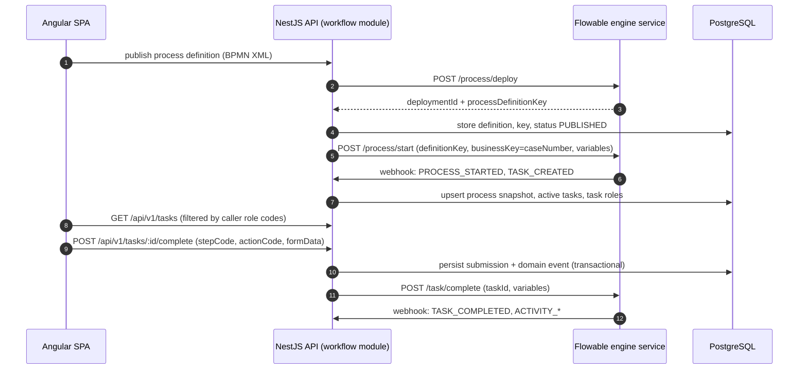
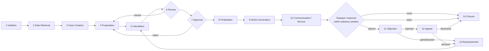
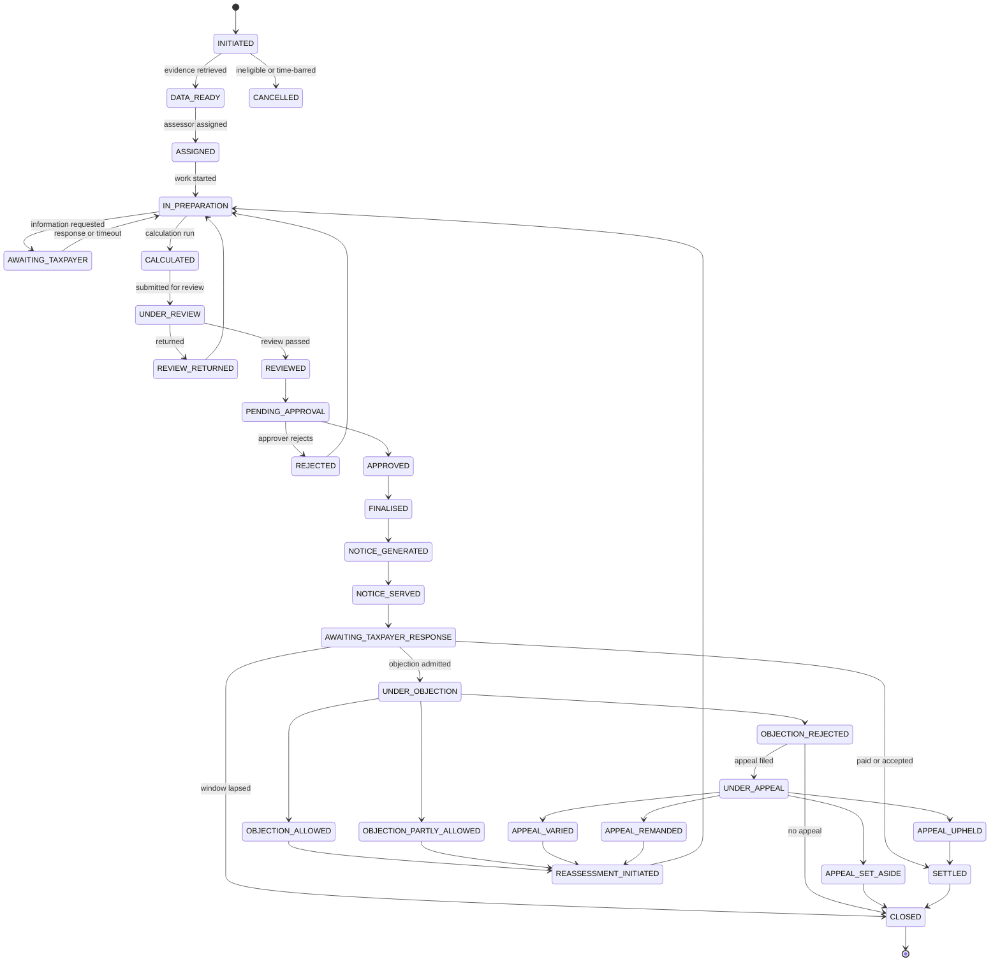
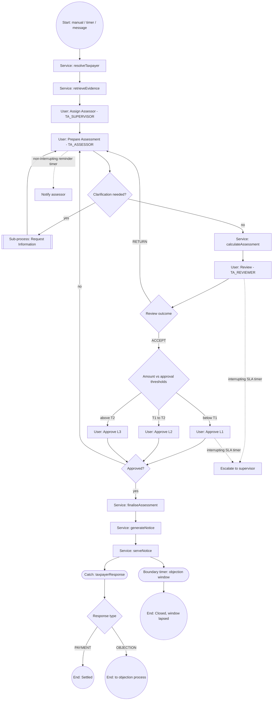
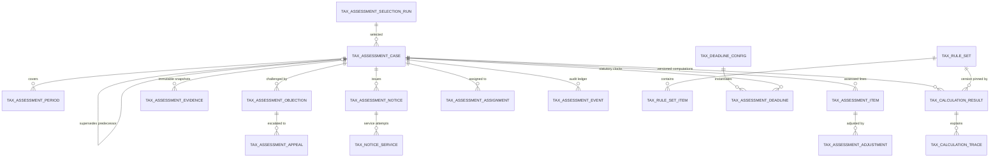
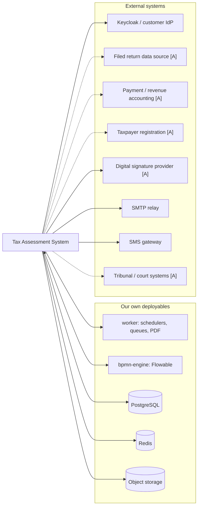
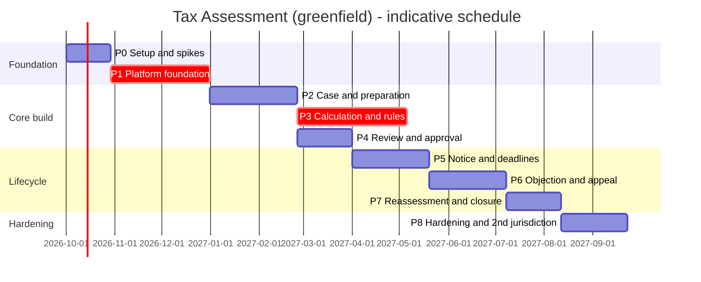
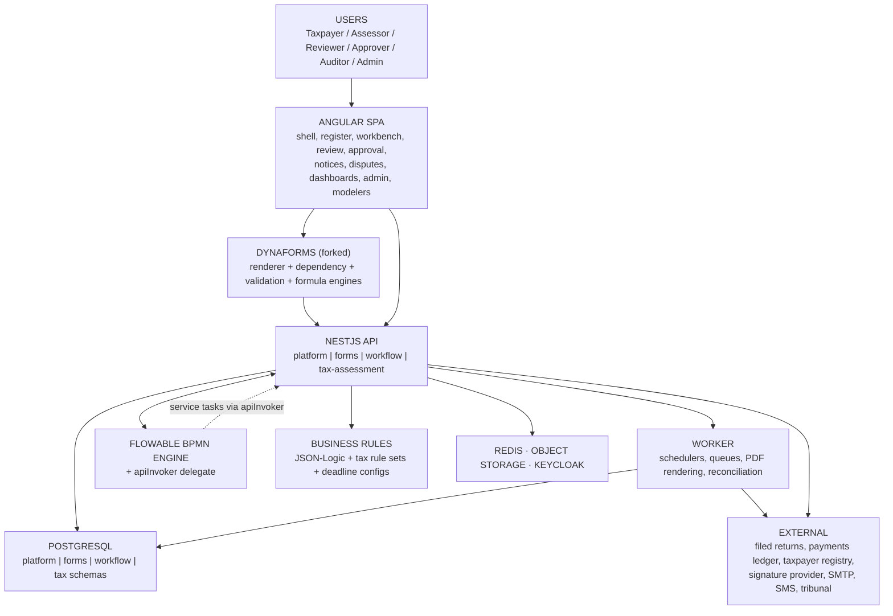

# V2 — Tax Assessment System: Greenfield Architecture & Implementation Plan

**Document ID:** `V2_tax_assessment_greenfield_plan_11092026`
**Product:** Tax Assessment System (IRIS Regtech)
**Date:** 11 September 2026
**Supersedes:** `V1_tax_assessment_initial_plan_05092026` (retained for reference)
**Status:** Draft for architecture / product / tax-domain review
**Scope:** Planning only. No code, migrations, BPMN files, DynaForms or configuration created or modified.

---

## How V2 differs from V1

V1 was written as a **brownfield assessment of an existing platform (iFile-Teapot)**. Roughly 45% of it was an inventory of capabilities that already existed — identity, RBAC, taxpayer master, document store, e-mail, audit plugins, risk scoring, dashboards — with instructions to reuse them unchanged. Every such claim carried an `[E]` evidence tag pointing at a Teapot source path.

**None of that applies now.** This is a new, standalone project. The only things carried across are the two chosen engines: **DynaForms** (form definition and rendering) and **BPMN** (process execution). Everything V1 called "reuse" is now either **build**, **adopt** (a third-party component), or **configure**.

| V1 framing | V2 framing |
|---|---|
| `[E]` Evidence — verified in the Teapot repo | Removed. Nothing is verifiable from a repository that does not exist yet. |
| `[A]` Assumption | **`[A]`** — retained. Business or external input still to be confirmed. |
| `[R]` Recommendation | **`[D]`** Decision — made here, binding unless revisited. **`[O]`** Open — must be decided, owner named. |
| "~45% reuse of existing Teapot capability" | ~0% platform reuse. See §24 for the real build inventory. |
| "Choose between three workflow engines already in the repo" | One engine, chosen here (§2.4). |
| "Do not extend the legacy Audit Journaling module" | No legacy module exists. The risk it described — a 2,500-line hand-written assessment component — is now a **discipline to maintain**, not a mess to avoid. |
| "Build inside `api-dynaforms`, no new deployable unit" | New project, new deployables (§3.1). |

What V2 keeps from V1 essentially unchanged, because it was jurisdiction-neutral domain analysis and remains correct: the tax domain model (§7), the 14-stage functional scope (§8), the consolidated state machine (§10), the DynaForms template catalogue (§11), the business-rule taxonomy (§15) and the status model (§16).

---

## Legend

| Tag | Meaning |
|---|---|
| **[D]** Decision | Decided in this document. Binding unless explicitly revisited through an ADR. |
| **[A]** Assumption | Not knowable from here — business, legal or customer input. Stated so it can be confirmed. |
| **[O]** Open | A decision that must be made, with an owner and a "needed by" date. Consolidated in §29. |

---

## 1. Executive Summary

### 1.1 What we are building

A **standalone, configuration-driven tax assessment platform**: a system in which a tax authority can initiate, prepare, compute, review, approve, issue, serve, dispute and close tax assessments — and in which adding a new tax type or a new jurisdiction is a **configuration change, not a release**.

There is no existing codebase. Everything below is new, with two exceptions:

1. **DynaForms** — the JSON-defined form engine (builder, renderer, dependency engine, validation engine, formula engine, ~29 widget types). Forked into this repository and owned by this team. **[D]**
2. **BPMN execution** — Flowable 7, adopted as an off-the-shelf open-source engine and wrapped in our own service. **[D]**

### 1.2 The central architectural commitment

> **Forms display. The server decides. Nothing that determines a legal figure or a statutory date may execute in a browser.**

This single rule drives most of the design:

- The DynaForms **formula engine is for on-screen assistance and cross-checks only**. As inherited it cannot express `IF`, `ROUND`, `SUM`, `MIN`, `MAX`, slab logic or day-count arithmetic, and it is floating-point. A **server-side Tax Calculation Service** using exact decimal arithmetic is the authoritative computation. Because we now own the fork we *could* extend the formula language — and we deliberately will not make it authoritative even if we do (§4.4).
- **Statutory deadlines are never computed client-side.** The form displays a server-supplied deadline; admissibility is decided server-side against the stored service date.
- Every computed figure carries a **stored, explainable trace** and pins the **version of the rule set** that produced it.

### 1.3 The four pillars of the build

| Pillar | What it is | Why it is called out |
|---|---|---|
| **Platform foundation** | Identity integration, RBAC, menus/permissions, masters, documents, notifications, audit, scheduling, i18n | Every other pillar depends on it. In V1 this existed; here it is the critical path for Phase 1. |
| **Form & process engines** | DynaForms fork + Flowable wrapper + JSON-Logic rule engine | Adopted, not invented. Configured per tax type and jurisdiction. |
| **Tax assessment domain** | Case, item, adjustment, evidence, calculation, notice, service, objection, appeal, deadline, event | The actual product. Thin domain tables wrapping form submissions and process instances. |
| **Tax configuration** | Versioned, effective-dated rule sets; deadline configs; notice templates; masters | The jurisdiction-portability mechanism. Acceptance criterion: **new jurisdiction = zero code**. |

### 1.4 Effort shape

Greenfield inverts V1's numbers. **[A]** — indicative, for the team shape in §25.

| Category | Share of scope | Notes |
|---|---|---|
| Platform foundation (new) | ~30% | Identity integration, RBAC, masters, documents, notifications, audit, scheduling — all absent, all prerequisite |
| Tax assessment domain services (new) | ~25% | Case lifecycle, evidence, adjustments, notices, objections, appeals |
| Tax calculation & rule configuration (new) | ~15% | Highest-risk component. Decimal-exact, traced, versioned |
| Front end (new) | ~20% | Shell, register, workbench, review/approval, notices, disputes, dashboards, admin |
| Adopted engines (fork / integrate / configure) | ~10% | DynaForms fork stand-up; Flowable wrapper; workflow and form configuration |

### 1.5 The five biggest risks

1. **Calculation correctness and precision.** Tax computation must be decimal-exact, reproducible, explainable and defensible in court. Floating point anywhere in the pipeline is a defect. Mitigated by a golden-case regression gate in CI, a rule simulator, and dual control on rule-set publication. (§28 R1)
2. **Platform foundation is now on the critical path.** V1 could start on tax logic in week one because identity, RBAC and masters existed. Here, nothing works until they do. Under-estimating this is the most likely cause of a slipped Phase 3. (§28 R2)
3. **Statutory deadlines and deemed service.** Objection and appeal windows, limitation periods, holiday calendars and deemed-service rules are jurisdiction law. Getting one wrong is a legal exposure, not a bug. (§28 R3)
4. **Scope of "standalone".** With no platform to lean on, the temptation is to build a general-purpose regulatory platform instead of a tax assessment system. Every foundation component must be built to the minimum Tax Assessment needs, with extension points — not as a product in itself. (§28 R4)
5. **No payments / liability ledger.** Outstanding balance, refunds and interest-to-date all depend on a ledger. Whether we build one or integrate one is an open decision with a large scope swing. (§28 R5, §29 Q6)

---

## 2. Technology Stack

### 2.1 Decisions

**[D]** — rationale from §2.2 onward. Versions are targets at project start; pin exact versions in the repository.

| Layer | Choice | Version target |
|---|---|---|
| **Database** | PostgreSQL | 16+ |
| **Cache / queue backing** | Redis | 7+ |
| **Primary backend runtime** | Node.js + TypeScript | Node 22 LTS, TS 5.6+ |
| **Backend framework** | NestJS | 11 |
| **ORM / migrations** | Sequelize + `sequelize-typescript`, `sequelize-cli` migrations | 6 / 2 |
| **Decimal arithmetic** | `decimal.js` — **mandatory for all monetary computation** | latest |
| **Rule evaluation** | JSON-Logic (`json-logic-engine`) | 5 |
| **BPMN engine** | Flowable on Spring Boot 3.4, Java 21 LTS — the single Java service | Flowable 7.x |
| **Java build** | Maven | 3.9+ |
| **Front end** | Angular | 20/21 |
| **UI kit** | PrimeNG + Tailwind CSS | current |
| **Charts** | ApexCharts (`ng-apexcharts`) | current |
| **BPMN authoring (UI)** | `bpmn-js` + custom Flowable property panels | 17+ |
| **Server-side PDF** | Puppeteer (headless Chromium), async queue | 24+ |
| **Object storage** | S3-compatible (MinIO in dev, S3 / Azure Blob in prod) | — |
| **Job scheduling** | `@nestjs/schedule` for cron; BullMQ (Redis) for durable work | current |
| **Authentication** | OIDC / OAuth2 via Keycloak; JWT access tokens | Keycloak 26+ |
| **Logging** | Pino (structured JSON) to an aggregator | current |
| **Metrics / tracing** | OpenTelemetry → Prometheus + Grafana / Tempo | current |
| **API contract** | OpenAPI 3.1, generated from Nest decorators | — |
| **Testing** | Jest (unit/integration), Playwright (E2E), JUnit (Flowable), k6 (load), fast-check (property) | current |
| **Containers** | Docker + Compose (dev), Kubernetes + Helm (prod) | — |
| **CI/CD** | Match customer standard — GitHub Actions or Jenkins **[O]** | — |

### 2.2 Why NestJS / TypeScript as the primary backend

- The DynaForms fork is TypeScript. A single language across the form engine and the domain services removes an entire translation layer and lets form-definition types be shared rather than duplicated.
- The front end is Angular/TypeScript. Shared DTOs and enums across the whole stack, in one monorepo, is a real correctness win for a system with ~60 status codes and ~18 form templates.
- NestJS gives module boundaries, DI, interceptors, guards and OpenAPI generation out of the box — exactly the structure this system needs.

**The one real objection is money arithmetic.** JavaScript's `Number` is IEEE-754 double and is unsafe for currency. This is addressed, not hand-waved:

1. All monetary columns are `NUMERIC(20,4)` or wider in PostgreSQL. **[D]**
2. All monetary computation uses `decimal.js`; the Sequelize `DECIMAL` type is configured to return **strings, never JS numbers**. **[D]**
3. A lint rule and a review checklist item forbid arithmetic operators on any value typed as money; the `Money` type in `packages/decimal` is a branded type that makes `a + b` a compile error. **[D]**
4. The calculation pipeline carries 100% branch coverage on rounding, and property-based tests for rounding direction and idempotency. **[D]**

With those four controls, TypeScript is as safe here as Java `BigDecimal`. Without them it is not — so they are non-negotiable, not aspirational.

### 2.3 Why Flowable stays Java

Flowable is a mature BPMN 2.0 engine with native support for what statutory process actually needs: interrupting and non-interrupting boundary timers, event sub-processes, message correlation, multi-instance tasks, and a durable async job executor. Reimplementing that in Node is not a reasonable use of the budget, and no Node BPMN library is close.

So: **one Java service**, deliberately thin. It runs BPMN, exposes a REST surface, emits lifecycle events, and calls back into our services through a generic delegate. **No tax logic lives in it, ever.** **[D]**

### 2.4 Workflow engine — one engine, decided now

V1 found three engines coexisting and recommended a "dual-track" MVP on a table-driven engine with a later BPMN migration. **That recommendation is withdrawn.** It existed only because both engines already existed and neither could be deleted.

Greenfield, building two workflow engines in order to migrate between them is indefensible. **We build on BPMN/Flowable from day one.** **[D]**

| Why BPMN rather than a table-driven step engine |
|---|
| Statutory timers are a hard requirement, not a nicety: objection windows, appeal windows, response windows, limitation warnings, SLA escalation. A table-driven engine has none. |
| Objection and appeal are separate processes with independent lifetimes that must correlate to a parent case by business key. BPMN message correlation does this natively. |
| A visual process journey is an audit-defence artefact for a tax authority, not a developer convenience. |
| Parallel review, multi-level approval routing and event sub-processes are all in scope by Phase 4–6. |

The cost — eventual consistency between engine state and our read models — is mitigated in §17.3 with a reconciliation job, and by making **our domain event ledger, not the engine's tables, the audit system of record**. **[D]**

What we keep from the table-driven idea: the **assessment cycle/window** concept (a selection campaign with `effective_from` / `effective_to`) is genuinely useful and becomes `tax_assessment_selection_run` (§13.4) — a domain concept, not an engine feature.

### 2.5 Why Keycloak rather than building identity

Building authentication — password policy, MFA, token issuance and rotation, session management, account recovery, lockout — is weeks of work with a large security blast radius and no product differentiation. Keycloak provides it, deploys on-premises (a common tax-authority requirement), and federates to a customer's existing directory.

**We build authorisation, not authentication.** **[D]** Roles, permissions, menu access and record-level scoping are domain concerns and stay ours (§9). Keycloak issues the token and asserts identity; our services decide what that identity may do.

### 2.6 Explicitly rejected

| Option | Why not |
|---|---|
| Java/Spring for the whole backend | Forks the stack against DynaForms and the front end; two languages for no gain beyond `BigDecimal`, which §2.2 solves |
| Camunda 8 (Zeebe) | Excellent engine, but the operational footprint (Zeebe + Elasticsearch + Operate) is heavy at this scale, and licensing is a customer decision we should not pre-empt |
| A Node BPMN library | Not credible for statutory timers, durable state and crash recovery |
| Microservices from day one | Premature. A modular monolith with enforced module boundaries, plus the Flowable service, suits this team size; split later along the seams in §14.2 |
| NoSQL as primary store | Tax assessment is relational, transactional and audited. PostgreSQL with JSONB where the shape is genuinely dynamic is correct |
| Building our own BPMN engine | No |
| Building our own identity provider | No (§2.5) |

### 2.7 Where JSONB is and is not allowed **[D]**

| Allowed | Not allowed |
|---|---|
| Form definitions (`form_template_definition`) | Any monetary amount that must be reported, aggregated or recalculated |
| Form submissions (`form_template_data.json`) — the authoring record | Any statutory date |
| Immutable evidence snapshots (payload exactly as retrieved) | Case status, adjustment lines, calculation results |
| Rule-set item parameters and conditions | Anything a register query or index must filter on |
| Event payloads in the audit ledger | — |

The rule: **JSONB is the authoring and evidence format; normalised columns are the reporting and computation format.** Adjustments and calculation results are written to both — the submission JSON is what the officer filled in; the normalised rows are what the system computes and reports on (§13.3).

---

## 3. Repository and Project Structure

### 3.1 Monorepo layout **[D]**

A single repository. At this team size, cross-cutting changes (a new status code touching a migration, a service, a DTO and a screen) are the norm, and a polyrepo taxes every one of them.

```
tax-assessment-system/
├── apps/
│   ├── api/                       # NestJS — the modular monolith
│   ├── bpmn-engine/               # Spring Boot + Flowable (Java 21)
│   ├── web/                       # Angular SPA
│   └── worker/                    # NestJS — schedulers, BullMQ consumers, PDF rendering
├── packages/
│   ├── dynaforms-core/            # Forked DynaForms engine (framework-agnostic TS)
│   ├── dynaforms-angular/         # Forked builder + renderer components
│   ├── contracts/                 # Shared DTOs, enums, status codes, generated OpenAPI types
│   ├── decimal/                   # Money type + guarded arithmetic helpers
│   └── testing/                   # Fixtures, golden-case harness, test utilities
├── db/
│   ├── migrations/                # sequelize-cli, forward-only
│   └── seeds/                     # Reference data, demo jurisdiction
├── config/
│   ├── rule-sets/                 # Versioned tax rule sets (JSON, promoted per environment)
│   ├── form-templates/            # Exported DynaForms templates
│   ├── bpmn/                      # Process definitions
│   └── notice-templates/          # HTML notice templates per type and language
├── deploy/
│   ├── docker/                    # Dockerfiles, compose for local dev
│   └── helm/                      # Kubernetes charts
├── docs/
│   ├── adr/                       # Architecture decision records
│   └── domain/                    # Tax domain documentation, jurisdiction guides
└── plans/
```

### 3.2 Why DynaForms splits into two packages

`dynaforms-core` holds the form definition model, dependency engine, validation engine and formula evaluation as **framework-agnostic TypeScript**. `dynaforms-angular` holds the builder and renderer components.

This matters because the **same validation and dependency logic must run on the server** — client-side validation is a UX affordance, never a control. Splitting the core out means the API imports and executes exactly the code the browser ran, rather than a re-implementation that will drift. **[D]**

### 3.3 The fork discipline **[D]**

Forking DynaForms means we own it, which is a licence to make it worse. Three rules:

1. **No tax domain code in `dynaforms-*`.** The packages know about fields, validation and layout. They must never know what a tax adjustment is. Enforced by an import-boundary lint rule.
2. **Every divergence from the upstream behaviour is recorded in an ADR**, so that a future decision to re-converge is possible.
3. **Extensions go through the element schema**, not through special cases in the renderer. `readOnlyForRoles` (§9.4) is a schema property, not an `if (isTaxForm)`.

### 3.4 Conventions **[D]**

| Concern | Convention |
|---|---|
| Tables | `snake_case`: `tax_assessment_case`, `tax_assessment_adjustment` |
| Primary keys | `id bigserial`; plus a `uuid` column on every externally-addressable entity |
| Foreign keys | `<entity>_id`, `ON DELETE RESTRICT` throughout — assessments are never hard-deleted |
| Audit columns | `created_at`, `created_by`, `updated_at`, `updated_by`, `is_active` on every mutable table |
| Money | `NUMERIC(20,4)`; never `float`, `double`, `real`, or JS `number` |
| Nest modules | `apps/api/src/<domain>/{controllers,services,models,dto,constants}` |
| Migrations | Timestamped, forward-only, reversible `down` where feasible; menus, permissions and display keys seeded by migration |
| i18n | Every user-visible string is a display key (`ta.field.*`, `ta.error.*`, `ta.status.*`). No hard-coded English anywhere |
| API routes | `/api/v1/<resource>`; every route registered in the permission catalogue by migration |
| Commits | Conventional Commits; an ADR referenced for any architectural change |

---

## 4. DynaForms — What We Adopt and What We Change

### 4.1 What the fork gives us on day one

| Capability | Detail |
|---|---|
| Form definition model | A nested tree of element nodes stored as JSONB, with identity, data, behaviour, validation, calculation, lookup, numeric, file, table and presentation properties per node |
| Widget catalogue | ~29 field types: textbox, checkbox, textarea, section, datepicker, dropdown, toggle, radio, divider, multiselect, number, password, header, button, container, tab, div, file, timepicker, box widget, table, buttongroup, formula, signature, phone, email, captcha, autocomplete, banner |
| Builder | Visual form authoring, so tax forms are configured by the product/BA team, not coded |
| Renderer | Runtime form rendering with layout, theming and RTL support |
| Dependency engine | `dependsOn.rules` with operators `eq`, `neq`, `contains`, `lt`, `gt`, `lte`, `gte`, `empty`, `notEmpty`; effects `setVisibility`, `setRequired`, `setFieldProps`, `filterOptions` |
| Validation engine | Per-type defaults, regex presets, length/range/date bounds, formula validations with display-keyed error messages |
| Formula engine | `+ - * / ( )` over numbers, formula fields, dates and table numeric cells; percentage auto-scaling; currency propagation; date arithmetic; ordered formula-selection rules; table aggregates |
| Lookup / API fields | Dropdown, multiselect and autocomplete populated from an API endpoint with configurable label/value paths |
| Submission model | Draft / submitted / approved / rejected status, a uuid handle, a business-key field, and a **revision chain** via `previous_submission_uuid` |

### 4.2 Persistence model we carry over

Three tables, adapted to our naming conventions:

| Table | Purpose |
|---|---|
| `form_category` | Grouping: `Tax Assessment` with sub-categories per tax type |
| `form_template` | `category_id`, `definition` (JSONB), `schema_version`, `status` (DRAFT/PUBLISHED/ARCHIVED), `is_login_required`, `metadata` |
| `form_template_data` | `form_template_id`, `json` (JSONB submission), `status`, `uuid`, `reference_number`, `submission_unique_identifier`, `previous_submission_uuid`, `user_id`, `metadata` |

Two inherited mechanisms map directly onto tax requirements and we keep them deliberately: **[D]**

- `previous_submission_uuid` gives a **supersession chain** — the natural mechanism for revised assessments at submission level.
- The category-configured reference-number pattern gives **case numbers and notice numbers** without new code.

### 4.3 Form versioning

Inherited behaviour: templates carry `schema_version` and a DRAFT → PUBLISHED → ARCHIVED status, and versioning is achieved by **cloning to a new template row** rather than by a version column.

Tax forms change every assessment year, so this matters. **[D]**:

1. Keep clone-per-year as the versioning mechanism — it is simple and it keeps historic submissions renderable against the exact template that produced them.
2. `form_template_data.form_template_id` pins which template version produced each submission. Never repoint it.
3. Add a **template lineage** column (`derived_from_template_id`) so a year-on-year family is queryable — a small addition the fork lets us make cheaply.
4. Establish a naming convention (`TA-06 Adjustments — CIT — AY2026`) and a template registry document from day one, or the catalogue becomes unnavigable by year three (§28 R14).

### 4.4 Calculation — the hard limit, and why we respect it anyway

**As inherited, the formula engine supports:** arithmetic with precedence, percentage fields, currency propagation, date arithmetic, ordered formula-selection rules with AND/OR condition trees (first match wins), formula-based validations, and table row/column aggregates.

**It does not support:** `SUM`, `AVERAGE`, `COUNT`, `ROUND`, `MIN`, `MAX`, `IF`, `VLOOKUP`, any function-call syntax, ternaries, `&&`, `||`, modulo, exponentiation, arrays, property access, string results, or mixed currency. It is also floating-point.

Mapping that onto tax computation:

| Tax requirement | Feasible in the form formula engine? | Where it actually runs |
|---|---|---|
| `Taxable income = Gross − Deductions − Exemptions` | Yes | Indicative on screen; authoritative on server |
| `Tax = Taxable income × Flat rate` | Yes | Indicative on screen; authoritative on server |
| Progressive slab tax (3–7 bands) | Partially — as formula-selection rules, one formula per band | **Server** |
| Rounding to statutory precision | No | **Server** |
| `SUM` over N dynamic adjustment rows | No (only fixed table aggregates) | **Server** |
| Interest accrued across multiple rate periods | No | **Server** |
| Penalty = greater of (fixed, % of tax) | No (`MAX` absent) | **Server** |
| Loss carry-forward across years with expiry | No | **Server** |

**We own the fork, so we could add `IF`, `ROUND`, `SUM` and `MAX`. We will not make the result authoritative.** **[D]** The reasons are not about expressiveness:

1. **Floating point.** Even with functions added, the engine computes in JS doubles. Making it decimal-exact means rewriting its evaluator — and we would then have two decimal engines to keep in agreement.
2. **Auditability.** A legal figure must carry a stored trace naming the rule-set version that produced it. A formula in a form definition has no version, no effective date and no trace.
3. **Trust boundary.** Anything evaluated in the renderer is, in principle, attacker-controlled. A tax liability cannot be.

So the discipline stands: **forms display, the server decides.** We will add a small number of formula functions (`ROUND`, `MIN`, `MAX`, `IF`) purely to make **on-screen cross-checks** more expressive — for example, flagging to the officer that a client-side estimate disagrees with the server result. **[D]**

### 4.5 Extensions we will make to the fork

| Extension | Why | Size |
|---|---|---|
| `readOnlyForRoles` element property | Field-level access without a bespoke per-field role-locking component (§9.4) | Small |
| Server-side execution of the validation + dependency engines | Client-side validation is never a control; the API must run the same code | Medium |
| `ROUND` / `MIN` / `MAX` / `IF` in the formula language | Richer on-screen cross-checks only — never authoritative (§4.4) | Small |
| `derived_from_template_id` lineage column | Year-on-year template families (§4.3) | Small |
| Server-fed read-only fields (`source: 'server'`) | Calculation results render in the form but are never editable or client-computed | Small |
| Structured audit hook on submission write | Feed the domain event ledger without the domain reaching into the form package | Small |

Everything else we take as-is. Each extension gets an ADR (§3.3).

---

## 5. BPMN — Engine, Contracts and Our Wrapper

### 5.1 Architecture

Flowable runs as its own service. Our API owns the business meaning; Flowable owns sequencing, timers and task state.



### 5.2 Authoring contracts **[D]**

Inherited from the proven Teapot conventions, because they work:

| Element | Contract |
|---|---|
| **User task** | `flowable:candidateGroups` (role codes) **and** `flowable:properties`: `stepCode`, `formId`, `roles`. Without these, routing, authorisation and form loading all break. |
| **Service task** | `flowable:delegateExpression="${apiInvoker}"` with `flowable:field`s: `endpoint`, `method`, `inputExpression`, `outputVariable`, `retryPolicy`, `idempotencyKey`. **Built by us from day one** — see §5.3. |
| **Sequence flow** | Structured condition AST in `flowable:conditionJson` (CDATA), evaluated at runtime via a JSON-Logic evaluator. Leaves reference `<stepCode>.action` or `<stepCode>.data.<fieldPath>`. |
| **Process variables** | `{ "<stepCode>": { "action": "<ACTION_CODE>", "data": { … } } }` plus the domain variables in §12.3 |
| **Action codes** | Derived from the `buttonGroup` children of the linked form template. The BPMN layer never defines actions. |
| **Business key** | **Always the assessment case number**, so objection and appeal processes correlate to their parent case. |

### 5.3 The `apiInvoker` delegate — built in Phase 1, not Phase 5

In V1 this was gap G6: the linking-workflow editor only supported a `statusUpdater` service task, so calling an arbitrary API from a process was impossible, and the plan deferred a generic delegate to Phase 5 while using a different engine until then.

**That constraint does not exist here. We build `apiInvoker` as part of the engine wrapper in Phase 1.** **[D]** It is perhaps 300 lines of Java plus a modeler property panel, and without it every system step in §8 has to be faked. Required capabilities:

- Endpoint, method, input expression, output variable
- Retry with exponential backoff, then a persisted failed-operation queue
- Idempotency key propagation, so a retried `generateNotice` does not issue two notices
- Structured error → BPMN error event mapping, so a failure can route to a manual exception task
- Timeout and circuit-breaking per endpoint

Service tasks needed by the main process: `resolveTaxpayer`, `retrieveEvidence`, `calculateAssessment`, `finaliseAssessment`, `postLiability`, `generateNotice`, `signNotice`, `serveNotice`, `computeStatutoryDates`, `archiveCase`.

### 5.4 Runtime read model

Flowable owns its own schema. We maintain a **read model** in our database, fed by webhooks, because the register, the task inbox and the audit timeline must be queryable in one SQL statement alongside domain data.

| Table | Content |
|---|---|
| `wf_process_snapshot` | One row per process instance: `process_instance_id`, `definition_key`, `business_key`, `status`, `current_step_code`, `variables`, `is_ended` |
| `wf_active_task` | `task_id`, `task_definition_key`, `step_code`, `form_template_id`, `assignee`, `sla_due_at`, `created_at` |
| `wf_active_task_role` | Normalised task → role code |
| `wf_activity_progress` | Append-only activity log for the journey view |

### 5.5 Known hazards, handled up front

| Hazard | Handling **[D]** |
|---|---|
| Webhooks are fire-and-forget; the read model can lag or diverge | Reconciliation job comparing Flowable runtime against `wf_*` tables; alert on divergence; **the domain event ledger, not `wf_*`, is the audit system of record** (§19) |
| A task with no role rows defaults to "open to any authenticated user" | **Publish-time validation rejects any process with a role-less user task.** Fail closed, always |
| `definitionKey` is generated per deployment | Never hard-code a definition key anywhere; resolve by `workflow_code` through our own registry |
| Long-running processes outlive definition versions | Pin the definition version on the case; migrate instances explicitly, never implicitly |

---

## 6. Platform Foundation — What We Must Build

This section replaces V1 §6 ("Existing Reusable Capabilities"). Everything here existed in Teapot and exists nowhere now. It is the Phase 1 critical path.

**Scope discipline [D]:** each component is built to the minimum Tax Assessment needs, with a clean extension point. We are not building a regulatory platform.

### 6.1 Identity and access

| Component | Build scope |
|---|---|
| Authentication | **Adopt Keycloak.** Our services validate JWTs, extract `sub`, username and role claims |
| User profile | Local `app_user` table mirroring Keycloak subjects: display name, e-mail, department, active flag, preferred language |
| Roles | `role` table: `role_code`, `role_name`, `role_type`, `department_id`. Role codes are the currency of the whole system (§9) |
| User↔role | `user_role` mapping, with optional validity window for delegation |
| Permissions | `permission` (route key + action level), `menu`, `menu_role_permission`. Every API route registered by migration |
| Authorisation cache | Redis-backed role→permitted-route cache, **fail closed** on miss or Redis outage |
| Record-level scoping | A mandatory scope predicate applied in the service layer — taxpayers see only their own cases, officers their queue/team, auditors all |
| Delegation | `delegation` table: delegator, delegate, role scope, validity window, reason. Resolved at authorisation time |

### 6.2 Taxpayer and reference masters

| Component | Build scope |
|---|---|
| Taxpayer | `taxpayer`: TIN, name, type (legal/natural), registration date, status, sector, financial-year format, contact and address, language preference |
| Taxpayer contacts | Multiple addresses and channels with a designated service address |
| Tax type | `tax_type`: code, name, description, active periods |
| Tax period | `tax_period` / `period_frequency`: period code, start, end, frequency, assessment year label |
| Filing calendar | `filing_calendar`: due dates per tax type and period, grace days, extension rules |
| Holiday calendar | `holiday`: per jurisdiction — required by the deadline engine for working-day arithmetic |
| Currency | `currency`: code, decimal places, rounding rule |
| Generic masters | Adjustment reasons, notice types, objection grounds, appeal forums, closure reasons, decline reasons — a single `master_data` / `master_data_item` pair with a code group, rather than a table per list |

**[D]** The generic `master_data` pattern is deliberate: these lists are jurisdiction configuration, and a table per list means a migration per jurisdiction.

### 6.3 Documents

| Component | Build scope |
|---|---|
| Storage | S3-compatible object storage behind a `DocumentStorage` interface; MinIO locally |
| Metadata | `document`: key, filename, MIME type, size, **SHA-256 checksum**, owner entity reference, classification, retention class |
| Access control | Scoped by the owning entity's access rules; signed, expiring URLs only — **never a raw storage path in an API response** |
| Access history | `document_access_log`: who viewed or downloaded what, when. Required for audit |
| Validation | MIME sniffing, extension allowlist, size limits, malware scan hook **[O]** |

### 6.4 Notifications

| Component | Build scope |
|---|---|
| Alert catalogue | `notification_type`: code, description, default channels |
| Templates | `notification_template`: per type, per channel, **per language**; body with merge fields |
| Recipient resolution | By role code, by explicit user, by taxpayer contact, with to/cc/bcc expressions |
| Dispatch | BullMQ queue; SMTP for e-mail; pluggable SMS provider; in-app notification table |
| Delivery history | `notification_history`: recipient, channel, template version, sent at, provider reference, delivery status, bounce reason. **This is the communication audit record** (§19) |
| Unsubscribe / preferences | Per taxpayer, per notification type — where legally permitted |

### 6.5 Audit

| Component | Build scope |
|---|---|
| Entity history | Generic before/after row snapshots for registered tables, written by a Sequelize hook into `entity_history` |
| Domain event ledger | `tax_assessment_event` — append-only, the domain audit system of record (§13.4) |
| API trace | Request/response logging per configured route, with **payload redaction for financial and personal data**, batched asynchronously |
| Exception log | Structured error capture with correlation id |
| Timeline API | A single endpoint merging entity history, domain events, workflow progress, notification history and document access into one chronological view (§19.2) |

### 6.6 Scheduling and background work

| Component | Build scope |
|---|---|
| Cron scheduler | `@nestjs/schedule` for periodic jobs: deadline evaluation, reminders, auto-closure, reconciliation, selection campaigns |
| Durable queue | BullMQ for work that must survive restart: PDF rendering, notice dispatch, bulk selection, liability posting |
| Job registry | `scheduled_job`: code, cron expression, last run, last status, enabled — so operations can see and control jobs |
| Idempotency | `idempotency_key` table keyed on (operation, key) with stored result hash, for all state-changing outbound operations |
| Failed operations | `suspended_operation` queue with retry count and manual replay — the safety net for integration failure |

### 6.7 Localisation

| Component | Build scope |
|---|---|
| Display keys | `display_key` + `display_key_label` per language. Every user-visible string resolves through this |
| Language master | `language`: code, name, direction (LTR/RTL), active |
| Number/date formatting | Locale-aware in the front end; **never** locale-dependent in stored data or computation |
| RTL | Layout support in the renderer and shell from Phase 1 — retrofitting RTL is far more expensive than building with it |

### 6.8 Configurable grids and export

| Component | Build scope |
|---|---|
| Grid definitions | `grid_definition`: `grid_key`, column definitions (JSONB) — register columns are configuration, not code |
| Server-side pagination | Standard `page` / `pageSize` / `sort` / `filter` contract across all list endpoints |
| Export | CSV and XLSX export per grid key, generated asynchronously above a row threshold |

---

## 7. Tax Assessment Domain Overview

Carried forward from V1 with minor edits. This analysis was jurisdiction-neutral and remains correct.

### 7.1 Generic concepts (jurisdiction-neutral core)

| Concept | Definition used in this plan |
|---|---|
| **Taxpayer** | Legal or natural person subject to tax |
| **TIN** | Jurisdiction-issued identifier; format is configuration |
| **Tax type** | CIT, PIT, VAT, WHT, excise, etc. |
| **Tax period** | The period assessed (`period_start` / `period_end`) |
| **Assessment year** | Label for the year of assessment |
| **Tax return / filed return** | The taxpayer's declaration |
| **Declared figures** | Amounts as filed |
| **Assessed figures** | Amounts as determined by the authority |
| **Assessment item** | One line of the assessment (a concept, e.g. "operating revenue") carrying declared vs assessed vs difference |
| **Adjustment** | A change from declared to assessed, with type, reason code, amount, evidence, officer opinion |
| **Taxable base** | Assessed income / turnover / value after adjustments |
| **Tax liability** | Base × rate structure |
| **Credits / WHT / advance tax / payments** | Amounts reducing liability |
| **Penalty / interest** | Statutory additions |
| **Net payable / refundable** | Final position |
| **Assessment decision** | The determination (no change / additional / refund / nil) |
| **Assessment notice / order** | The served legal instrument |
| **Service of notice** | The act and proof of delivery, and the date from which appeal periods run |
| **Objection** | First-instance challenge to the authority |
| **Appeal** | Escalation to tribunal / court / higher authority |
| **Settlement / agreed assessment** | Negotiated closure |
| **Reassessment / revision / amended assessment** | New assessment superseding a prior one |
| **Closure** | Terminal state; case archived |
| **Statutory deadline** | Time limit governing an action |
| **Limitation period** | Time limit on the authority's power to assess or reassess |

### 7.2 Assessment archetypes to support

The design must accommodate all of these through configuration. **[D]**

| Archetype | Characteristics |
|---|---|
| **Self-assessment acceptance** | Return accepted as filed; system-generated, no officer |
| **Desk / summary assessment** | Automated checks plus officer confirmation; adjustments from arithmetic and matching |
| **Best-judgement / presumptive assessment** | Officer determines base from indirect evidence |
| **Audit-based assessment** | Full field or desk audit producing adjustments |
| **Non-filer assessment** | No return filed; base estimated |
| **Amended / reassessment** | Triggered by new information, appeal outcome, or taxpayer application |
| **Protective / provisional assessment** | Interim liability pending final determination |

### 7.3 Generic vs jurisdiction-specific split

The core design decision for reusability. **[D]**

| Aspect | Generic (platform code) | Jurisdiction-specific (configuration) |
|---|---|---|
| Case, item, adjustment, decision, notice, objection, appeal entities | ✔ | — |
| State machine skeleton (draft → review → approve → issue → dispute → close) | ✔ | State names, extra states, transition permissions |
| Role concept and permission checks | ✔ | Role codes, hierarchy, approval thresholds, delegation rules |
| Adjustment classification | ✔ (type + reason code + amount + evidence) | The reason-code catalogue |
| Calculation *pipeline* (base → liability → credits → penalty → interest → net) | ✔ | Rates, slabs, thresholds, rounding, day count, minimum tax, surcharges |
| Deadlines *engine* (event + offset + calendar) | ✔ | Objection window, appeal window, limitation period, holidays |
| Notice *generation* | ✔ (template + merge + PDF + sign + serve + verify) | Notice templates, legal wording, languages, statutory references |
| Numbering | ✔ (pattern generator) | The pattern |
| Currency and rounding | ✔ | Currency code, decimal places, rounding rule |
| Interest computation *engine* | ✔ | Rate schedule with effective dates, compounding, grace |
| Evidence and audit | ✔ | Retention periods |

**The acceptance test for this split:** standing up a second jurisdiction requires new rule sets, deadline configs, form templates, BPMN definitions, display keys and master data — **and zero lines of code**. This is tested explicitly in Phase 8 by configuring a second jurisdiction end to end.

---

## 8. Tax Assessment Functional Scope

### 8.1 Lifecycle overview



### 8.2 Stage-by-stage specification

Every API listed is **new** — there are no inherited endpoints. Where V1 named a Teapot endpoint to reuse, V2 names the service we build.

---

#### Stage 1 — Assessment Initiation

| | |
|---|---|
| **Objective** | Create a candidate assessment for a taxpayer / tax type / period and decide whether it proceeds |
| **Actors** | System scheduler, Tax Officer, Supervisor; taxpayer for requested revisions |
| **Inputs** | Selection criteria, risk score, filing anomaly, campaign definition, manual request |
| **Outputs** | `tax_assessment_case` row in `INITIATED`; BPMN process started with business key = case number |
| **Forms** | TA-01 *Assessment Initiation* (trigger path, tax type, period(s), TIN, reason, priority, proposed officer) |
| **Workflow** | Start event (manual / timer / message) → service task `resolveTaxpayer` → user task `Confirm Initiation` (optional) |
| **Gateways** | `triggerPath` ∈ {RISK, RANDOM, ANOMALY, CAMPAIGN, TAXPAYER_REQUEST, NON_FILER, COURT_DIRECTION} |
| **Validations** | TIN exists and is active; period closed for filing; no open assessment for the same (TIN, taxType, period) unless reassessment; within limitation period |
| **Business rules** | Risk score ≥ band threshold; campaign membership; officer workload cap; conflict-of-interest exclusion |
| **Data** | TIN, taxpayer name, tax type, period, assessment year, trigger path, risk score + model version, priority, statutory limitation date |
| **APIs (new)** | `POST /api/v1/cases`; `POST /api/v1/selection/runs`; `GET /api/v1/taxpayers/validate-tin`; `GET /api/v1/users/assignable` |
| **Notifications** | `TA_CASE_INITIATED` → assigned officer + supervisor |
| **Audit** | Case creation, trigger path, selection model + version, selection score, selector identity |
| **Exceptions** | TIN not found; duplicate open case; limitation expired; no eligible officer |
| **Escalation** | Unassigned > N days → supervisor |
| **Status** | `—` → `INITIATED` |

---

#### Stage 2 — Taxpayer and Filing Data Retrieval

| | |
|---|---|
| **Objective** | Assemble the authoritative evidence pack: taxpayer profile, filing history, declared figures, payments, prior assessments |
| **Actors** | System (service tasks); Tax Officer (manual supplement) |
| **Inputs** | TIN, tax type, period(s) |
| **Outputs** | Immutable, hashed **evidence snapshot** stored on the case |
| **Forms** | TA-02 *Taxpayer Information* — read-only, prefilled |
| **Workflow** | Service task `retrieveEvidence` fanning out to the configured providers |
| **Gateways** | Return filed? → desk/audit path; not filed → non-filer path |
| **Validations** | At least one successful filing for the period unless non-filer path; snapshot completeness |
| **Business rules** | Use the latest final, non-error filing; revised returns supersede |
| **Data** | Taxpayer profile, filing records, declared figures per concept per period, payment and WHT records, prior assessments |
| **APIs (new)** | `POST /api/v1/cases/:id/evidence/refresh`; `GET /api/v1/cases/:id/evidence` |
| **Providers (§17)** | `FiledReturnDataProvider`, `PaymentLedgerProvider`, `TaxpayerRegistryProvider` — interfaces with manual-entry fallback |
| **Notifications** | On retrieval failure → officer + IT |
| **Audit** | Source system, query parameters, retrieval timestamp, **SHA-256 hash of retrieved payload** |
| **Exceptions** | Source unavailable; no filing; conflicting revisions; stale data |
| **Escalation** | Retry with backoff; after N failures raise an exception task |
| **Status** | `INITIATED` → `DATA_READY` |

> **Immutability requirement [D].** The evidence snapshot is frozen at retrieval and versioned. An assessment defended in court must be reproducible from the data as it stood. `tax_assessment_evidence` is append-only, with `is_current` marking the active snapshot.

---

#### Stage 3 — Assessment Case Creation

| | |
|---|---|
| **Objective** | Materialise the working case: number it, scope it, assign it |
| **Actors** | System; Supervisor / Team Lead |
| **Inputs** | Initiation + evidence snapshot |
| **Outputs** | Case number, scope (tax type + period + items), assigned assessor, statutory dates |
| **Forms** | TA-03 *Assessment Case Creation* (scope, assessment type, complexity, target date, assignment) |
| **Workflow** | Service task `generateCaseNumber` → user task `Assign Assessor` |
| **Gateways** | Assessment type → DESK / AUDIT / BEST_JUDGEMENT / NON_FILER / AMENDED |
| **Validations** | Assessor holds the assessor role and has no conflict; target date ≤ limitation date |
| **Business rules** | Number pattern from category configuration; complexity drives the approval threshold |
| **APIs (new)** | `POST /api/v1/cases/:id/assign`; `GET /api/v1/users/assignable?roleCode=TA_ASSESSOR` |
| **Notifications** | `TA_CASE_ASSIGNED` to assessor |
| **Audit** | Number allocation, assignment, scope |
| **Status** | `DATA_READY` → `ASSIGNED` |

---

#### Stage 4 — Assessment Preparation

| | |
|---|---|
| **Objective** | Record the officer's findings, adjustments and evidence |
| **Actors** | Tax Assessor; Taxpayer (responding to information requests) |
| **Inputs** | Evidence pack, taxpayer submissions, third-party data |
| **Outputs** | Assessment items, adjustments with reasons and evidence, officer opinion, information-request log |
| **Forms** | TA-04 *Assessment Details*; TA-05 *Income / Tax Base*; TA-06 *Adjustments* (repeating table); TA-07 *Supporting Documents*; TA-08 *Information Request* (taxpayer-facing) |
| **Workflow** | User task `Prepare Assessment` (loop) with boundary timers; sub-process `Request Information` (send → wait → receive → evaluate) |
| **Gateways** | Clarification required? Response received in time? |
| **Validations** | Every adjustment has type, reason code, amount, period, and per configuration mandatory evidence and narrative; adjusted values within tolerance; totals reconcile |
| **Business rules** | Adjustment reason catalogue is configurable; evidence mandatory above a threshold amount; taxpayer response window per statute |
| **Data** | Declared vs assessed per item, adjustment rows, evidence references, clarification notes |
| **APIs (new)** | `POST /api/v1/cases/:id/adjustments`; `POST /api/v1/submissions`; `POST /api/v1/documents`; `POST /api/v1/tasks/:id/complete`; `POST /api/v1/cases/:id/notes` |
| **Notifications** | Information request to taxpayer; reminder before response deadline; escalation on non-response |
| **Audit** | Every field change (old → new), evidence upload, clarification sent and received |
| **Exceptions** | Taxpayer non-response; contradictory evidence; assessor unavailable |
| **Escalation** | Non-response → best-judgement path; assessor inactivity → reassign |
| **Status** | `ASSIGNED` → `IN_PREPARATION` (⇄ `AWAITING_TAXPAYER`) |

---

#### Stage 5 — Assessment Calculation

| | |
|---|---|
| **Objective** | Produce the authoritative liability computation |
| **Actors** | System (authoritative); Assessor (inputs, and override with justification) |
| **Inputs** | Assessed base after adjustments, credits, payments, dates |
| **Outputs** | Computation result: taxable base, tax before credits, credits, tax after credits, penalty, interest, net payable or refundable — with a full stored trace |
| **Forms** | TA-09 *Tax Calculation* — read-only, server-fed; TA-10 *Penalty and Interest* |
| **Workflow** | Service task `calculateAssessment` via `apiInvoker` (idempotent, re-runnable) |
| **Gateways** | Net position → payable / refund / nil |
| **Validations** | Rate set effective for the period exists; currency consistent; no negative base unless loss allowed; refund ≤ payments |
| **Business rules** | **All jurisdiction-specific — all configuration.** Rate and slab tables, minimum tax, surcharge, rounding, loss set-off order and expiry, credit ordering, penalty basis, interest rate schedule with day count and compounding, grace periods |
| **APIs (new)** | `POST /api/v1/cases/:id/calculate` → `{result, trace[], ruleSetVersion}`; `POST /api/v1/calculate/preview` (what-if, no persistence); `GET /api/v1/cases/:id/calculation` |
| **Notifications** | Calculation failure → assessor |
| **Audit** | Rule-set code + version, inputs hash, every intermediate value, overrides with justification and actor |
| **Exceptions** | No effective rate set; ambiguous overlapping rules; divide-by-zero; currency mismatch |
| **Escalation** | Configuration error → tax-configuration administrator |
| **Status** | `IN_PREPARATION` → `CALCULATED` |

> **Non-negotiable design rules for calculation [D]:**
> 1. Server-side only; the renderer never computes the legal figure.
> 2. Exact decimal arithmetic throughout (`NUMERIC` columns, `decimal.js`), never floating point.
> 3. Every run stores an explainable trace, step by step.
> 4. Rule sets are versioned and effective-dated; a case pins the version it used.
> 5. Recalculation is idempotent and produces a **new versioned result**, never an overwrite.

---

#### Stage 6 — Assessment Review

| | |
|---|---|
| **Objective** | Independent quality and legal check before approval |
| **Actors** | Tax Reviewer / Senior Tax Officer |
| **Inputs** | Prepared case + computation |
| **Outputs** | Review outcome (accept / return for rework / escalate), review comments per item |
| **Forms** | TA-11 *Assessment Review* (checklist, per-adjustment concurrence, comments, recommendation) |
| **Workflow** | User task `Review Assessment` + exclusive gateway on `actionCode` |
| **Gateways** | `ACCEPT` / `RETURN` / `ESCALATE` |
| **Validations** | **Reviewer ≠ preparer** (segregation of duties); all mandatory checklist items answered; comments mandatory on `RETURN` |
| **Business rules** | Review mandatory above a monetary threshold; second review for complex cases; time limit for review |
| **APIs (new)** | `GET /api/v1/tasks`; `POST /api/v1/tasks/:id/complete` |
| **Notifications** | Task assigned; rework returned to assessor; SLA warning |
| **Audit** | Reviewer identity, decision, comments, timestamps, elapsed time |
| **Exceptions** | Reviewer conflict of interest; reviewer absent |
| **Escalation** | Timer boundary event → supervisor reassignment |
| **Status** | `CALCULATED` → `UNDER_REVIEW` → (`REVIEW_RETURNED` \| `REVIEWED`) |

---

#### Stage 7 — Assessment Approval

| | |
|---|---|
| **Objective** | Obtain the authority to issue |
| **Actors** | Approver / Head of Section / Commissioner, by threshold |
| **Inputs** | Reviewed case |
| **Outputs** | Approval decision, digital sign-off, approval conditions |
| **Forms** | TA-12 *Assessment Approval* (decision, conditions, remarks, signature widget) |
| **Workflow** | User task `Approve Assessment`; multi-level via gateway on threshold |
| **Gateways** | Amount ≥ threshold₁ → level 2; ≥ threshold₂ → level 3 |
| **Validations** | Approver level sufficient; delegation valid and within its window; signature captured where required |
| **Business rules** | **Approval thresholds are configuration.** Delegation rules. Segregation of duties |
| **APIs (new)** | `POST /api/v1/cases/:id/approve` \| `/reject` (records level, delegation, signature reference) |
| **Notifications** | Approval request; approved/rejected outcome to assessor |
| **Audit** | Approver, level, delegation used, decision, conditions, signature id |
| **Exceptions** | Approver unavailable; threshold changed mid-case |
| **Escalation** | Timer → next approver in hierarchy |
| **Status** | `REVIEWED` → `PENDING_APPROVAL` → (`APPROVED` \| `REJECTED`) |

---

#### Stage 8 — Assessment Finalisation

| | |
|---|---|
| **Objective** | Freeze the assessment as a legal determination |
| **Actors** | System |
| **Inputs** | Approved case |
| **Outputs** | Immutable assessment record + version; liability posted |
| **Forms** | TA-13 *Assessment Decision* (read-only summary) |
| **Workflow** | Service tasks `finaliseAssessment`, `postLiability`, `computeStatutoryDates` |
| **Validations** | All mandatory data present; computation matches approved figures; no open clarification |
| **Business rules** | Finalisation locks the case for editing; supersession of a prior assessment recorded; statutory windows computed from the **service date**, not the finalisation date |
| **APIs (new)** | `POST /api/v1/cases/:id/finalise`; `POST /api/v1/cases/:id/liability` |
| **Notifications** | Internal confirmation |
| **Audit** | Finalisation event, version number, superseded case reference |
| **Exceptions** | Liability posting failure → compensating action, case held in `FINALISATION_FAILED` |
| **Status** | `APPROVED` → `FINALISED` |

---

#### Stage 9 — Assessment Notice Generation

| | |
|---|---|
| **Objective** | Produce the legally serviceable instrument |
| **Actors** | System; authorised signatory |
| **Inputs** | Finalised assessment |
| **Outputs** | Notice number, rendered PDF (multi-language), digital signature, verification QR, stored artefact |
| **Forms** | TA-14 *Assessment Notice* merge fields; notice HTML template per type per language |
| **Workflow** | Service tasks `generateNotice`, `signNotice` (async via queue — Puppeteer is slow) |
| **Gateways** | Notice type: additional assessment / refund / nil / amended / best-judgement |
| **Validations** | Template exists for (notice type, language, jurisdiction); all merge fields resolvable; signature succeeded |
| **Business rules** | Notice numbering pattern; mandatory statutory content blocks; language(s) per taxpayer preference |
| **APIs (new)** | `POST /api/v1/cases/:id/notices`; `GET /api/v1/notices/:number/pdf`; `GET /public/verify/:token` |
| **Notifications** | Notice ready for despatch |
| **Audit** | Template + version used, merge data, signature id, artefact checksum |
| **Exceptions** | Render or sign failure → retry, then manual task |
| **Status** | `FINALISED` → `NOTICE_GENERATED` |

---

#### Stage 10 — Taxpayer Communication / Service of Notice

| | |
|---|---|
| **Objective** | Serve the notice, prove service, start statutory clocks |
| **Actors** | System; Despatch officer; Taxpayer |
| **Inputs** | Notice artefact, taxpayer contact and preference |
| **Outputs** | Delivery records per channel, **service date**, acknowledgement |
| **Forms** | TA-14b *Notice Despatch* (channels, addresses, dispatch reference); taxpayer portal view |
| **Workflow** | Service task `serveNotice` (multi-channel); optional user task `Record Physical Service`; intermediate catch for acknowledgement |
| **Gateways** | Channel selection; acknowledgement received? |
| **Validations** | At least one valid channel; e-mail deliverable; portal account active |
| **Business rules** | **Deemed-service rules are jurisdiction configuration** (portal publication = service; post = service + N days) |
| **APIs (new)** | `POST /api/v1/notices/:id/serve`; `GET /api/v1/notices/:id/service-proof` |
| **Notifications** | Notice to taxpayer; internal despatch confirmation; reminder before objection deadline |
| **Audit** | Per-channel send record, bounce/failure, open/download event, acknowledgement, computed service date |
| **Exceptions** | Bounced e-mail; unreachable taxpayer; portal not activated |
| **Escalation** | Failed service → alternative channel → physical service task |
| **Status** | `NOTICE_GENERATED` → `NOTICE_SERVED` → `AWAITING_TAXPAYER_RESPONSE` |

---

#### Stage 11 — Objection / Dispute

| | |
|---|---|
| **Objective** | Handle a first-instance challenge |
| **Actors** | Taxpayer; Objection Officer; Objection Committee; Approver |
| **Inputs** | Objection application, grounds, supporting documents, disputed items |
| **Outputs** | Objection decision (allowed / partly allowed / rejected), revised figures where applicable |
| **Forms** | TA-15 *Objection* (taxpayer-facing); TA-15b *Objection Assessment* (officer); TA-15c *Objection Decision* |
| **Workflow** | Separate process `TAX_ASSESSMENT_OBJECTION`, correlated to the parent case by business key: `Validate Admissibility` → `Assign Officer` → `Examine` → `Committee Opinion` → `Decide` → `Issue Decision Notice` |
| **Gateways** | Admissible? (in time, fee/deposit paid, grounds stated); outcome branch |
| **Validations** | Filed within window from **service date**; disputed items belong to the case; required deposit satisfied — **all server-side** |
| **Business rules** | Objection window, extension/condonation rules, deposit percentage, stay of collection, decision deadline — all configuration |
| **APIs (new)** | `POST /api/v1/cases/:id/objections`; `GET /api/v1/objections/:id`; `POST /api/v1/objections/:id/decision`; `POST /api/v1/objections/:id/opinions` (committee voting) |
| **Notifications** | Objection received (acknowledgement); assignment; hearing notice; decision |
| **Audit** | Filing date vs deadline, admissibility decision, committee votes, decision and reasons |
| **Exceptions** | Late filing; incomplete grounds; withdrawal |
| **Escalation** | Decision-deadline breach → supervisory escalation (some jurisdictions deem an objection allowed on breach — must be configurable) |
| **Status** | `AWAITING_TAXPAYER_RESPONSE` → `UNDER_OBJECTION` → (`OBJECTION_ALLOWED` \| `OBJECTION_PARTLY_ALLOWED` \| `OBJECTION_REJECTED`) |

---

#### Stage 12 — Appeal

| | |
|---|---|
| **Objective** | Track escalation to tribunal / court / higher authority and implement its outcome |
| **Actors** | Taxpayer; Legal / Appeals Officer; external appellate authority |
| **Inputs** | Appeal filing, objection decision, case bundle |
| **Outputs** | Appeal record, hearing schedule, appellate decision, implementation instruction |
| **Forms** | TA-16 *Appeal*; TA-16b *Appeal Hearing Record*; TA-16c *Appellate Decision* |
| **Workflow** | Process `TAX_ASSESSMENT_APPEAL`: `Register Appeal` → `Prepare Bundle` → `Track Hearings` (loop with timers) → `Record Decision` → `Implement Decision` |
| **Gateways** | Decision: upheld / varied / set aside / remanded |
| **Validations** | Appeal window from objection-decision service date; forum valid; bundle complete |
| **Business rules** | Appeal window, forum hierarchy, deposit, stay of collection, remand handling |
| **APIs (new)** | `POST /api/v1/cases/:id/appeals`; `POST /api/v1/appeals/:id/decision`; `POST /api/v1/appeals/:id/hearings` |
| **Integrations** | Court/tribunal case-management systems are external. **Manual entry in v1** **[A]** |
| **Notifications** | Hearing dates, filing deadlines, decision recorded |
| **Audit** | Full appeal chronology, documents, decision text |
| **Escalation** | Missed hearing or filing deadlines |
| **Status** | `OBJECTION_REJECTED` → `UNDER_APPEAL` → (`APPEAL_UPHELD` \| `APPEAL_VARIED` \| `APPEAL_SET_ASIDE` \| `APPEAL_REMANDED`) |

---

#### Stage 13 — Reassessment / Revised Assessment

| | |
|---|---|
| **Objective** | Produce a new assessment superseding the previous one |
| **Actors** | Tax Officer; Approver; System |
| **Inputs** | Trigger: appellate or objection outcome, new information, error rectification, taxpayer application |
| **Outputs** | New assessment case linked to the predecessor; revised liability; revised notice |
| **Forms** | TA-17 *Reassessment* (reason, statutory basis, items reopened) — prefilled from the predecessor |
| **Workflow** | Re-entry to Stages 4–10 with `assessmentType = AMENDED` and `predecessorCaseId` set |
| **Gateways** | Within limitation? Full or partial reopening? |
| **Validations** | Statutory ground cited; within limitation (with extension rules for fraud or concealment); predecessor is `FINALISED` or later |
| **Business rules** | Limitation periods, permitted grounds, whether penalty and interest recompute from the original due date |
| **APIs (new)** | `POST /api/v1/cases/:id/reassess`; `GET /api/v1/cases/:id/versions`; `GET /api/v1/cases/:id/diff/:versionA/:versionB` |
| **Notifications** | Reassessment initiated; revised notice |
| **Audit** | Trigger, statutory ground, predecessor link, delta between versions |
| **Status** | terminal-ish state → `REASSESSMENT_INITIATED` → normal flow with `version = n+1` |

---

#### Stage 14 — Assessment Closure

| | |
|---|---|
| **Objective** | Close the case and set retention |
| **Actors** | System; Supervisor |
| **Inputs** | Payment settled / refund issued / dispute exhausted / time-barred |
| **Outputs** | Closed case, closure reason, retention date |
| **Forms** | TA-18 *Closure* (reason, remarks) |
| **Workflow** | User task `Confirm Closure` → service task `archiveCase` |
| **Validations** | No open objection or appeal; no outstanding balance unless written off; all documents archived |
| **Business rules** | Auto-closure after N days with no response; write-off authority thresholds |
| **APIs (new)** | `POST /api/v1/cases/:id/close` |
| **Notifications** | Closure confirmation to taxpayer where required |
| **Audit** | Closure reason, actor, final balances |
| **Status** | → `CLOSED` (or `TIME_BARRED`, `WRITTEN_OFF`) |

---

## 9. Actors, Roles and Permissions

### 9.1 The access model we build

Replaces V1 §9.1, which described an inherited model. Here it is a Phase 1 deliverable (§6.1).

Four layers, each independently testable:

1. **Authentication** — Keycloak issues a JWT. Our guard validates signature, expiry and audience, and populates a request context with `{userId, username, roleCodes, departmentId}`.
2. **Route authorisation** — every route has a permission key; a role→permitted-routes map is cached in Redis and refreshed on migration. **Fail closed** on cache miss.
3. **Record-level scoping** — a mandatory scope predicate in the service layer, never in the controller. Each domain service declares how a caller's roles narrow the result set.
4. **Field-level access** — step-specific form templates, plus the `readOnlyForRoles` element property (§9.4).

### 9.2 Role codes

Indicative; final codes are jurisdiction configuration. **[A]**

| Role code | Responsibilities |
|---|---|
| `TA_TAXPAYER` | View own assessments and notices, respond to clarifications, file objections and appeals, pay |
| `TA_ASSESSOR` | Prepare assessment, record adjustments, submit for review |
| `TA_SPECIALIST` | Technical opinion on referred cases |
| `TA_REVIEWER` | Independent review; return for rework |
| `TA_APPROVER_L1` / `L2` / `L3` | Approve by monetary threshold |
| `TA_SUPERVISOR` | Assign, reassign, monitor SLA, escalate |
| `TA_OBJECTION_OFFICER` | Handle objections |
| `TA_COMMITTEE_MEMBER` | Vote on objection or settlement outcomes |
| `TA_APPEALS_OFFICER` | Manage appeals |
| `TA_NOTICE_ISSUER` | Sign and despatch notices |
| `TA_AUDITOR_READONLY` | Read-only oversight and audit access |
| `TA_ADMIN` | Configure rule sets, templates, workflows, masters |
| `SYSTEM` | Service accounts for scheduled and service-task actions |

### 9.3 Permission matrix

V = view, C = create, E = edit, S = submit, R = review, A = approve, X = reject, RA = reassign, RO = reopen, CL = close, OB = objection, AP = appeal, AD = admin

| Capability | Taxpayer | Assessor | Specialist | Reviewer | Approver | Supervisor | Objection Off. | Appeals Off. | Auditor RO | Admin |
|---|---|---|---|---|---|---|---|---|---|---|
| View own case | V | V | V | V | V | V | V | V | V | V |
| View all cases | — | own+team | referred | queue | queue | all | objections | appeals | all | all |
| Create case | request | C | — | — | — | C | — | — | — | C |
| Edit assessment data | — | E (own, pre-review) | E (opinion only) | comments | conditions | — | E (objection) | — | — | — |
| Submit for review | — | S | S | — | — | — | S | S | — | — |
| Review | — | — | — | R | — | — | R | — | — | — |
| Approve / Reject | — | — | — | — | A / X | — | A / X (objection) | — | — | — |
| Reassign | — | — | — | — | — | RA | RA | RA | — | AD |
| Reopen / Reassess | — | request | — | — | A | RO | — | — | — | AD |
| Close | — | — | — | — | — | CL | CL | CL | — | AD |
| File objection | OB | — | — | — | — | — | — | — | — | — |
| File appeal | AP | — | — | — | — | — | — | — | — | — |
| Generate / sign notice | — | — | — | — | — | — | — | — | — | AD |
| View notice | V (own) | V | V | V | V | V | V | V | V | V |
| Configure rules/templates | — | — | — | — | — | — | — | — | — | AD |
| View audit trail | own | own cases | — | V | V | V | V | V | **V (all)** | V |

**Segregation of duties [D]** — enforced at transition level, not by convention: reviewer ≠ preparer; approver ≠ reviewer; rule-set publisher ≠ case worker on any case computed with that rule set.

### 9.4 Field-level access

V1 flagged this as a gap because the platform only had a bespoke per-field role-locking component. We own the fork, so we solve it properly. **[D]**

1. **Primary mechanism: step-scoped templates.** Each workflow step gets its own template showing only what that role may edit. This covers ~90% of cases and requires no engine feature.
2. **Secondary mechanism: `readOnlyForRoles`** — a generic element property in the DynaForms schema, enforced **both** in the renderer (UX) **and** server-side on submission (control). A field the caller may not edit is rejected server-side if changed, never merely hidden.

Hiding a field in the browser is not access control. Both layers are required.

---

## 10. End-to-End Lifecycle

### 10.1 Consolidated state machine



### 10.2 Transition table

Every row becomes one sequence flow plus gateway in BPMN, and one `tax_assessment_event` record.

| # | From | Event / action | To | Actor role | Validation | Task type | Audit event |
|---|---|---|---|---|---|---|---|
| 1 | — | `INITIATE` | INITIATED | Supervisor / SYSTEM | TIN valid, no duplicate, in limitation | Start | `CASE_INITIATED` |
| 2 | INITIATED | `RETRIEVE_DATA` | DATA_READY | SYSTEM | Snapshot complete | Service | `EVIDENCE_SNAPSHOT_CREATED` |
| 3 | INITIATED | `CANCEL` | CANCELLED | Supervisor | Reason mandatory | User | `CASE_CANCELLED` |
| 4 | DATA_READY | `ASSIGN` | ASSIGNED | Supervisor | Assessor eligible, no conflict | User | `CASE_ASSIGNED` |
| 5 | ASSIGNED | `START` | IN_PREPARATION | Assessor | Assignee = actor | User | `PREPARATION_STARTED` |
| 6 | IN_PREPARATION | `REQUEST_INFO` | AWAITING_TAXPAYER | Assessor | Query text, deadline | User + timer | `INFO_REQUESTED` |
| 7 | AWAITING_TAXPAYER | `RESPONSE_RECEIVED` | IN_PREPARATION | Taxpayer | Within window | Message catch | `INFO_RECEIVED` |
| 8 | AWAITING_TAXPAYER | `TIMEOUT` | IN_PREPARATION | SYSTEM | Window elapsed | Timer boundary | `INFO_TIMEOUT` |
| 9 | IN_PREPARATION | `CALCULATE` | CALCULATED | Assessor / SYSTEM | Adjustments complete and valid | Service | `CALCULATION_RUN` |
| 10 | CALCULATED | `SUBMIT_FOR_REVIEW` | UNDER_REVIEW | Assessor | Mandatory fields, evidence | User | `SUBMITTED_FOR_REVIEW` |
| 11 | UNDER_REVIEW | `RETURN` | REVIEW_RETURNED | Reviewer | Comments mandatory | User | `REVIEW_RETURNED` |
| 12 | UNDER_REVIEW | `ACCEPT` | REVIEWED | Reviewer | Reviewer ≠ preparer, checklist complete | User | `REVIEW_ACCEPTED` |
| 13 | REVIEWED | `ROUTE_APPROVAL` | PENDING_APPROVAL | SYSTEM | Threshold → level | Gateway | `ROUTED_FOR_APPROVAL` |
| 14 | PENDING_APPROVAL | `APPROVE` | APPROVED | Approver(level) | Level sufficient, signature | User | `APPROVED` |
| 15 | PENDING_APPROVAL | `REJECT` | REJECTED | Approver | Reason mandatory | User | `REJECTED` |
| 16 | APPROVED | `FINALISE` | FINALISED | SYSTEM | Figures match approval | Service | `FINALISED` |
| 17 | FINALISED | `GENERATE_NOTICE` | NOTICE_GENERATED | SYSTEM | Template + merge OK | Service | `NOTICE_GENERATED` |
| 18 | NOTICE_GENERATED | `SERVE` | NOTICE_SERVED | SYSTEM / Despatch | ≥1 channel succeeded | Service/User | `NOTICE_SERVED` (+ service date) |
| 19 | NOTICE_SERVED | `START_RESPONSE_WINDOW` | AWAITING_TAXPAYER_RESPONSE | SYSTEM | Deadline computed | Timer | `RESPONSE_WINDOW_OPENED` |
| 20 | AWAITING_TAXPAYER_RESPONSE | `PAYMENT_SETTLED` | SETTLED | SYSTEM | Balance nil | Message | `SETTLED` |
| 21 | AWAITING_TAXPAYER_RESPONSE | `FILE_OBJECTION` | UNDER_OBJECTION | Taxpayer | In time, admissible | Start (sub-process) | `OBJECTION_FILED` |
| 22 | AWAITING_TAXPAYER_RESPONSE | `WINDOW_LAPSED` | CLOSED | SYSTEM | Deadline passed | Timer | `WINDOW_LAPSED` |
| 23 | UNDER_OBJECTION | `DECIDE_*` | OBJECTION_* | Objection Approver | Decision + reasons | User | `OBJECTION_DECIDED` |
| 24 | OBJECTION_ALLOWED / PARTLY | `REASSESS` | REASSESSMENT_INITIATED | SYSTEM | — | Service | `REASSESSMENT_TRIGGERED` |
| 25 | OBJECTION_REJECTED | `FILE_APPEAL` | UNDER_APPEAL | Taxpayer | In time, forum valid | Start | `APPEAL_FILED` |
| 26 | UNDER_APPEAL | `RECORD_DECISION` | APPEAL_* | Appeals Officer | Decision document attached | User | `APPEAL_DECIDED` |
| 27 | APPEAL_VARIED / REMANDED | `REASSESS` | REASSESSMENT_INITIATED | SYSTEM | Within limitation | Service | `REASSESSMENT_TRIGGERED` |
| 28 | REASSESSMENT_INITIATED | `START` | IN_PREPARATION | Assessor | Ground cited | User | `REASSESSMENT_STARTED` |
| 29 | SETTLED | `CLOSE` | CLOSED | Supervisor / SYSTEM | No open dispute | User/Service | `CASE_CLOSED` |

---

## 11. Form Design (DynaForms Configuration)

### 11.1 Category organisation

| Attribute | Value |
|---|---|
| `name` | `Tax Assessment` |
| `code` | `TAX` |
| Sub-categories | per tax type: `TAX-CIT`, `TAX-VAT`, `TAX-WHT`, `TAX-PIT` |
| `dashboard_enabled` | `true` |
| `reference_pattern` | e.g. `TA{YYYY}{SEQ:8}` |

Menus seeded by migration: *Assessment Register*, *My Assessments*, *Initiate Assessment*, *Assessment Workbench*, *Review Queue*, *Approval Queue*, *Notices*, *Objections*, *Appeals*, *Tax Rule Configuration*, *Assessment Dashboard*, *Assessment Audit Trail*.

### 11.2 Template catalogue

18 templates, carried over from V1.

| # | Template | Stage | Primary role | Persistence |
|---|---|---|---|---|
| TA-01 | Assessment Initiation | 1 | Supervisor/System | submission + `tax_assessment_case` |
| TA-02 | Taxpayer Information (read-only) | 2 | All | evidence snapshot |
| TA-03 | Assessment Case Creation | 3 | Supervisor | case |
| TA-04 | Assessment Details | 4 | Assessor | case + submission |
| TA-05 | Income / Tax Base | 4 | Assessor | `tax_assessment_item` |
| TA-06 | Adjustments | 4 | Assessor | `tax_assessment_adjustment` |
| TA-07 | Supporting Documents | 4 | Assessor/Taxpayer | documents |
| TA-08 | Information Request / Clarification | 4 | Assessor ↔ Taxpayer | submission + notes |
| TA-09 | Tax Calculation (read-only) | 5 | System | `tax_calculation_result` |
| TA-10 | Penalty and Interest | 5 | System/Assessor | calculation result |
| TA-11 | Assessment Review | 6 | Reviewer | submission + history |
| TA-12 | Assessment Approval | 7 | Approver | submission + history |
| TA-13 | Assessment Decision (summary) | 8 | System | case snapshot |
| TA-14 | Assessment Notice | 9 | System | notice + artefact |
| TA-15 | Objection | 11 | Taxpayer / Officer | objection |
| TA-16 | Appeal | 12 | Taxpayer / Officer | appeal |
| TA-17 | Reassessment | 13 | Assessor | case v(n+1) |
| TA-18 | Closure | 14 | Supervisor | case |

### 11.3 The three critical templates

#### TA-06 — Adjustment Form

| Property | Design |
|---|---|
| **Purpose** | Capture each change from declared to assessed, with legal basis and evidence |
| **Sections** | *Adjustment Summary* (Div), *Adjustment Lines* (Table, dynamic rows), *Evidence* (Section), *Officer Opinion* (Section), *Actions* (ButtonGroup) |
| **Fields (per line)** | `adjustmentType` (Dropdown, mandatory), `taxPeriod` (Dropdown, mandatory), `conceptCode` (Autocomplete from concept catalogue), `declaredAmount` (Number/currency, read-only, prefilled), `assessedAmount` (Number/currency, mandatory), `differenceAmount` (Formula `@assessedAmount - @declaredAmount`, read-only), `reasonCode` (Dropdown, mandatory), `statutoryReference` (Textbox, conditional), `narrative` (Textarea, mandatory when difference ≠ 0), `evidence` (File, conditional-mandatory above a threshold), `officerOpinion` (Textarea) |
| **Calculated** | `differenceAmount`; per-table aggregate `totalAdjustment` — **indicative only**; the server recomputes on submit |
| **Conditional** | `statutoryReference` visible when `adjustmentType == 'STATUTORY_DISALLOWANCE'`; `evidence` required when `differenceAmount` exceeds threshold; `reasonCode` options filtered by `adjustmentType` via `filterOptions` |
| **Validations** | Formula validation `@assessedAmount >= 0`; narrative required by dependency; **server-side**: reason code valid for tax type, sum of lines equals the posted total, amounts within tolerance |
| **Lookup** | `adjustmentType`, `reasonCode`, `conceptCode` from master data APIs |
| **Read-only** | `declaredAmount`, `differenceAmount`; entire form after `FINALISED` |
| **Role editability** | Editable by `TA_ASSESSOR` at step `TA_PREPARE`; read-only at review and approval (separate step templates) |
| **Persistence** | Submission JSON **and** normalised rows in `tax_assessment_adjustment`, written by the domain service on submit |

> **Why normalise as well as store JSON.** Adjustments must be queryable per case, per reason code, per period. JSONB alone makes materiality, ageing and adjustment-reason reporting expensive, and makes recalculation depend on parsing a form payload. The submission JSON is the authoring record; the normalised rows are the computational and reporting record.

#### TA-09 — Tax Calculation Form

| Property | Design |
|---|---|
| **Purpose** | Present the authoritative computation, transparently and reproducibly |
| **Sections** | *Base Determination*, *Tax Computation*, *Credits and Payments*, *Penalty*, *Interest*, *Net Position*, *Computation Trace* |
| **Fields** | All Number/currency, **read-only, server-fed**: `declaredBase`, `totalAdjustments`, `assessedBase`, `lossesSetOff`, `taxableBase`, `taxBeforeCredits`, `withholdingCredit`, `advanceTaxCredit`, `otherCredits`, `taxAfterCredits`, `penaltyAmount`, `interestAmount`, `totalPayable`, `amountAlreadyPaid`, `netPayableOrRefundable`, `currency`, `ruleSetCode`, `ruleSetVersion`, `calculatedAt` |
| **Client formulas** | **Indicative only**, for immediate feedback while the officer types |
| **Formula validations** | `@netPayableOrRefundable == @totalPayable - @amountAlreadyPaid` as a **cross-check** that surfaces any disagreement between client display and server result |
| **Trace section** | Read-only table rendering the server's computation trace, step by step, each row expandable to its inputs and rule reference |
| **Role editability** | No one. Overrides are a separate, audited action on a separate template requiring justification |

#### TA-15 — Objection Form

| Property | Design |
|---|---|
| **Purpose** | Taxpayer-facing objection filing |
| **Access** | Authenticated taxpayer portal; optionally an open form with OTP and captcha for unregistered agents |
| **Sections** | *Assessment Reference*, *Grounds of Objection*, *Disputed Items*, *Relief Sought*, *Supporting Documents*, *Declaration*, *Actions* |
| **Fields** | `assessmentNoticeNumber` (validated by API against notices), `noticeServiceDate` (read-only, fetched), `objectionDeadline` (**read-only, server-supplied — never client-computed**), `groundCategory` (Multi Select), `groundsNarrative` (Textarea, mandatory, min length), `disputedItems` (Table: item, disputed amount, reason), `totalDisputedAmount` (table total), `reliefSought` (Dropdown), `depositPaidReference` (conditional), `documents` (File, multiple), `declaration` (Checkbox, mandatory), `signature` (Signature widget) |
| **Conditional** | Deposit fields shown only where the jurisdiction requires a deposit, driven by a hidden `jurisdictionCode` field |
| **Validations** | **Server-side and authoritative**: notice number exists and belongs to the caller; filing date ≤ deadline; disputed amount ≤ assessed amount; at least one ground; declaration ticked |
| **Persistence** | Submission + `tax_assessment_objection` |

> **Deadline rule [D].** Statutory deadlines are never evaluated in the browser. The form displays a server-supplied deadline; admissibility is decided server-side against the stored service date.

### 11.4 Shared conventions for all assessment forms **[D]**

1. Every form has exactly one top-level Section/Div/Tab wrapper.
2. Every submit path uses a `ButtonGroup` whose button names become the workflow action codes (`SUBMIT`, `RETURN`, `APPROVE`, `REJECT`, `ESCALATE`, `SAVE_DRAFT`). This is the contract the BPMN condition builder consumes.
3. Every label and error message is a display key (`ta.field.*`, `ta.error.*`).
4. The submission unique identifier is set on the case number field, so submissions are searchable by case number.
5. All monetary fields are Number/currency with a single currency code per form, set from jurisdiction configuration.
6. Server-fed read-only fields carry `source: 'server'` and are rejected if changed on submit.
7. Each workflow step gets its **own template** where editability differs by role, rather than one template with per-field role locking.

---

## 12. BPMN Process Design

### 12.1 Process decomposition

| Process | Key | Trigger | Notes |
|---|---|---|---|
| Main assessment | `TAX_ASSESSMENT_MAIN` | Manual / timer / message | Stages 1–10, 14 |
| Objection | `TAX_ASSESSMENT_OBJECTION` | Message from taxpayer filing | Correlated by business key |
| Appeal | `TAX_ASSESSMENT_APPEAL` | Message | Correlated by business key |
| Reassessment | reuses `TAX_ASSESSMENT_MAIN` with `assessmentType=AMENDED` | Message | Predecessor link |
| Selection campaign | `TAX_ASSESSMENT_SELECTION` | Timer (cycle) | Fans out to main processes |

Separate processes — not one diagram — because objection and appeal have independent lifetimes and SLAs, and may outlive the main process. **[D]**

### 12.2 Main process



### 12.3 Element specification

#### User tasks

| Task | `stepCode` | `formId` | `roles` | Action codes | SLA |
|---|---|---|---|---|---|
| Assign Assessor | `TA_ASSIGN` | TA-03 | `TA_SUPERVISOR` | `ASSIGN` | 2d |
| Prepare Assessment | `TA_PREPARE` | TA-04/05/06 | `TA_ASSESSOR` | `SAVE_DRAFT`, `REQUEST_INFO`, `SUBMIT` | configurable, e.g. 30d |
| Provide Information | `TA_TP_INFO` | TA-08 | `TA_TAXPAYER` | `RESPOND` | statutory |
| Specialist Opinion | `TA_SPECIALIST` | TA-04 (opinion) | `TA_SPECIALIST` | `RESPOND` | 10d |
| Review | `TA_REVIEW` | TA-11 | `TA_REVIEWER` | `ACCEPT`, `RETURN`, `ESCALATE` | 7d |
| Approve L1/L2/L3 | `TA_APPROVE_L1/2/3` | TA-12 | `TA_APPROVER_L1/2/3` | `APPROVE`, `REJECT` | 5d |
| Record Physical Service | `TA_SERVE_MANUAL` | TA-14b | `TA_NOTICE_ISSUER` | `SERVED` | 3d |
| Confirm Closure | `TA_CLOSE` | TA-18 | `TA_SUPERVISOR` | `CLOSE` | — |

#### Service tasks

All via the `apiInvoker` delegate (§5.3): `resolveTaxpayer`, `retrieveEvidence`, `calculateAssessment`, `finaliseAssessment`, `postLiability`, `generateNotice`, `signNotice`, `serveNotice`, `computeStatutoryDates`, `archiveCase`.

#### Gateways

| Gateway | Condition source | Expression shape |
|---|---|---|
| Clarification needed | `TA_PREPARE.action` | action == `REQUEST_INFO` |
| Review outcome | `TA_REVIEW.action` | action == `ACCEPT` / `RETURN` / `ESCALATE` |
| Approval routing | process variable `netPayable` set by `calculateAssessment` | field ≥ threshold |
| Response type | message payload variable | — |

**[D]** Approval routing reads a **process variable set by the calculation service**, never a form field. A gateway must never branch on a client-supplied monetary value.

#### Timers and escalation

| Timer | Type | Attached to | Effect |
|---|---|---|---|
| Preparation reminder | Non-interrupting `timeCycle` | Prepare | Reminder e-mail |
| Review SLA | Interrupting `timeDuration` | Review | Escalate to supervisor, reassign |
| Approval SLA | Interrupting | Approve | Escalate to next level |
| Taxpayer information window | Interrupting | Provide Information | Proceed on best judgement |
| Objection window | Interrupting boundary on the wait state | after service | Close case |
| Limitation warning | Non-interrupting, process-level | process | Alert supervisor |

**SLA tracking [D].** BPMN timers fire events but do not give a queryable "which cases are breaching" view. We build a persisted `sla_tracker` alongside — due at, warned at, breached at, per task — fed by task creation and completion events. This is a platform component (§6.6), not a tax-specific one.

#### Process variables

`caseId`, `caseNumber`, `tin`, `taxpayerName`, `taxTypeCode`, `taxPeriodCode`, `assessmentYear`, `assessmentType`, `jurisdictionCode`, `currencyCode`, `assessedBase`, `netPayable`, `riskScore`, `ruleSetVersion`, `assignedAssessorId`, `noticeNumber`, `serviceDate`, `objectionDeadline`, `limitationDate`, `predecessorCaseId`, `status`.

### 12.4 Configuration vs platform service

| Belongs in BPMN configuration | Belongs in a platform service |
|---|---|
| Task order, roles per task, form per task | Task authorisation by role code |
| Gateway conditions on action and variable values | JSON-Logic evaluation |
| SLA durations and reminder cycles | SLA persistence, breach detection, reminder dispatch |
| Which service task runs where | The `apiInvoker` delegate, retries, idempotency |
| Approval levels and thresholds | Threshold evaluation and delegation resolution |
| Notification points | Notification dispatch and history |
| Statuses reached at each step | Status transition and history writing |
| — | Tax calculation |
| — | Notice rendering, signing, serving |
| — | Statutory date computation |

---

## 13. Data Model

Greenfield: this section now covers the **whole** schema, not just a tax domain layered onto an existing one.

### 13.1 Schema organisation **[D]**

Four PostgreSQL schemas in one database, for clarity and grant separation:

| Schema | Contents |
|---|---|
| `platform` | Identity, roles, permissions, menus, masters, documents, notifications, audit, scheduling, i18n, grids |
| `forms` | DynaForms: categories, templates, elements, submissions |
| `workflow` | Process definition registry, process snapshot, active tasks, activity progress, SLA tracker |
| `tax` | The tax assessment domain and tax configuration |

Flowable keeps its own schema, managed by Flowable's own Liquibase changelogs. We never write to it directly. **[D]**

### 13.2 Platform schema (summary)

Detail in §6. Tables: `app_user`, `role`, `user_role`, `delegation`, `permission`, `menu`, `menu_role_permission`, `taxpayer`, `taxpayer_contact`, `tax_type`, `tax_period`, `period_frequency`, `filing_calendar`, `holiday`, `currency`, `master_data`, `master_data_item`, `document`, `document_access_log`, `notification_type`, `notification_template`, `notification_history`, `entity_history`, `api_trace_log`, `exception_log`, `scheduled_job`, `idempotency_key`, `suspended_operation`, `display_key`, `display_key_label`, `language`, `grid_definition`.

### 13.3 Tax domain schema



| Table | Key columns |
|---|---|
| `tax_assessment_case` | `id`, `uuid`, `case_number` (unique), `taxpayer_id`, `tin`, `taxpayer_name`, `tax_type_code`, `jurisdiction_code`, `assessment_year`, `assessment_type`, `trigger_path`, `selection_run_id`, `risk_score`, `risk_model_version`, `status_code`, `liability_status`, `version`, `predecessor_case_id`, `process_instance_id`, `business_key`, `currency_code`, `assessed_base`, `net_payable`, `limitation_date`, `target_completion_date`, `opened_at`, `finalised_at`, `closed_at`, `closure_reason`, `legal_hold`, `is_active`, audit columns |
| `tax_assessment_period` | `case_id`, `tax_period_code`, `period_start`, `period_end`, `filing_reference` |
| `tax_assessment_item` | `case_id`, `period_id`, `concept_code`, `item_label_key`, `declared_amount`, `assessed_amount`, `difference_amount`, `source` (FILED/OCR/OFFICER/THIRD_PARTY), `sequence` |
| `tax_assessment_adjustment` | `case_id`, `item_id`, `adjustment_type`, `reason_code`, `statutory_reference`, `amount`, `direction` (ADD/DEDUCT), `narrative`, `evidence_document_id`, `officer_opinion`, `proposed_by`, `approved_by`, `status` |
| `tax_calculation_result` | `case_id`, `version`, `rule_set_id`, `rule_set_version`, `inputs_hash`, `taxable_base`, `tax_before_credits`, `total_credits`, `tax_after_credits`, `penalty_amount`, `interest_amount`, `total_payable`, `amount_paid`, `net_payable_or_refundable`, `currency_code`, `is_current`, `calculated_at`, `calculated_by` — **every monetary column `NUMERIC(20,4)` or wider** |
| `tax_calculation_trace` | `result_id`, `sequence`, `step_code`, `description_key`, `expression`, `inputs_json`, `output_value`, `rule_reference` |
| `tax_assessment_evidence` | `case_id`, `source_system`, `request_json`, `response_json` (or document key), `payload_hash`, `retrieved_at`, `retrieved_by`, `is_current` — **append-only** |
| `tax_assessment_notice` | `case_id`, `notice_number` (unique), `notice_type`, `template_id`, `template_version`, `language_code`, `document_id`, `artefact_checksum`, `signature_reference`, `generated_at`, `issued_by`, `qr_payload`, `verification_token` |
| `tax_notice_service` | `notice_id`, `channel` (EMAIL/PORTAL/SMS/POST/HAND), `address`, `dispatched_at`, `delivery_status`, `provider_reference`, `acknowledged_at`, `deemed_service_at`, `failure_reason` |
| `tax_assessment_objection` | `case_id`, `objection_number`, `filed_at`, `filed_by`, `filing_channel`, `deadline_at`, `is_late`, `condonation_status`, `grounds_json`, `disputed_amount`, `deposit_reference`, `admissibility_status`, `assigned_to`, `decision`, `decision_at`, `decision_by`, `decision_reasons`, `decision_notice_id` |
| `tax_assessment_appeal` | `objection_id`, `case_id`, `appeal_number`, `forum_code`, `forum_reference`, `filed_at`, `deadline_at`, `stay_granted`, `hearing_json`, `decision`, `decision_at`, `decision_document_id`, `implementation_status` |
| `tax_assessment_assignment` | `case_id`, `user_id`, `role_code`, `assigned_at`, `assigned_by`, `released_at`, `is_current`, `delegation_id` |
| `tax_assessment_event` | `case_id`, `event_type`, `from_status`, `to_status`, `actor_user_id`, `actor_role_code`, `occurred_at`, `payload_json`, `correlation_id` — **append-only; the domain audit ledger** |
| `tax_assessment_deadline` | `case_id`, `deadline_type` (RESPONSE/OBJECTION/APPEAL/LIMITATION/SLA), `anchor_event`, `anchor_at`, `due_at`, `warned_at`, `breached_at`, `status`, `config_id` |
| `tax_rule_set` | `code`, `jurisdiction_code`, `tax_type_code`, `version`, `status` (DRAFT/PUBLISHED/ARCHIVED), `effective_from`, `effective_to`, `currency_code`, `rounding_rule`, `authored_by`, `published_by`, `published_at` |
| `tax_rule_set_item` | `rule_set_id`, `item_type` (RATE_BAND/THRESHOLD/CREDIT_ORDER/PENALTY/INTEREST/LOSS_RULE/MIN_TAX/SURCHARGE), `sequence`, `condition_json`, `parameters_json`, `expression`, `description_key` |
| `tax_deadline_config` | `jurisdiction_code`, `tax_type_code`, `deadline_type`, `anchor_event`, `offset_value`, `offset_unit`, `calendar_rule` (CALENDAR_DAYS/WORKING_DAYS), `extension_rule_json`, `effective_from`, `effective_to` |
| `tax_assessment_selection_run` | `campaign_code`, `criteria_json`, `risk_model_id`, `run_at`, `candidate_count`, `selected_count`, `run_by`, `status` |

### 13.4 Data-integrity rules **[D]**

1. Monetary columns are `NUMERIC(20,4)` or wider. Never `float`, `double` or `real`.
2. `tax_calculation_result` rows are **immutable**. Recalculation inserts a new version and flips `is_current` in one transaction.
3. `tax_assessment_evidence` and `tax_assessment_event` are **append-only**, enforced by revoking UPDATE and DELETE from the application database role.
4. Unique constraint on (`taxpayer_id`, `tax_type_code`, `assessment_year`, `version`) for non-cancelled cases.
5. `case_number` and `notice_number` unique; gapless within a pattern where the jurisdiction requires it (allocated from a sequence table, not a `max()+1` query).
6. Foreign keys `ON DELETE RESTRICT` throughout. Assessments are never hard-deleted; `is_active` soft-delete only.
7. `legal_hold` on a case blocks retention-driven deletion regardless of retention class.
8. Every status change writes exactly one `tax_assessment_event` row, in the same transaction as the status update.

### 13.5 Indexing and volume **[D]**

Designed with the model, not retrofitted:

| Concern | Approach |
|---|---|
| Register search at 1M+ cases | `vw_tax_assessment_register` materialised or indexed view; composite indexes on (`status_code`, `tax_type_code`, `assessment_year`), (`taxpayer_id`), (`case_number`), (`current_assignee`) |
| Event and evidence growth | Monthly range partitioning on `occurred_at` / `retrieved_at` once volume justifies it; plan for it in the DDL from the start |
| Deadline scanning | Partial index on `tax_assessment_deadline (due_at) WHERE status = 'OPEN'` — the scheduler must never table-scan |
| Adjustment reporting | Index on (`case_id`), (`reason_code`, `created_at`) |
| Evidence payloads | Large payloads to object storage with only the hash and a document reference in the row |

---

## 14. API and Service Architecture

### 14.1 Deployment shape **[D]**

Four deployable units. A modular monolith, not microservices — the boundaries below are module boundaries first, and become service boundaries only if load or team structure demands it.

| Unit | Contents | Scaling |
|---|---|---|
| `api` | All NestJS domain modules, synchronous request handling | Horizontal, stateless |
| `worker` | Schedulers, BullMQ consumers, PDF rendering, bulk selection, reconciliation | Horizontal; PDF workers scale independently (Puppeteer is memory-hungry) |
| `bpmn-engine` | Flowable + `apiInvoker` delegate | Horizontal; Flowable's async executor coordinates through the database |
| `web` | Angular SPA, served statically behind nginx | CDN or static hosting |

Splitting `worker` from `api` on day one is deliberate: a 40-second notice render must never occupy a request thread, and a runaway scheduler must not degrade interactive latency. **[D]**

### 14.2 Module structure

```
apps/api/src/
  platform/
    auth/                    # JWT validation, request context, guards
    authorization/           # Permission catalogue, Redis cache, scope predicates
    user/  role/  delegation/
    taxpayer/  tax-type/  tax-period/  calendar/  master-data/
    document/                # Storage abstraction, checksum, access log
    notification/            # Types, templates, recipient resolution, dispatch, history
    audit/                   # Entity history, API trace, timeline aggregation
    scheduling/              # Job registry, idempotency, suspended operations
    i18n/                    # Display keys, languages
    grid/                    # Grid definitions, pagination, export
  forms/                     # DynaForms host: categories, templates, submissions
                             # (imports packages/dynaforms-core)
  workflow/
    definition/              # Process registry, publish, version pinning
    engine-client/           # Flowable REST client
    webhook/                 # Snapshot + progress ingestion
    task/                    # Task list, claim, complete, role filtering
    sla/                     # SLA tracker, breach detection, reminders
    rule/                    # JSON-Logic evaluation, condition builder support
  tax-assessment/
    case/                    # Lifecycle facade — the only writer of case truth
    evidence/                # Provider fan-out, freeze, hash
    adjustment/
    calculation/
      pipeline/              # base, loss, rounding, rate, surcharge, credits, penalty, interest, net
      rule-set/              # Versioned rule sets, effective dating, publish, simulate
    deadline/                # Anchor + offset + calendar engine, persisted clocks
    notice/                  # Render, sign, store, serve, prove, verify
    objection/  appeal/
    selection/               # Risk-based and campaign case selection
    event/                   # Append-only domain ledger
    dashboard/  report/
```

**Module boundary rule [D]:** `tax-assessment/*` may import from `platform/*`, `forms/*` and `workflow/*`. Nothing may import from `tax-assessment/*`. Enforced by an import-boundary lint rule in CI — this is what keeps the platform reusable and the domain replaceable.

### 14.3 API catalogue

Every route is new. Every route is registered in the permission catalogue by migration.

| Method | Route | Purpose | Auth |
|---|---|---|---|
| POST | `/api/v1/cases` | Create case + start process | `TA_SUPERVISOR`, `TA_ADMIN` |
| GET | `/api/v1/cases` | Paginated register search | role-scoped |
| GET | `/api/v1/cases/:id` | Case detail aggregate | role-scoped |
| POST | `/api/v1/cases/:id/assign` | Assign / reassign | Supervisor |
| POST | `/api/v1/cases/:id/evidence/refresh` | Re-pull evidence (new snapshot) | Assessor |
| GET | `/api/v1/cases/:id/evidence` | Snapshot list + payloads | role-scoped |
| POST | `/api/v1/cases/:id/adjustments` | Upsert adjustment lines | Assessor |
| POST | `/api/v1/cases/:id/calculate` | Run authoritative calculation | Assessor / SYSTEM |
| POST | `/api/v1/calculate/preview` | Stateless what-if | Assessor |
| GET | `/api/v1/cases/:id/calculation` | Current result + trace | role-scoped |
| POST | `/api/v1/cases/:id/approve` \| `/reject` | Approval decision | Approver |
| POST | `/api/v1/cases/:id/finalise` | Freeze | SYSTEM |
| POST | `/api/v1/cases/:id/notices` | Generate notice | SYSTEM / Notice issuer |
| GET | `/api/v1/notices/:number/pdf` | Download artefact | role-scoped / taxpayer-own |
| POST | `/api/v1/notices/:id/serve` | Record service | SYSTEM / Despatch |
| GET | `/api/v1/notices/:id/service-proof` | Proof of service | role-scoped |
| POST | `/api/v1/cases/:id/objections` | File objection | Taxpayer |
| POST | `/api/v1/objections/:id/decision` | Record objection decision | Objection approver |
| POST | `/api/v1/cases/:id/appeals` | Register appeal | Taxpayer / Appeals officer |
| POST | `/api/v1/appeals/:id/decision` | Record appellate decision | Appeals officer |
| POST | `/api/v1/cases/:id/reassess` | Start reassessment | Assessor / Supervisor |
| GET | `/api/v1/cases/:id/versions`, `/diff/:a/:b` | Version lineage and delta | role-scoped |
| POST | `/api/v1/cases/:id/close` | Close | Supervisor |
| GET | `/api/v1/cases/:id/timeline` | Unified audit timeline | role-scoped |
| GET | `/api/v1/dashboard/*` | KPI endpoints | role-scoped |
| POST | `/api/v1/selection/runs` | Execute a selection campaign | Admin |
| GET/POST | `/api/v1/rule-sets`, `/:id/publish`, `/:id/simulate` | Rule-set configuration | `TA_ADMIN` |
| GET/POST | `/api/v1/deadline-configs` | Deadline configuration | `TA_ADMIN` |
| GET | `/api/v1/tasks`, POST `/api/v1/tasks/:id/complete` | Task inbox | role-scoped |
| POST | `/api/v1/submissions` | Form submission write | role-scoped |
| POST | `/api/v1/documents`, GET `/api/v1/documents/:id` | Evidence and attachments | role-scoped |
| GET | `/public/verify/:token` | Public notice verification (status only) | public |

### 14.4 Calculation service design


Design rules **[D]**:

- Each step is a small, independently unit-testable class consuming `tax_rule_set_item` rows of its `item_type` and emitting trace entries.
- Every step takes and returns `Money` (branded decimal), never `number`.
- Conditions on rule items are JSON-Logic, so the same evaluator and the same condition-builder UI serve workflow rules and tax rules.
- The pipeline is **pure**: given the same inputs and the same rule-set version, it returns the same result and the same trace. No clock reads, no database reads, no randomness inside the steps — all inputs are resolved before the pipeline runs and hashed into `inputs_hash`.
- Purity is what makes the golden-case regression harness (§26) possible, and it is what makes an assessment reproducible in court four years later.

### 14.5 Cross-cutting API concerns **[D]**

| Concern | Approach |
|---|---|
| Response envelope | Consistent `{data, meta, errors}` shape via a Nest interceptor |
| Errors | Typed error codes with display keys; exception filter writes to `exception_log` with a correlation id |
| Pagination | `page` / `pageSize` / `sort` / `filter`, with a total count; cursor pagination for large exports |
| Idempotency | `Idempotency-Key` header **required** on `calculate`, `finalise`, `notices`, `serve`, `liability`; stored key + result hash |
| Retry | Exponential backoff, then the `suspended_operation` queue with manual replay |
| Logging | Pino structured JSON with `caseId` and `correlationId` on every line; **no financial payloads** |
| Tracing | OpenTelemetry spans across API → Flowable → worker |
| Versioning | `/api/v1` path-stable. Behaviour is versioned by rule-set and template version, not by URL |
| OpenAPI | Generated from decorators, published, and used to generate the front-end client — one source of truth |

---

## 15. Business Rules Architecture

### 15.1 Rule taxonomy

| Category | Where it lives | Change process |
|---|---|---|
| **1. Platform-level** — authorisation, segregation of duties, mandatory-field enforcement, audit writing | Platform code | Release |
| **2. Tax-type-specific** — which forms, items and credits apply to CIT vs VAT vs WHT | Form templates + process definition per sub-category | Configuration |
| **3. Jurisdiction-specific** — rates, slabs, thresholds, penalties, interest, deadlines, limitation, deemed service, deposit | `tax_rule_set` + `tax_deadline_config`, versioned and effective-dated | Configuration, published under dual control |
| **4. Configurable business rules** — routing, escalation, materiality, evidence requirements, approval thresholds | JSON-Logic conditions on transitions and rules; risk-score models | Configuration |
| **5. Requires code** — the calculation pipeline steps, day-count algorithms, currency conversion, external integrations | Platform code | Release |

### 15.2 Rule inventory

| Rule area | Examples | Category |
|---|---|---|
| Case selection | risk score ≥ band, random %, anomaly flags, non-filer detection | 4 |
| Eligibility | in limitation period, no duplicate open case, period closed | 3 + 4 |
| Data validation | TIN format, amount ≥ 0, difference reconciles, evidence mandatory above threshold | 2 + 4 |
| Base determination | which items are addable or deductible, loss set-off order and expiry | 3 |
| Rates | flat, slab, minimum tax, presumptive percentage, surcharge | 3 |
| Credits | WHT, advance tax, foreign tax credit, ordering and caps | 3 |
| Penalty | fixed, % of tax, greater-of, capped, waived on voluntary disclosure | 3 (+5 for the `greater-of` primitive) |
| Interest | rate schedule with effective dates, simple or compound, day count, grace | 3 (+5 for the algorithm) |
| Rounding | nearest unit, direction, per-step vs final | 3 |
| Approval | thresholds by amount and complexity, level count, delegation validity | 4 |
| SLA | per-task durations, reminder cycles, escalation targets | 4 |
| Deadlines | objection, appeal and response windows, limitation, extension and condonation | 3 |
| Service | deemed-service rules per channel | 3 |
| Closure | auto-close after N days, write-off thresholds | 3 + 4 |

### 15.3 Rule governance **[D]**

1. Rule sets follow a `DRAFT` → `PUBLISHED` → `ARCHIVED` lifecycle with a version number and an effective date range.
2. Publishing is an audited, permissioned action requiring `TA_ADMIN` **and** a second approver — **dual control in production, enforced in code, not policy**.
3. A case pins the rule-set version it used. Recalculation under a newer version creates a new result version and is flagged in the UI as a version change.
4. A **rule simulator** runs a draft or published rule set against a sample or historic case and diffs the results against the stored result. This is the single most valuable safeguard against a bad rate change, and it ships with Phase 3, not after it.
5. Rule sets export and import as JSON for promotion between environments.
6. Overlapping effective-date ranges for the same (jurisdiction, tax type) are rejected at publish time. Ambiguity here is a wrong assessment.

---

## 16. Status Model

### 16.1 Status catalogue

| Group | Statuses |
|---|---|
| Initial | `INITIATED`, `DATA_READY`, `ASSIGNED` |
| Working | `IN_PREPARATION`, `AWAITING_TAXPAYER`, `CALCULATED` |
| Review | `UNDER_REVIEW`, `REVIEW_RETURNED`, `REVIEWED` |
| Approval | `PENDING_APPROVAL`, `APPROVED`, `REJECTED` |
| Issue | `FINALISED`, `NOTICE_GENERATED`, `NOTICE_SERVED`, `AWAITING_TAXPAYER_RESPONSE` |
| Dispute | `UNDER_OBJECTION`, `OBJECTION_ALLOWED`, `OBJECTION_PARTLY_ALLOWED`, `OBJECTION_REJECTED` |
| Appeal | `UNDER_APPEAL`, `APPEAL_UPHELD`, `APPEAL_VARIED`, `APPEAL_SET_ASIDE`, `APPEAL_REMANDED` |
| Reassessment | `REASSESSMENT_INITIATED` |
| Terminal | `SETTLED`, `CLOSED`, `CANCELLED`, `TIME_BARRED`, `WRITTEN_OFF` |
| Exception | `FINALISATION_FAILED`, `NOTICE_FAILED` |

### 16.2 Status design rules **[D]**

1. Status is **derived from the workflow**, never set ad hoc by a controller. Only the case lifecycle facade writes `status_code`, and only in response to a workflow transition.
2. Every status change writes exactly one `tax_assessment_event` row, in the same transaction.
3. Status names are display keys. The same code set serves every jurisdiction with different labels.
4. Terminal statuses are enforced: no transition out of `CLOSED` except by creating a successor case. `REASSESSMENT_INITIATED` creates a successor; it never reopens the predecessor.
5. **Case status and liability status are separate columns and must never be conflated.** A case can be `CLOSED` with a liability that is `PARTLY_PAID`. Liability status: `UNPAID`, `PARTLY_PAID`, `PAID`, `REFUNDED`, `WRITTEN_OFF`, `STAYED`.

---

## 17. Integration Architecture

### 17.1 Integration map

Greenfield changes this fundamentally: in V1 most integrations were internal calls to sibling Teapot services. Here almost everything internal is a module call inside our own process, and the integrations that remain are genuinely external.



### 17.2 Provider interfaces **[D]**

Every external data dependency sits behind an interface with **at least two implementations: the real one, and a manual-entry or fixture fallback**. This is what lets the system be demonstrated, tested and deployed before the customer's integrations are ready — and it is what keeps a jurisdiction swap from becoming a rewrite.

| Interface | Responsibility | v1 implementations |
|---|---|---|
| `TaxpayerRegistryProvider` | Resolve TIN → taxpayer profile, validate TIN, registration status | Local master (built, §6.2) + external adapter **[O]** |
| `FiledReturnDataProvider` | Declared figures per concept per period; filing history and status | Manual entry + file import; external adapter **[O]** |
| `PaymentLedgerProvider` | Payments, credits, outstanding balance, post liability, post refund | Manual entry; external adapter **[O]** — see §29 Q6 |
| `DocumentSignatureProvider` | Sign a rendered notice, return a verifiable signature reference | Provider adapter **[O]**; unsigned mode for non-production |
| `NotificationChannelProvider` | Send on a channel, report delivery status | SMTP, SMS gateway, in-app portal |
| `IdentityProvider` | Token validation, user and group claims | Keycloak OIDC |

The V1 finding that a jurisdiction-specific stored procedure had leaked into the data path is the exact failure mode these interfaces prevent. No jurisdiction-specific SQL, ever. **[D]**

### 17.3 Reliability patterns **[D]**

| Concern | Approach |
|---|---|
| Sync vs async | Sync for lookups in a user's request path; async for notice generation and despatch, liability posting, bulk selection, evidence refresh |
| Retry | Exponential backoff with jitter, capped; then persist to `suspended_operation` for manual replay |
| Idempotency | Idempotency keys on all state-changing outbound calls; dedupe on (`case_id`, `operation`, `key`) |
| Circuit breaking | Per-provider failure counters; on open circuit, degrade to a manual task rather than blocking the case |
| Eventual consistency | Reconciliation job comparing Flowable runtime state against `workflow.*` read models; alert on divergence; **domain event ledger is the audit record of truth** |
| Graceful degradation | If the filed-return provider is down, the case continues with evidence marked stale and a warning on the workbench. The system must never become unusable because an external system is |
| Security | Mutual TLS or signed requests to external providers; **never log payloads containing taxpayer financial data** |

---

## 18. UI/UX Plan

### 18.1 Screen inventory

Greenfield: the "reused component" column from V1 is gone. Every screen is built, but most are **thin** — the DynaForms renderer does the work.

| # | Screen | Build weight | Notes |
|---|---|---|---|
| 1 | App shell, navigation, auth | Medium | Menus driven by the permission model; language and RTL switch |
| 2 | Assessment Dashboard | Medium | KPI tiles + ApexCharts, fed by dashboard endpoints |
| 3 | Assessment Register (list) | Medium | Grid driven by `grid_definition`; server-side pagination; CSV/XLSX export |
| 4 | My Assessments | Thin | Same grid component, role-scoped filter |
| 5 | Task Inbox | Medium | Role-filtered active tasks, claim and open |
| 6 | Initiate Assessment | Thin | Renderer with TA-01 |
| 7 | **Assessment Workbench** | **Heavy** | The one substantial screen (§18.2) |
| 8 | Review Screen | Thin | Renderer with TA-11 + read-only prior sections |
| 9 | Approval Screen | Thin | Renderer with TA-12 |
| 10 | Calculation Panel | Medium | Read-only result + expandable trace table |
| 11 | Notice Screen | Medium | Preview, download, despatch, service proof |
| 12 | Objection / Appeal Screens | Thin | Renderer with TA-15 / TA-16 |
| 13 | Reassessment + version diff | Medium | Renderer with TA-17 plus a side-by-side version comparison |
| 14 | Process Journey | Medium | `bpmn-js` viewer with progress overlay |
| 15 | Case Timeline | Medium | Merged audit view (§19.2) |
| 16 | Taxpayer Portal | Medium | My assessments, notices, clarifications, objections |
| 17 | Rule Set Configuration | **Heavy** | Rate bands, thresholds, penalties, interest schedules, condition builder, simulator |
| 18 | Deadline Configuration | Medium | Anchor + offset + calendar rules |
| 19 | Form Builder | Adopted | From the DynaForms fork |
| 20 | BPMN Modeler | Medium | `bpmn-js` + Flowable property panels including `apiInvoker` |
| 21 | Admin: users, roles, permissions, masters, display keys | Medium | Standard CRUD, but a lot of it |
| 22 | SLA / Ageing View | Medium | Fed by the SLA tracker |

### 18.2 The Assessment Workbench

The only genuinely heavy screen.

```
+---------------------------------------------------------------------------+
| TA-2026-00001234 | Acme Trading WLL | TIN 1234567890 | CIT | AY 2025       |
| Status: IN_PREPARATION   Assessor: J. Doe   Due: 12 Oct 2026 (18d)  [SLA]  |
+----------+----------------------------------------------------------------+
| NAV      | WORKING AREA (DynaForms renderer)                              |
| Summary  |  +----------------------------------------------------------+  |
| Taxpayer |  | Adjustments (TA-06)                                      |  |
| Evidence |  | [dynamic table of adjustment lines]                      |  |
| Base     |  |                                                          |  |
| Adjust.  |  +----------------------------------------------------------+  |
| Calc     |                                                                |
| Docs     +----------------------------------------------------------------+
| Notes    | SIDE PANEL (tabbed)                                            |
| History  |  Evidence snapshot | Declared vs assessed | Calculation trace  |
|          |  Prior assessments | Notes and queries     | Risk flags        |
+----------+----------------------------------------------------------------+
| [Save Draft]  [Request Information]  [Recalculate]  [Submit for Review]    |
+---------------------------------------------------------------------------+
```

Design rules **[D]**:

- The working area is **always** the DynaForms renderer. Never hand-written form markup. V1 recorded what happens otherwise: a 2,500-line component that could not be configured for a new jurisdiction. That failure is the reason this rule exists.
- The side panel is read-only context. It never edits.
- Action buttons come from the form's `ButtonGroup`, so the workbench hard-codes no workflow actions.
- A component size budget is enforced in review: no component over ~400 lines without an ADR.

### 18.3 UX requirements

| Requirement | Note |
|---|---|
| Deadline visibility | Every screen shows the governing statutory deadline and days remaining, **server-supplied** |
| Declared vs assessed | Always side by side with the difference highlighted |
| Explainability | Every computed figure is clickable through to its trace step |
| Evidence proximity | Evidence viewable without leaving the field being justified |
| Autosave | Draft autosave on the workbench |
| Accessibility | WCAG 2.1 AA; keyboard navigation through the whole assessment flow |
| RTL + multi-language | Built in from Phase 1, not retrofitted |
| Performance | Server-side pagination on registers; lazy-load evidence and trace; virtual scroll on long adjustment tables |
| Offline tolerance | Draft submissions survive a lost connection and resubmit |

---

## 19. Audit and Compliance

### 19.1 What must be auditable

| Event | Captured by |
|---|---|
| Case created — who, when, why, on what selection basis | `tax_assessment_event` + `tax_assessment_selection_run` |
| Evidence retrieved — source, parameters, payload hash | `tax_assessment_evidence` (append-only) |
| Every field change — old → new | `entity_history` snapshots + submission revision chain |
| Adjustment proposed, changed, removed | `tax_assessment_adjustment` + event ledger |
| Calculation run — inputs, rule-set version, every intermediate step | `tax_calculation_result` + `tax_calculation_trace` |
| Manual override of a computed figure | Event + mandatory justification + actor |
| Workflow transitions | `wf_activity_progress` + event ledger |
| Review and approval decisions, including delegation used | Event ledger + submission approval fields |
| Reassignment | `tax_assessment_assignment` history |
| Notice generated — template version, merge data, checksum, signature | `tax_assessment_notice` |
| Notice served — channel, timestamps, delivery status, acknowledgement | `tax_notice_service` + `notification_history` |
| Taxpayer communication read or downloaded | `document_access_log` + notice view events |
| Document uploaded, viewed, deleted | `document_access_log` |
| Objection, appeal, decisions | Domain tables + event ledger |
| Reassessment linkage | `predecessor_case_id` + submission revision chain |
| API access | `api_trace_log` (configurable per route, redacted) |
| Errors | `exception_log` |

### 19.2 Audit architecture **[D]**

1. **The domain event ledger is the system of record.** Workflow tables are a read model and may lag; `tax_assessment_event` may not.
2. **Register tables with the history hook** so before/after snapshots are automatic rather than remembered.
3. **One timeline API** merges event ledger, entity history, workflow progress, notification history and document access into a single chronological view. No consolidated table — merge at read time, cache if needed.
4. **Redaction is configured, not hoped for.** The API trace logger has an explicit field allowlist; financial and personal fields never reach the log.

### 19.3 Audit integrity **[D]**

| Control | Implementation |
|---|---|
| Append-only | Database-level revoke of UPDATE and DELETE on `tax_assessment_event` and `tax_assessment_evidence` for the application role |
| Tamper evidence | SHA-256 payload hashes on evidence; artefact checksums on notices, verified on download |
| Retention | Configurable per record class (typically 7–10 years); `legal_hold` blocks deletion for cases under appeal |
| Non-repudiation | Digital signature on issued notices; signature reference stored and verifiable |
| Segregation of duties | Enforced at transition level: reviewer ≠ preparer, approver ≠ reviewer, rule-set publisher ≠ case worker |
| Access audit | Reads of taxpayer financial data logged for privileged roles |
| Clock integrity | All timestamps `timestamptz` in UTC, from the database clock, never the application server's |

---

## 20. Security

| Area | Approach **[D]** |
|---|---|
| **Authentication** | Keycloak OIDC; short-lived JWTs with refresh; MFA for officer roles; the system never stores a password |
| **Authorisation** | Permission catalogue + Redis role→route cache; **fail closed** on cache miss or Redis outage |
| **Workflow task authorisation** | Role codes asserted on every user task; **publish-time validation rejects any process containing a role-less user task** |
| **Record-level access** | Mandatory scope predicate in the service layer, never the controller. Taxpayers see only their own cases; officers their queue or team; auditors read-all |
| **Field-level access** | Step-specific templates plus `readOnlyForRoles`, enforced **server-side on submit**, not only in the renderer |
| **Document access** | Signed, expiring URLs only; access logged; never a raw storage path in a response |
| **Sensitive data** | Taxpayer financial data classified; redacted from traces and logs; encryption at rest for evidence artefacts and documents; TLS everywhere in transit |
| **Public endpoints** | Only notice verification and optionally objection filing. Captcha and rate limiting. Verification returns **status only — never financial detail** |
| **Input security** | `class-validator` DTOs on every route; parameterised queries only; output encoding; CSP and standard security headers on the SPA |
| **Calculation integrity** | Server-authoritative; client values never trusted; results immutable and versioned |
| **Secrets** | Vault or cloud secret manager; nothing in environment files committed to the repository |
| **Dependency security** | SCA scanning in CI; a failed high-severity scan blocks the build |
| **Penetration testing** | Before go-live and annually thereafter **[A]** |
| **Audit integrity** | §19.3 |

---

## 21. Reporting and Search

### 21.1 Search dimensions

Every one indexed (§13.5).

| Dimension | Source |
|---|---|
| Case number, status, assessment type, trigger path | `tax_assessment_case` |
| Taxpayer name, TIN, taxpayer type, sector | case + `taxpayer` |
| Tax type, tax period, assessment year | case + period |
| Assessed amount, adjustment amount, net payable, outstanding | case + current calculation result |
| Assessing officer, reviewer, approver, current assignee | assignment |
| Initiation, finalisation, notice, service, closure dates | case + notice |
| Objection status and deadline, appeal status and forum | objection / appeal |
| SLA status (on track / warning / breached), ageing bucket | deadline + SLA tracker |
| Risk score, risk band, selection campaign | case + selection run |

### 21.2 Implementation approach **[D]**

1. `vw_tax_assessment_register` — a view joining case, current calculation result, current assignment, latest notice, open deadline and dispute status. Materialised with scheduled refresh if the live view cannot hold p95 < 2 s at target volume.
2. List UI driven by `grid_definition` with `grid_key = 'taxAssessmentRegister'`.
3. Export at `GET /api/v1/cases/export?format=csv|xlsx`, generated asynchronously above a row threshold and delivered as a document.
4. Dashboards as dedicated KPI endpoints with cached aggregates — never ad-hoc aggregation over the register view in a request path.

### 21.3 Report catalogue

| Report | Purpose |
|---|---|
| Assessment register | Operational list across all dimensions |
| Ageing & SLA | Cases by age band and SLA state, by officer and team |
| Revenue impact | Additional tax assessed by tax type, period, officer, adjustment reason |
| Adjustment analysis | Frequency and value by reason code — feeds policy and risk-model tuning |
| Notice register | Notices issued, served, unserved, acknowledged |
| Dispute register | Objections and appeals: volumes, ageing, success rate, revenue at risk |
| Reassessment analysis | Volume and cause of reassessment — a quality indicator |
| Officer productivity | Cases handled, cycle time, rework rate, upheld-on-objection rate |
| Statutory compliance | Deadlines met vs breached; limitation exposure |
| Audit extract | Full case history export for external audit |
| Risk model performance | Selected vs yielding cases — closes the loop with case selection |

---

## 22. Non-Functional Requirements

Targets to be confirmed with the customer. **[A]**

| NFR | Target / approach |
|---|---|
| **Scalability** | 1M+ taxpayers; 100k+ cases/year; 500 concurrent officers. Stateless API behind a load balancer; Flowable async executor; batch selection off-peak |
| **Performance** | Register search p95 < 2 s at 1M rows; form render < 1.5 s; calculation < 3 s for a typical case; notice PDF generated asynchronously with a < 60 s SLA |
| **Availability** | 99.5% in business hours. Degrades gracefully when an external provider is down — evidence marked stale, case continues |
| **Security** | §20 |
| **Maintainability** | Zero hard-coded tax logic. Module boundaries enforced in CI. Component size budgets |
| **Configurability** | New jurisdiction = rule set + deadline config + templates + process + display keys + masters. **No code change.** Validated by configuring a second jurisdiction in Phase 8 |
| **Extensibility** | New tax type = new sub-category + templates + rule set. New calculation primitive = new pipeline step class |
| **Observability** | Structured logs with `caseId` and `correlationId`; OpenTelemetry traces; metrics for calculation latency, notice generation, webhook lag, SLA breaches, queue depth |
| **Data retention** | Configurable per record class; `legal_hold` on cases under appeal |
| **Disaster recovery** | RPO ≤ 15 min, RTO ≤ 4 h **[A]**; PostgreSQL PITR; object storage replicated; Flowable state is in the database, so recovery is database-centric |
| **Localisation** | All strings via display keys; per-language notice and notification templates; RTL; locale-aware formatting in the UI only |
| **Multi-jurisdiction** | `jurisdiction_code` on rule sets, deadline configs, templates and cases; a jurisdiction resolver in the request context |
| **Multi-tax-type** | `tax_type_code` throughout; sub-categories per tax type |
| **Accessibility** | WCAG 2.1 AA |
| **Browser support** | Evergreen Chrome, Edge, Firefox, Safari **[A]** |

---

## 23. Build / Adopt / Configure Matrix

This replaces V1 §23 ("Existing Functionality Reuse Matrix"). Every row that said "reuse, no change" is now **Build** or **Adopt**.

**Legend:** **A** = Adopt third-party or fork · **B** = Build · **C** = Configure (no code once built)

| # | Capability | A/B/C | Source or approach | Phase |
|---|---|---|---|---|
| 1 | Form definition & rendering | **A** | DynaForms fork (`packages/dynaforms-*`) | 1 |
| 2 | Form builder | **A** | DynaForms fork | 1 |
| 3 | Submission storage | **A→B** | Fork's model, adapted to our schema and conventions | 1 |
| 4 | Draft/submit/approve statuses | **A** | Fork | 1 |
| 5 | Submission revision chain | **A** | Fork (`previous_submission_uuid`) | 1 |
| 6 | Reference numbering | **B** | Pattern generator with a sequence table (gapless where required) | 1 |
| 7 | On-screen calculation | **A** | Fork's formula engine — indicative only (§4.4) | 1 |
| 8 | Conditional fields | **A** | Fork's dependency engine | 1 |
| 9 | Field validation | **A→B** | Fork's engine, plus **server-side execution** of the same code (§3.2) | 1 |
| 10 | Lookup fields | **A** | Fork's API-backed options, pointed at our master-data endpoints | 1 |
| 11 | File upload & evidence | **B** | Document module + S3-compatible storage (§6.3) | 1 |
| 12 | Digital signature | **B** | `DocumentSignatureProvider` interface + provider adapter | 5 |
| 13 | BPMN authoring | **B** | `bpmn-js` + Flowable property panels (incl. `apiInvoker`) | 1–2 |
| 14 | BPMN execution | **A** | Flowable 7, wrapped | 1 |
| 15 | `apiInvoker` service-task delegate | **B** | Java delegate + modeler panel (§5.3) | 1 |
| 16 | Workflow read model & webhooks | **B** | `workflow` schema + webhook ingestion | 1 |
| 17 | Task inbox & role filtering | **B** | Task module | 2 |
| 18 | Process journey viewer | **B** | `bpmn-js` viewer + progress overlay | 4 |
| 19 | Rule engine | **A** | `json-logic-engine` | 1 |
| 20 | Condition builder UI | **B** | Shared by workflow rules and tax rule sets | 3 |
| 21 | Risk-based case selection | **B** | Scoring model with versioned rules and bands | 6 |
| 22 | Roles & permissions | **B** | §6.1 | 1 |
| 23 | Authentication | **A** | Keycloak | 1 |
| 24 | Authorisation cache | **B** | Redis role→route cache, fail closed | 1 |
| 25 | Delegation | **B** | `delegation` table + resolution at authorisation time | 4 |
| 26 | Menus & navigation | **B** | Permission-driven menu model | 1 |
| 27 | Display keys & i18n | **B** | §6.7 | 1 |
| 28 | Taxpayer master | **B** | §6.2 | 1 |
| 29 | Tax type / period / calendar masters | **B** | §6.2 | 1 |
| 30 | Holiday calendar | **B** | Required by the deadline engine | 5 |
| 31 | Generic master data | **B** | `master_data` + `master_data_item` | 1 |
| 32 | Filed return data | **B** | `FiledReturnDataProvider` + manual/import fallback | 1 |
| 33 | Payments / liability ledger | **B** | `PaymentLedgerProvider` + manual fallback — **scope open** (§29 Q6) | 5 |
| 34 | Document store | **B** | §6.3 | 1 |
| 35 | Notes & attachments | **B** | Polymorphic note/attachment against any case entity | 2 |
| 36 | Notifications | **B** | §6.4 | 1 |
| 37 | Multi-language notification bodies | **B** | Template per type, channel and language | 1 |
| 38 | SMS / OTP | **B** | Channel provider | 5 |
| 39 | Entity history snapshots | **B** | Sequelize hook → `entity_history` | 1 |
| 40 | API trace audit + redaction | **B** | §6.5 | 1 |
| 41 | Exception logging | **B** | §6.5 | 1 |
| 42 | Domain event ledger | **B** | `tax_assessment_event`, append-only | 1 |
| 43 | Unified case timeline | **B** | Read-time merge across sources | 4 |
| 44 | Grid configuration | **B** | `grid_definition` | 1 |
| 45 | CSV / XLSX export | **B** | Async above a threshold | 2 |
| 46 | Dashboards & charts | **B** | KPI endpoints + ApexCharts | 6 |
| 47 | Notice generation (PDF/QR/verify) | **B** | Render → sign → store → verify pipeline, async | 5 |
| 48 | Notice service & proof of service | **B** | Multi-channel + deemed-service rules | 5 |
| 49 | Scheduled jobs | **B** | `@nestjs/schedule` + job registry | 1 |
| 50 | Durable queue | **A→B** | BullMQ + our consumers | 1 |
| 51 | Idempotency & suspended operations | **B** | §6.6 | 2 |
| 52 | Public / open forms | **A→B** | Fork supports them; we add captcha and rate limiting | 6 |
| 53 | **Tax calculation engine** | **B** | §14.4 — the highest-risk component | 3 |
| 54 | **Tax rule-set store + admin + simulator** | **B** | §15.3 | 3 |
| 55 | **Statutory deadline engine** | **B** | Anchor + offset + calendar + extensions, persisted clocks | 5 |
| 56 | **Assessment case domain** | **B** | §13.3 | 1–7 |
| 57 | Objection & appeal domain | **B** | §13.3 | 6 |
| 58 | Reassessment & version lineage | **B** | Predecessor links, version diff | 7 |
| 59 | Assessment workbench | **B** | §18.2 | 2 |
| 60 | Golden-case regression harness | **B** | §26 | 3 |
| 61 | Deployment & CI/CD | **B** | Docker, Helm, pipeline | 0–1 |
| 62 | Migrations & seeding | **B** | sequelize-cli; Flowable uses its own Liquibase | 1 |
| 63 | Tax rules per jurisdiction | **C** | Rule sets + deadline configs | 3+ |
| 64 | Assessment forms | **C** | 18 templates | 1–7 |
| 65 | Process definitions | **C** | 5 processes | 1–7 |
| 66 | Role codes, permissions, menus | **C** | Seeded by migration | 1 |
| 67 | Notification types and templates | **C** | Seeded by migration | 1+ |
| 68 | Register columns and filters | **C** | Grid definitions | 1 |
| 69 | Master data catalogues | **C** | Adjustment reasons, notice types, grounds, forums | 1+ |

---

## 24. Component Build Inventory

This replaces V1 §24 ("Gap Analysis"). There are no gaps against an existing platform — there is a build list. Ordered by risk.

| # | Component | Complexity | Depends on | Principal risk |
|---|---|---|---|---|
| C1 | **Tax calculation engine** — 9-step pipeline, decimal-exact, traced, pure | **H** | Rule-set store, masters | **Highest.** Correctness, precision, jurisdiction variance, SME availability |
| C2 | **Tax rule-set store + admin UI + simulator** — versioned, effective-dated, dual-control publish | **H** | C1 | A bad publish computes every subsequent case wrongly |
| C3 | **Platform foundation** — identity integration, RBAC, masters, documents, notifications, audit, scheduling, i18n | **H** (breadth, not depth) | — | Critical path for everything. Easy to under-estimate; easy to gold-plate |
| C4 | **Statutory deadline engine** — anchor + offset + calendar + extensions, persisted clocks, scheduler | **M–H** | Holiday calendar | Legal exposure if wrong |
| C5 | **Assessment case domain + lifecycle facade** | **M–H** | C3, workflow | Leaky abstraction over the workflow engine |
| C6 | **Notice generation & service** — render, sign, store, verify, multi-channel serve, proof of service | **M–H** | Documents, signature provider | Legal wording; PDF throughput; deemed-service rules |
| C7 | **Payments / liability integration** | **H** | External system | **Scope-open.** Blocks outstanding-balance and interest-to-date reporting (§29 Q6) |
| C8 | **DynaForms fork stand-up** — extract core, server-side validation, extensions | **M** | — | Fork discipline; divergence without ADRs |
| C9 | **BPMN wrapper + `apiInvoker` + read model + reconciliation** | **M** | Flowable | Eventual consistency; role-less task defaults |
| C10 | **Assessment workbench** | **M** | Forms, case APIs | Re-creating a 2,500-line unconfigurable component |
| C11 | **Objection & appeal domain + processes** | **M** | C4, C5 | Jurisdictional variety is greatest here |
| C12 | **Reassessment & version lineage** | **M** | C5, C4 | Version proliferation; interest recomputation semantics |
| C13 | **Evidence snapshot service** — provider fan-out, freeze, hash | **M** | Providers | Storage growth; provider availability |
| C14 | **Golden-case regression harness + rule simulator** | **M** | C1, C2 | Without it, C1 and C2 risk is unmanaged |
| C15 | **SLA tracker + breach ledger + reminders** | **M** | Workflow events | Duplicate SLA notions if built ad hoc per module |
| C16 | **Register view, grids, search, export** | **M** | Data model | View performance at 1M rows |
| C17 | **Risk-based case selection** | **M** | Scoring model | Selection quality; feedback loop |
| C18 | **Dashboards & reports** | **M** | C16 | Aggregation cost in request paths |
| C19 | **Admin UIs** — users, roles, permissions, masters, display keys, deadline configs | **M** (volume) | C3 | Volume of screens; easy to under-plan |
| C20 | **Taxpayer portal** | **M** | C6, C11 | Public exposure; authentication for taxpayers |
| C21 | **Idempotency, retries, suspended operations, reconciliation** | **M** | — | Duplicate notices or liability postings |
| C22 | **Deployment, CI/CD, observability** | **M** | — | Late discovery of performance and operability issues |
| C23 | **Decimal money type + lint enforcement** | **L** | — | If skipped, C1 correctness is unprovable |
| C24 | **Import-boundary and component-size lint rules** | **L** | — | Architecture erodes silently without them |

---

## 25. Phased Implementation Roadmap

### 25.1 Team assumption **[A]**

3 backend (Node/Nest) · 1 backend (Java, part-time from Phase 1) · 2 frontend (Angular) · 1 BA / tax SME · 1 QA · 1 tech lead / architect (hands-on).

This is one more backend engineer than V1 assumed, because the platform foundation has to be built rather than inherited.

### 25.2 Phases

#### Phase 0 — Foundations and spikes (3–4 weeks)

| Aspect | Detail |
|---|---|
| **Objectives** | Repository, pipeline, environments and the decisions that shape everything else |
| **Key decisions to close** | Q1, Q4, Q5, Q6, Q8, Q17 (§29) |
| **Deliverables** | Monorepo scaffolded; Docker Compose dev environment (Postgres, Redis, Keycloak, MinIO, Flowable); CI pipeline with lint, test, build, SCA; ADR process running |
| **Spikes** | (1) DynaForms fork extraction — can `dynaforms-core` run server-side? (2) `apiInvoker` delegate end to end. (3) Decimal money type ergonomics through a sample calculation. (4) Keycloak token → our role model |
| **Risks** | Decisions deferred → design churn later |
| **Exit criteria** | A developer can clone, `docker compose up`, and hit a health endpoint through the full stack |

#### Phase 1 — Platform foundation (7–9 weeks) — *the new critical path*

| Aspect | Detail |
|---|---|
| **Objectives** | Everything the tax domain stands on |
| **Backend** | Auth guard + request context; role/permission/menu model with Redis cache; user, taxpayer, tax type, period, calendar and generic masters; document module with S3 and checksums; notification module with templates, dispatch and history; entity history; API trace with redaction; scheduler and job registry; i18n |
| **Forms** | DynaForms fork extracted into `dynaforms-core` + `dynaforms-angular`; server-side validation execution; forms host module |
| **Workflow** | Flowable deployed; wrapper service; process registry; webhook ingestion and read model; `apiInvoker` delegate; publish-time role validation |
| **Frontend** | App shell, auth, navigation, i18n/RTL, admin CRUD for users, roles, permissions and masters |
| **DB** | `platform`, `forms`, `workflow` schemas |
| **Testing** | Unit + integration on every foundation module; RBAC matrix tests from day one |
| **Risks** | Scope creep into a general-purpose platform (§28 R4) — enforce the "minimum Tax Assessment needs" rule |
| **Deliverables** | A user can log in, be authorised, see a menu, render a form, submit it, and have a BPMN process advance |

#### Phase 2 — Case foundation & preparation (6–8 weeks)

| Aspect | Detail |
|---|---|
| **Objectives** | An officer can create and work a case |
| **Scope** | Stages 1–4 |
| **Backend** | Case lifecycle facade; evidence service with provider interfaces and manual fallback; adjustment service with normalisation; event ledger; assignment; note and attachment; case number generator |
| **Frontend** | Assessment register (grid + export); initiate screen; **Assessment Workbench**; task inbox; evidence and notes panels |
| **Forms** | TA-01 to TA-08 |
| **Workflow** | `TAX_ASSESSMENT_MAIN` stages 1–4 with the information-request sub-process |
| **DB** | `tax` schema: case, period, item, adjustment, evidence, assignment, event, selection run; `vw_tax_assessment_register` |
| **Testing** | E2E: create → assign → prepare → submit. Register load-tested at 1M synthetic rows **now**, not in Phase 8 |
| **Risks** | Workbench scope creep; form complexity in the builder |
| **Deliverables** | End-to-end preparation of an assessment on configured forms |

#### Phase 3 — Calculation & rule configuration (8–10 weeks) — *the critical phase*

| Aspect | Detail |
|---|---|
| **Objectives** | Authoritative, explainable, configurable computation |
| **Scope** | Stage 5 |
| **Backend** | Nine-step calculation pipeline; `Money` type and lint enforcement; rule-set service with draft/publish/version/effective dating and dual control; trace persistence; override with justification; **rule simulator**; **golden-case regression harness in CI** |
| **Frontend** | Calculation panel with expandable trace; rule-set configuration UI; condition builder; simulator UI |
| **Forms** | TA-09, TA-10 (read-only, server-fed) |
| **Workflow** | `calculateAssessment` service task via `apiInvoker` |
| **DB** | `tax_rule_set`, `tax_rule_set_item`, `tax_calculation_result`, `tax_calculation_trace` |
| **Testing** | **Golden-file tests per jurisdiction × tax type × scenario — blocking in CI.** Property tests for rounding and idempotency. 100% branch coverage on rounding |
| **Dependencies** | Tax SME sign-off on every rule; masters complete |
| **Risks** | **Highest.** Correctness, precision, jurisdiction variance, SME availability |
| **Deliverables** | A rate change is a configuration change, provably safe |

*Phase 3 starts as soon as Phase 2's data model lands and runs partly in parallel with Phase 4 — it has the longest lead time and the greatest SME dependency.*

#### Phase 4 — Review, approval & finalisation (4–5 weeks)

| Aspect | Detail |
|---|---|
| **Objectives** | The governance chain |
| **Scope** | Stages 6–8 |
| **Backend** | Approval routing by threshold; delegation resolution; segregation-of-duties enforcement; finalisation and freezing; case timeline API |
| **Frontend** | Review screen, approval screen, queues, process journey viewer, case timeline |
| **Forms** | TA-11, TA-12, TA-13 |
| **Workflow** | Review and approve tasks, threshold gateways, SLA timers, escalation |
| **Testing** | RBAC matrix; segregation-of-duties tests; threshold routing; delegation window edge cases |
| **Deliverables** | A case can be reviewed, approved and finalised with full audit |

#### Phase 5 — Notice, service & deadlines (6–7 weeks)

| Aspect | Detail |
|---|---|
| **Objectives** | Legally serviceable notices, provable service, running statutory clocks |
| **Scope** | Stages 9–10 |
| **Backend** | Notice render → sign → store → verify pipeline (async, queued); notice templates per type and language; signature provider; multi-channel service with proof; **deadline engine**; **SLA tracker**; holiday calendar; liability posting via provider |
| **Frontend** | Notice preview/download/verify; despatch screen; SLA and ageing views; taxpayer notice view |
| **Forms** | TA-14, TA-14b + notice HTML templates |
| **Workflow** | Notice and service tasks; boundary timers; response window |
| **DB** | `tax_assessment_notice`, `tax_notice_service`, `tax_deadline_config`, `tax_assessment_deadline`, `sla_tracker` |
| **Testing** | PDF rendering across languages and RTL; signature verification; **deadline computation across calendars, holidays and boundaries — exhaustive** |
| **Risks** | Legal wording sign-off; PDF throughput; deemed-service rules |
| **Deliverables** | Notices issued, served, tracked; statutory clocks running |

#### Phase 6 — Objection, appeal & taxpayer portal (6–7 weeks)

| Aspect | Detail |
|---|---|
| **Objectives** | Dispute handling and taxpayer self-service |
| **Scope** | Stages 11–12 |
| **Backend** | Objection service (admissibility, deposit, committee opinion, decision); appeal service (forum, hearings, decision, implementation); risk-based selection; public endpoints with captcha and rate limiting |
| **Frontend** | Objection and appeal screens (taxpayer + officer); dispute register; taxpayer portal; dashboards |
| **Forms** | TA-15, TA-16 + decision forms |
| **Workflow** | `TAX_ASSESSMENT_OBJECTION`, `TAX_ASSESSMENT_APPEAL` correlated by business key |
| **Testing** | Deadline and admissibility edge cases; committee voting; stay-of-collection effects; public endpoint security |
| **Risks** | Jurisdictional variety is greatest here |
| **Deliverables** | Full dispute lifecycle with deadlines and outcomes |

#### Phase 7 — Reassessment & closure (4–5 weeks)

| Aspect | Detail |
|---|---|
| **Objectives** | Versioned reassessment and clean closure |
| **Scope** | Stages 13–14 |
| **Backend** | Reassessment service (limitation checks, ground capture, prefill from predecessor, delta computation); closure service; auto-closure scheduler; retention and legal hold |
| **Frontend** | Reassessment screen; version comparison view; closure screen |
| **Forms** | TA-17, TA-18 |
| **Testing** | Multi-version chains; limitation boundaries; comparison correctness; interest recomputation semantics |
| **Deliverables** | Reassessment and closure with full lineage |

#### Phase 8 — Hardening, second jurisdiction & go-live (5–6 weeks)

| Aspect | Detail |
|---|---|
| **Objectives** | Production readiness and **proof of configurability** |
| **Scope** | Reporting, performance, security, operability |
| **Backend** | Report endpoints; index and query tuning; reconciliation job; observability metrics and dashboards; runbooks |
| **Configuration** | **Configure a second jurisdiction end to end with zero code changes** — this is the acceptance test for §7.3, and the most valuable thing in this phase |
| **Testing** | Load and soak; security review and penetration test; DR rehearsal; UAT with tax officers |
| **Risks** | Late discovery of performance issues — mitigated by load-testing the register from Phase 2 |
| **Deliverables** | Production-ready system with reports, dashboards, runbooks and a proven second jurisdiction |

### 25.3 Schedule



**Indicative total: 14–16 months to full scope; 8–10 months to the MVP in §31.7.** **[A]**

This is meaningfully longer than V1's estimate, and the reason is entirely Phase 1: V1 inherited a platform and V2 builds one. Compressing Phase 1 is the most tempting and most damaging economy available on this project.

---

## 26. Testing Strategy

### 26.1 Test plan

| Level | Scope | Tooling | Gate |
|---|---|---|---|
| **Unit** | Calculation pipeline steps, rule resolution, deadline computation, admissibility, numbering, hashing, scope predicates | Jest | ≥ 90% on calculation and deadline packages; **100% branch on rounding** |
| **Golden-file / regression** | Whole-case calculation fixtures per jurisdiction × tax type × scenario (nil, refund, penalty, interest, loss set-off, presumptive, multi-year), with expected outputs **and expected traces** | Jest snapshot + committed fixtures | **Blocking in CI.** Any rule-set change must show an intentional, reviewed diff |
| **Property-based** | Rounding direction, non-negativity, monotonicity (more adjustment ⇒ not less tax), idempotency of recalculation | `fast-check` | Advisory in Phase 3, blocking from Phase 4 |
| **Integration** | Evidence retrieval through providers, submission persistence, workflow transitions, notice render + sign, notification dispatch | Jest + a real Postgres in Docker | Blocking |
| **Workflow** | Every BPMN path including timers, escalation and boundary events; message correlation between main, objection and appeal | JUnit (Flowable, with a test clock) + Jest (wrapper) | Blocking |
| **Contract** | API ↔ Flowable, API ↔ providers | Generated from OpenAPI + recorded fixtures | Blocking |
| **Security** | RBAC matrix per role × route; record-level scoping; field-level enforcement on submit; public endpoint exposure | Jest + manual review | Blocking |
| **E2E** | Multi-role journeys: initiate → prepare → review → approve → notice → serve → objection → appeal → reassess → close | Playwright, page-object model | Blocking on the main flow |
| **Performance** | Register at 1M cases; calculation throughput; notice generation concurrency; deadline scheduler at scale | k6 | Thresholds from Phase 2, blocking from Phase 6 |
| **Accessibility** | WCAG 2.1 AA on the main journey | axe + manual | Blocking on the main flow |
| **UAT** | Tax officers on real anonymised cases, per jurisdiction | Manual scripts derived from the canonical corpus | Sign-off |

### 26.2 The golden-case corpus **[D]**

The most important test asset on the project, and it is built in Phase 0–1, before the engine it tests.

- ~30 **canonical cases** per jurisdiction covering every calculation branch and every lifecycle branch.
- Each case carries inputs, expected outputs **and the expected trace**, signed off by the tax SME — signed off, not merely described.
- These double as the UAT script and as the rule simulator's regression baseline.
- Committed to the repository as fixtures. A change to any expected value requires an SME approver on the pull request.

### 26.3 Test data **[D]**

- Synthetic taxpayer, filing and payment data shaped like production, generated by a seeded factory so volumes are reproducible.
- **No real taxpayer data in any non-production environment.** If production-shaped data is required for UAT, it is anonymised and the anonymisation is itself tested.

---

## 27. Deployment and Configuration Strategy

### 27.1 Environments

```
LOCAL -> DEV -> SIT -> UAT -> PROD
```

| Environment | Purpose | Notes |
|---|---|---|
| LOCAL | Developer machine | Docker Compose: Postgres, Redis, Keycloak, MinIO, Flowable, api, worker, web |
| DEV | Continuous integration deploys | Reset freely; synthetic data |
| SIT | Integration with external providers | Provider adapters pointed at customer test systems |
| UAT | Business acceptance | Anonymised production-shaped data; frozen configuration per test cycle |
| PROD | Live | Dual control on rule-set publication |

### 27.2 Deployment topology **[D]**

| Unit | Prod deployment |
|---|---|
| `api` | Kubernetes Deployment, ≥3 replicas, HPA on CPU and request latency |
| `worker` | Separate Deployment; PDF workers a separate pool with higher memory limits |
| `bpmn-engine` | Deployment, ≥2 replicas; Flowable async executor coordinates through the database |
| `web` | Static assets behind a CDN or nginx |
| PostgreSQL | Managed service or HA cluster with PITR |
| Redis | Managed or HA; **the system fails closed if Redis is unavailable**, so it is a production dependency, not a cache-of-convenience |
| Object storage | S3 or Azure Blob, versioned, replicated, lifecycle rules per retention class |
| Keycloak | HA, backed by its own database |

### 27.3 Artefact promotion

| Artefact | Mechanism |
|---|---|
| Code | CI pipeline per unit; immutable image tags |
| Schema | `sequelize-cli` migrations, forward-only, run as a pre-deploy job; Flowable manages its own schema |
| Roles, permissions, menus, display keys | Migrations |
| Form templates | Export/import JSON, version-pinned per environment |
| BPMN definitions | Export XML → import → publish → pin version. **Definition keys are generated per deployment and must never be hard-coded** |
| **Rule sets** | Export/import JSON. **Publication in PROD requires dual control (author ≠ publisher)** — a wrong rate affects every case computed thereafter |
| Notice templates | Promoted like form templates, per type and language |
| Master data | Seed migrations for structural lists; admin UI for jurisdiction catalogues |

### 27.4 Operational runbook

- Reconciliation job status (Flowable runtime vs workflow read model).
- Suspended operation queue depth and replay.
- Notice generation backlog and failures.
- Deadline scheduler health and last successful run.
- Notification dispatch backlog and bounce rate.
- Rule-set version currently effective per jurisdiction and tax type.
- Redis availability (the system fails closed without it).
- Certificate and signing-credential expiry.

---

## 28. Risks and Mitigations

| # | Risk | Likelihood | Impact | Mitigation |
|---|---|---|---|---|
| R1 | **Incorrect tax computation** reaches production | Medium | **Critical** | Server-side decimal engine; branded `Money` type with lint enforcement; golden-file regression gate in CI; rule simulator; dual control on publish; parallel run during pilot |
| R2 | **Platform foundation under-estimated**, compressing Phase 1 and destabilising everything after it | **High** | **High** | Phase 1 sized explicitly at 7–9 weeks; "minimum Tax Assessment needs" scope rule; foundation modules have their own acceptance criteria and are not silently traded away |
| R3 | Statutory deadline computed wrongly (holidays, deemed service, extensions) | Medium | **Critical** | Configurable deadline engine over an explicit holiday calendar; exhaustive boundary tests; never computed client-side |
| R4 | **Scope creep into a general-purpose platform** | **High** | High | Every foundation component justified against a Tax Assessment requirement; import-boundary lint; ADR required to generalise anything |
| R5 | No payments / liability ledger available | Medium | High | Provider interface with manual-entry fallback from Phase 1; decide Q6 in Phase 0; defer outstanding-balance reporting if unresolved |
| R6 | BPMN eventual consistency corrupts the audit trail | Medium | High | Reconciliation job; **domain event ledger is the audit system of record**; alert on divergence |
| R7 | Fork divergence — DynaForms drifts into an unmaintainable bespoke engine | Medium | Medium | Fork discipline (§3.3): no domain code in the packages, ADR per divergence, extensions via the element schema |
| R8 | Assessment workbench becomes an unconfigurable mega-component | Medium | Medium | Hard rule: all form rendering through the renderer; component size budget enforced in review |
| R9 | Jurisdiction requirements discovered late | **High** | High | Jurisdiction workshop in Phase 0; configuration-first design; **second jurisdiction configured in Phase 8 as the acceptance test** |
| R10 | Tax SME availability to sign off rules and golden cases | Medium | **High** | Named SME allocated per phase; golden cases signed off, not just described; SME time booked before Phase 3 starts |
| R11 | Performance at 1M+ cases | Medium | Medium | Register load-tested from Phase 2; indexes designed with the model; partitioning planned in the DDL |
| R12 | PDF generation bottleneck | Medium | Medium | Asynchronous queue; separate worker pool; pre-render on finalisation; cache artefacts |
| R13 | Sensitive taxpayer data in logs or traces | Medium | High | Field allowlist in the trace logger; log review in security testing; no financial payloads in application logs |
| R14 | Form template proliferation across years and tax types | **High** | Medium | Naming and versioning convention from day one; template registry document; `derived_from_template_id` lineage |
| R15 | Rule-set change applied retroactively by accident | Medium | High | Version pinning on results; effective-date overlap rejected at publish; recalculation explicit and audited |
| R16 | Objection and appeal procedures vary more than the model allows | Medium | Medium | Anchor + offset + calendar model with an extension-rule JSON escape hatch; validated against three jurisdictions in design |
| R17 | Keycloak or external IdP integration friction with the customer's directory | Medium | Medium | Spike in Phase 0; our role model stays independent of IdP group structure, mapped at the boundary |
| R18 | Redis outage takes the system down (fail-closed authorisation) | Low | High | HA Redis; short-lived in-process fallback cache with an explicit, monitored TTL; documented as a production dependency |

---

## 29. Open Questions / Decisions Required

| # | Question | Owner | Needed by | Impact if unresolved |
|---|---|---|---|---|
| Q1 | Which jurisdiction is v1? Which is the second, used to prove configurability? | Product | Phase 0 | Rule-set and deadline model validation; R9 |
| Q2 | Which tax types are in v1 — CIT / VAT / WHT / PIT? | Product | Phase 0 | Form catalogue; whether natural-person taxpayers are needed |
| Q3 | Is a taxpayer self-service portal in v1, or officer-only? | Product | Phase 0 | Phase 6 scope; public endpoint security surface |
| Q4 | What is the customer's identity provider, and can we deploy Keycloak or must we federate to theirs? | Customer IT | Phase 0 | R17; Phase 1 auth design |
| Q5 | Where do declared figures from filed returns come from — an existing system, file import, or manual entry? | Customer IT | Phase 0 | `FiledReturnDataProvider`; evidence quality |
| Q6 | **What is the payments / liability ledger, and is an API available?** | Customer IT | Phase 0 | **R5.** Outstanding balances, refunds, interest-to-date. Largest single scope swing |
| Q7 | Expected volumes: taxpayers, cases/year, concurrent officers, notices/day | Customer | Phase 0 | NFR targets; R11; infrastructure sizing |
| Q8 | CI/CD platform and target infrastructure — cloud, on-premises, or air-gapped? | Customer IT | Phase 0 | Deployment design; whether managed services are available |
| Q9 | Languages required, and is RTL needed in v1? | Product | Phase 0 | Template and notice effort; must be known before Phase 1 UI work |
| Q10 | Are notices legally valid when served electronically? What constitutes deemed service per channel? | Legal | Phase 4 | Statutory clocks; R3 |
| Q11 | Is a digital signature on notices mandatory? Which provider? | Legal + IT | Phase 4 | Signature provider integration |
| Q12 | Approval thresholds and delegation rules | Customer | Phase 3 | Approval routing design |
| Q13 | Limitation periods, and extended limitation for fraud or concealment | Tax SME | Phase 3 | Reassessment guardrails |
| Q14 | Objection: is a deposit required? What percentage? Is collection stayed? | Tax SME | Phase 5 | Objection model |
| Q15 | Appeal forums, and whether any external case system must be integrated | Tax SME + IT | Phase 5 | Appeal model; manual entry assumption |
| Q16 | Data retention and legal hold policy | Legal + IT | Phase 6 | Retention design; storage lifecycle |
| Q17 | Does the calculation pipeline need to support currency conversion (foreign income, foreign tax credit)? | Tax SME | Phase 2 | Pipeline design; an added step is cheap early and expensive late |
| Q18 | Is OCR ingestion of financial statements in scope? | Product | Phase 2 | Evidence capture scope |
| Q19 | Who owns rule-set authoring in production — the authority's tax policy team or IRIS? | Customer | Phase 3 | Admin UI sophistication; training; governance |
| Q20 | Is there an existing taxpayer registration system of record we must not duplicate? | Customer IT | Phase 0 | Whether `taxpayer` is a master or a cache |

---

## 30. Recommended Next Steps

**Immediate (next 2 weeks)**

1. **Review this document** with architecture, product and a tax SME. The technology decisions in §2 are the ones to challenge first — they are cheap to change now and expensive later.
2. **Close Q1, Q2, Q4, Q5, Q6, Q8** — these six determine the shape of everything else.
3. **Stand up the repository and the Phase 0 environment.** Nothing else can be validated until a developer can run the stack.
4. **Run the four Phase 0 spikes** (§25.2): DynaForms core extraction, `apiInvoker`, decimal money ergonomics, Keycloak role mapping.

**Short term (weeks 3–10)**

5. **Convene the jurisdiction workshop** for the v1 jurisdiction and extract rates, thresholds, penalties, interest rules and deadlines into the `tax_rule_set` shape. This is the longest-lead item on the project and it does not depend on any code.
6. **Produce the canonical case corpus** (~30 cases) with SME-signed expected outputs. Before the engine exists.
7. **Write the foundational ADRs**: stack, workflow engine, fork strategy, calculation authority, module boundaries, identity.
8. **Start Phase 1.** The platform foundation is the critical path; every week it slips, slips everything.

**Do not start before Phase 0 closes**

- Any Angular component that renders assessment fields outside the DynaForms renderer.
- Any calculation logic in the front end.
- Any domain code inside `packages/dynaforms-*`.
- Any monetary arithmetic on a JS `number`.

---

## 31. Implementation Readiness Summary

### 31.1 What we adopt rather than build

- **DynaForms** — a mature JSON form platform: definitions, ~29 widget types, builder, renderer, dependency engine, validation engine, formula engine, tables and matrices, file upload, signature, captcha, open forms, submission storage with draft/approve statuses and a revision chain.
- **Flowable 7** — BPMN 2.0 execution with timers, boundary events, event sub-processes, message correlation, multi-instance tasks and a durable async job executor.
- **Keycloak** — authentication, MFA, federation.
- **JSON-Logic, BullMQ, Sequelize, Puppeteer, PrimeNG, ApexCharts, bpmn-js** — standard, well-understood components.

### 31.2 What is pure configuration once built

- The `TAX` category and per-tax-type sub-categories, with menus, display keys and permissions seeded by migration.
- **All 18 assessment forms**, including conditional sections, validations, lookups and indicative calculations.
- **The entire lifecycle** as BPMN definitions with timers, gateways and role-bound tasks.
- **Role codes, permission mappings and task-role bindings.**
- **Jurisdiction rules** — rates, thresholds, penalties, interest, deadlines — as versioned, effective-dated rule sets.
- **Notification types, templates and routing**, per language.
- **Register columns, filters and export** as grid definitions.
- **Master data** — adjustment reasons, notice types, objection grounds, appeal forums, closure reasons.
- **Risk-based case selection** as a published scoring model.

### 31.3 What requires new development

Everything in §24. The five that decide whether this project succeeds:

| Component | Why it cannot be configured |
|---|---|
| **Tax calculation engine** | Decimal-exact, traced, versioned, pure. The form formula engine is none of those things |
| **Tax rule-set store + simulator** | Nothing else can make a rate change safe |
| **Platform foundation** | Identity, RBAC, masters, documents, notifications, audit — the ground everything stands on |
| **Statutory deadline engine** | Anchor + offset + calendar + extensions, with persisted clocks. Legal exposure if wrong |
| **Assessment case domain** | The product itself |

### 31.4 Biggest technical risks

1. Calculation correctness and decimal precision (R1, C1, C23).
2. Platform foundation on the critical path and under-estimated (R2, C3).
3. BPMN eventual consistency in the audit trail (R6, C9).
4. Absence of a payments/ledger system (R5, C7).
5. Register and notice-generation performance at scale (R11, R12).

### 31.5 Biggest domain risks

1. Statutory deadlines and deemed service computed incorrectly (R3, Q10).
2. Jurisdictional variance in objection and appeal procedure exceeding the configuration model (R16, Q14, Q15).
3. Limitation periods and reassessment grounds (Q13).
4. Legal validity and wording of electronically served notices (Q10, Q11).
5. Tax SME availability to sign off rules and golden cases (R10).

### 31.6 Recommended MVP scope

**One jurisdiction, one tax type (CIT), desk and audit assessment, officer-facing only.**

| In | Out (deferred) |
|---|---|
| Platform foundation (identity, RBAC, masters, documents, notifications, audit) | Taxpayer self-service portal |
| Initiation (manual), evidence retrieval, case creation and assignment | Objection and appeal |
| Preparation with adjustments and evidence | Reassessment |
| Server-side calculation with a versioned rule set (flat rate + slab + penalty + simple interest) | Payments/ledger integration beyond manual entry |
| Review and single-level approval | Multi-level approval and delegation |
| Finalisation, notice generation and e-mail service | Risk-based selection |
| Register, basic dashboard, CSV export | OCR ingestion |
| Full audit trail | Multi-jurisdiction, multi-language |

MVP corresponds to **Phases 0–5 (partial)** — approximately **8–10 months** with the team in §25.1. **[A]**

### 31.7 Long-term scope

- All tax types (CIT, VAT, WHT, PIT, excise) as sub-categories.
- Multi-jurisdiction, proven on at least two.
- Full dispute lifecycle: objection, appeal, settlement, reassessment, closure.
- Taxpayer self-service portal for notices, clarifications, objections and payment.
- Risk-model feedback loop: selection performance measured against assessment yield.
- Analytics: adjustment-reason analysis, officer productivity, dispute-outcome prediction.
- Optional: extraction of the platform foundation into a reusable product, **only if a second product actually needs it** — not on speculation.

---

## Appendix A — Target Architecture



### Layer responsibilities

| Layer | Responsibility | Adopted | Built |
|---|---|---|---|
| **Users** | Officers, taxpayers, auditors, administrators | Keycloak (authentication) | Role model, permissions, scoping, delegation |
| **SPA** | Navigation, case shell, queues, dashboards, admin | PrimeNG, ApexCharts, bpmn-js | Shell, register, workbench, all screens |
| **DynaForms** | All data capture and display; conditional logic; client-side assistance | Forked engine | 18 template configurations; server-side validation execution; schema extensions |
| **API** | Domain orchestration; the only writer of assessment truth | NestJS | Every module |
| **Workflow** | Lifecycle sequencing, task assignment, timers, escalation | Flowable | Wrapper, read model, `apiInvoker`, SLA tracker, process definitions |
| **Business rules** | Routing, eligibility, scoring, tax parameters, deadlines | json-logic-engine | Rule sets, deadline configs, calculation pipeline, simulator |
| **Persistence** | Durable state, audit, reporting | PostgreSQL, Sequelize | Schema, migrations, views, history |
| **External** | Source data and downstream effects | — | Provider interfaces + adapters |

---

## Appendix B — Architecture Decision Record Index

ADRs to be written in Phase 0, before the code they govern.

| ADR | Decision | Section |
|---|---|---|
| ADR-001 | NestJS/TypeScript as the primary backend; decimal safety controls | §2.2 |
| ADR-002 | Flowable as the single workflow engine; no table-driven alternative | §2.3, §2.4 |
| ADR-003 | Keycloak for authentication; authorisation stays ours | §2.5 |
| ADR-004 | Monorepo structure and module boundaries | §3.1, §14.2 |
| ADR-005 | DynaForms fork strategy and fork discipline | §3.3, §4.5 |
| ADR-006 | Server-side calculation authority; formula engine is indicative only | §1.2, §4.4 |
| ADR-007 | Money representation and arithmetic rules | §2.2, §13.4 |
| ADR-008 | JSONB usage boundaries | §2.7 |
| ADR-009 | Domain event ledger as the audit system of record | §19.2 |
| ADR-010 | Provider interfaces for every external dependency | §17.2 |
| ADR-011 | Rule-set versioning, effective dating and dual-control publication | §15.3 |
| ADR-012 | Statutory deadlines are server-computed and persisted | §11.3, §12.3 |
| ADR-013 | Schema organisation and append-only enforcement | §13.1, §13.4 |
| ADR-014 | Modular monolith now; service extraction criteria later | §14.1 |
| ADR-015 | Fail-closed authorisation and the Redis dependency | §6.1, §28 R18 |

---

*End of document — `V2_tax_assessment_greenfield_plan_11092026`. Planning only; no code, configuration, BPMN or form artefacts were created or modified.*
